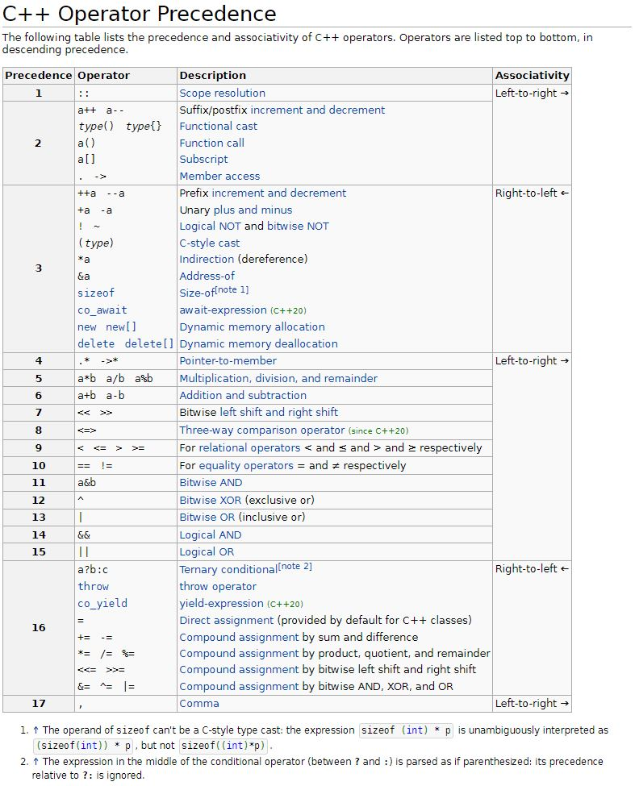
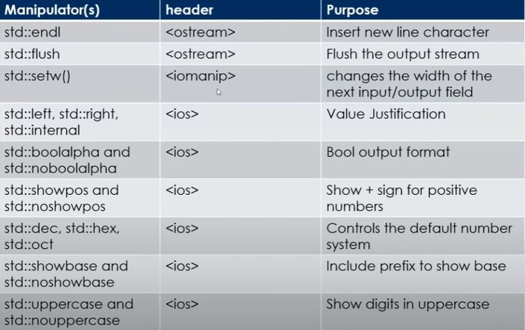
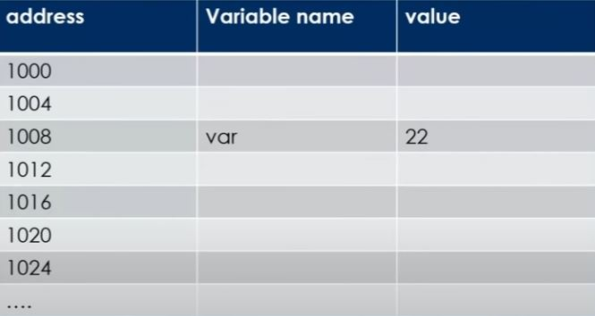
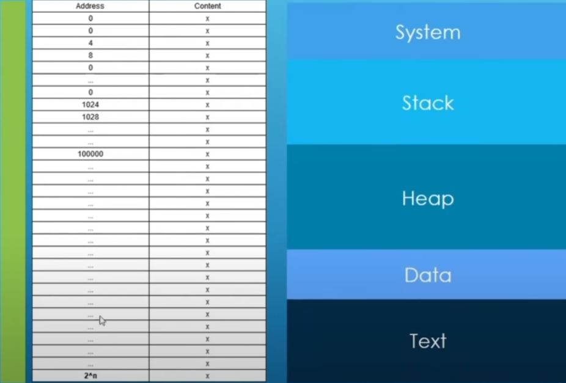

# C++ (Overview)

Common remarks on C++:
* complicated and difficult to learn
* unsafe (can scribble over memory and crash your program)
* incoherent mashup of every other programming language

These are all true; but still, C++:
* remains the language of choice
  * ahead of Java and in 3rd place on Tiobe Language Popularity index
* most of the advanced difficult features are for writing libraries. This can make writing applications in C++ easier
than in other languages

## C++ Standards

* 1979: "C with classes" invented by Bjarne Stroustrup
* 1998: the first standard
* 2011: C++11 standard..."a whole new language"
* 2017: C++17
  * medium-sized release containing library improvements: parallel algorithms, filesystem, string_view, optional, any, variant (tagged unions). Class Template Argument Deduction
* 2020: C++20
  * major release focused on Concepts, a major rearchitecture of templates and std::format, which makes formatting no longer suck
* 2023 (expected): C++23
  * Ranges and Modules will become useful
  * std::expected is a new paradigm for error handling

## C++ gaps

* no networking
* no thread pools
* asnychronous programming broken
* no sender-receiver
* no reflection (therefore no serialization, RPC, etc)
* way too many things still require unsafe code

## C++ safety

* C++ isn't safe
  * lets you access any memory location directly by its address ("pointers"), which by definition is unsafe
  * best known security CERTs are ascribed to unsafe memory usage in C and C++
* isn't as unsafe as people think either
  * modern C++ language and best practices vastly improve the situation
* still a long way to go

## C++ is not a standard

Some things are not mentioned in the C++ standard:
* bits in an integers
* DLLs
* whether characters are signed or unsigned
  * (signed int means e.g. ranges from -2147483648, 2147483647; unsigned 32-bit int ranges from 0,4294967295)
* common saying: "there are no interesting standards-compliant programs"

This reduces portability and is fragile; to combat the issue, if you need to rely on non-standardized behavior, try to rely on "implementation-defined" rather than "undefined" behavior so at least it is defined somewhere.

## C++ characteristics

* compiled
* multiparadigm (e.g. supports object-orientation)
* lightweight abstractions (supports low-level system programming and high-level abstractions)
* statically type safe and (largely) type inferenced
* Exceptions, Expected, and RAII

## C++ Compilation

* Java, Javscript use "Just in Time" (JIT) compilation
* C++ uses __"Ahead of Time"__ compilation (other examples: C, Rust, Swift)
  * may be less convenient because it means you must compile before running it
  * but the performance is faster because teh compiler can take its time to analyze the program in depth
  * enables metaprogramming for the compiler to control its code generation

## C++ use case

* C++ is a lightweight abstraction language that strikes a balance between being good for programmers (abstract) and good for the computer (i.e. low-memory, fast, low-level)
  * unlike almost any other language, C++ allows creation of powerful abstractions that are lightweight by having all the abstraction "compiled-away" during the build using __"`templates`"__. So, there is no performance penalty associated with using/creating abstractions.
* C++ offers low-level manipulation of code and data
  * no virtual machine, manual memory management, etc
* C++ offers abstraction through C++ generics, which use compile-time computation to generate optimal code

If you want code that is:
* good for the programmer (clear consistent, abstract, and extensible libraries)
* good for the computer (great time and space performance; low-level customizability)
Then C++ is most often the right language. Many programs don't need C++; i.e., it has no equivalent of scripting or notebooks for high-level programs.

https://www.youtube.com/watch?v=X4q1OM0voO0&list=PLRAV69dS1uWSR89FRQGZ6q9BR2b44Tr9N&index=1

Called "Golang" to avoid confusion caused by searching "Go" on search engines.

Features:
- Low Latency (if you are concerned about latency; adopted by twitch)
- Garbage Collection (if you want very fast and lots of support)
- GPU (if concerned about GPU power and utilization)
- Concurrency Support (built-in support)

# C++ Compilers

Common compilers for Windows:
* `Mingw`
* `MSVC`
* `clang llvm`

Common compilers for Linux:
* `GCC`
* `clang llvm`

to see what features each compiler supports, visit https://en.cppreference.com/w/cpp/compiler_support

For a windows machine, can go here to get `clang llvm` and `Mingw`: 

Can confirm installation successful at windows cmd: https://winlibs.com/
```
C:\Users\ascla>g++ --version
g++ (MinGW-W64 x86_64-ucrt-posix-seh, built by Brecht Sanders) 12.2.0
Copyright (C) 2022 Free Software Foundation, Inc.
This is free software; see the source for copying conditions.  There is NO
warranty; not even for MERCHANTABILITY or FITNESS FOR A PARTICULAR PURPOSE.


C:\Users\ascla>clang++ --version
(built by Brecht Sanders) clang version 15.0.6
Target: x86_64-w64-windows-gnu
Thread model: posix
InstalledDir: C:/mingw64/bin
```
For a windows machine, download microsoft visual studio to get the `MSVC compiler`. Can confirm installation by opening the newly installed "developer command prompt for VS 2019" and querying the compiler version:

```
**********************************************************************
** Visual Studio 2019 Developer Command Prompt v16.9.3
** Copyright (c) 2021 Microsoft Corporation
**********************************************************************

C:\Program Files (x86)\Microsoft Visual Studio\2019\BuildTools>cl.exe
Microsoft (R) C/C++ Optimizing Compiler Version 19.28.29913 for x86
Copyright (C) Microsoft Corporation.  All rights reserved.

usage: cl [ option... ] filename... [ /link linkoption... ]
```

https://godbolt.org/ is a pretty good online compiler that allows you to compile and run C++ code with various compilers. you can also share code snippets with others.

# running compilers and program

gcc
```
g++ -std=c++20 vector_simple_demo.cpp -o vector_simple_demo && vector_simple_demo
```

# Basics

## First program

```c++
#include <iostream>

int main(){
    std::cout << "num1" << std::endl;
    std::cout << "num2" ;
    std::cout << "num3" << std::endl;
    return 0;
}
```

`include` statement copies in a bunch of code at the top of the file before compilation. Like an import statement. The `return 0` statement tells the operating system the program exited successfully.
`iostream` is a header file that contains functions for basic I/O operations.

## Comments

* `//` for single-line comments.
* `/*` and `*/` for multi-line comments ("block comments").
* can't nest comments

## Errors

* Compile time errors
  * occurs during compilation... (e.g. missing semi-colon); causes compilation to fail. this is good.
* Runtime errors
  * logical error in your program; can cause a program to fail and crash
* Warnings
  * not serious enough to halt compilation; the compiler is telling you something about a problem that can be serious if not fixed soon. (division by 0 can actually be a warning)

## Functions

Functions have the following structure:
```c++
int addNumbers(int first, int second){
  int sum = first + second;
  return sum;
}

int main(int argc, char **argv)
{
  int first = 10;
  int second = 0;
  int sum;
  sum = addNumbers(first,second);
  std::cout << sum << std::endl;
  return 0;
}
```

## I/O

* `std::cout`: print data to console (terminal)
* `std::cin` read data from terminal
* `std::cerr` print errors to console
* `std::clog` print log messages to console

```c++
std::cout << "Hello World!" << std::endl;
std::cout << 12 << std::endl;
int age {21};
std::cout << "my age is " << age << std::endl;
// error
std::cerr << "std::cerr output: something went wrong " << age << std::endl;
// log
std::clog << "std::clog output: this is a log message " << std::endl;
```

### Output

```c++
std::cout << "Hello World!" << std::endl;
std::cout << 12 << std::endl;
int age {21};
std::cout << "my age is " << age << std::endl;
```

### Input

* use `std::cin` to get input from user
```c++
int age;
std::string name;

std::cout << "please enter your last name" << std::endl;
std::cin >> name;

std::cout << "please enter your age" << std::endl;
std::cin >> age;
```

* can chain getting input from user
```c++
int age;
std::string name;

std::cout << "please enter your last name and age, separated by spaced" << std::endl;
std::cin >> name >> age;
```

* can read a line of text from console like so
```c++
std::string full_name;
std::cout << "please enter your full name" << std::endl;
std::getline(std::cin, full_name);
```

## C++ program execution model

https://www.youtube.com/watch?v=8jLOx1hD3_o
jump to 02:49:57

## C++ Core Language vs Standard Library vs STL

* __Core Features__: core building block that makes up the C++ language; for example, how to define variables, the rules that make up how you can define and use functions, the rules about what you can and cannot do in C++, etc.. 
  * e.g. how functions are written, the built-in types
* __Standard Library__: a set of ready-to-use highly specialized components that we can use in our programs. e.g. `iostream`, `string`.
* __STL__: highly specialized part of the C++ standard library. collection of container types.

# Variables and Data Types

Common types
* `int`
* `double`
* `float`
* `char`
* `bool`
* `void` (represents a typeless type)
* `auto` (not a type; a keyword to deduce other types)

All data is stored in e.g. 32 bit wide (or 64 bit wide) registers. So the question is, how are ints, decimals, strings, etc represented in these registers.

a 32 bit wide register has 4 sections of 8 bits, which are called `bytes`.

## Number systems

Number systems transform data from forms readable to humans (e.g. `2`, `20.3`, `"Steve"`) into forms convenient for computers

* __base 10__:
  * `2371 = 2*10^3 + 3*10^2 + 7*10^1 + 1*10^0`
* __base 2 (binary)__:
  * `100101 = 1*2^5 + 0*10^4 + 0*2^3 + 1*2^2 + 0*2^1 + 1*2^0`

Generally, if we have `n` binary digits we can use to store 0's and 1's, then we can represent numbers from 0 all the way up to `2^n-1`.

For reference:
*  8 digits -> 1 byte  -> 0~255
* 16 digits -> 2 bytes -> 0~65535
* 32 digits -> 4 bytes -> 0~34359738367
* 64 digits -> 8 bytes -> 0~18446744073709551615

* __Hexadecimal system__: technique we use to shorten the length of a binary number. take a number and split it into groups of 4 bits:
  * 0000 -> 0 -> 0
  * 0001 -> 1 -> 1
  * 0010 -> 2 -> 2
  * 0011 -> 3 -> 3
  * 0100 -> 4 -> 4
  * 0101 -> 5 -> 5
  * 0110 -> 6 -> 6
  * 0111 -> 7 -> 7
  * 1000 -> 8 -> 8
  * 1001 -> 9 -> 9
  * 1010 -> 10 -> A
  * 1011 -> 11 -> B
  * 1100 -> 12 -> C
  * 1101 -> 13 -> D
  * 1110 -> 14 -> E
  * 1111 -> 15 -> F

Example: huge number in hexadecimal: `0x 6E30F13F`. We use `0x` in front to mean it is a hexadecimal number Each character represents 0-15 in base 10, which requires 4 bits in binary 0000-1111. So, rather than represent the large number as a 32 bit binary number, we can display it as a hexadecimal number and use fewer digits.

There also exists the seldom used __Octal system__, which groups numbers into 3 bits. Example: `0 15614170477`. `0` represents octal number system.

To represent numbers in C++ using various number systems, do it like so:
```c++
int num1 = 15; //15 in decimal
int num2 = 017; //15 in octal
int num3 = 0x0f; //15 in hexadecimal
int num4 = 0b00001111; //15 in binary - doable since C++14
```

In summary, hexadecimal system makes it a little easier for humans to handle streams of data with 1's and 0's. Octal system has the same goal but is seldom used anymore.

## basics

__variable__ a named piece of memory that you use to store specific types of data
* must start with lowercase letter or underscore
* are case sensitive

## braced variable initialization

initializing a variable has the form:
```c++
typename variable_name {intializer_value};
```

```c++
// compiler will put in garbage value
int elephant_count; // declare a variable
int elephant_count{}; // declares and initializes to 0
int elephant_count{10}; // declares and initializes to 10
int elephant_count{dog_count + cat_count}; // initializes with expression
int elephant_count{2.9}; // 2.9 is of type double, with wider range than int. will yield int.ERROR or WARNING
```

## functional variable initialization

```c++
int apple_count(5);
int orange_count(10);
int fruit_count (apple_count + orange_count);
int bad_initialization (doesnt_exist3 + doesnt_exist4);
// information loss. less safe than braced initializers.
int narrowing_conversion_functional (2.9); // implicit conversion; will happen silently. curly braces {} are preferred
```

## variable assignment initilization

```c++
int bike_count = 2;
int truck_count = 7;
int vehicle_count = bike_count + truck_count;
int narrowing_conversion_assignment = 2.9;
```

## size of a type in memory

Query the size of a type in memory with
```c++
std::cout << "sizeof int : " << sizeof(int) << std::endl;
std::cout << "sizeof int : " << sizeof(truck_count) << std::endl;
```

## `int`

* typically occupies 4 bytes (32-bits) or more in memory
* whether an int is signed or unsigned, it will still occupy the same amount of space in memory

## integer modifier (__`signed`__, __`unsigned`__, __`short`__, __`long`__)

* can make ints __`signed`__ or __`unsigned`__, which denotes whether to represent positive or negative or only positive integers
* `unsigned int`: can only be positive
  * unsigned int range: `[2,2^n-1]`, where `n` is the number of bits available in memory
  * e.g. 4 bytes in memory: `[0,4294967295]`
* `signed int`: can be positive or negative
  * signed int range `[2^(n-1), 2^(n-1)-1]`
  * e.g. 4 bytes in memory: `[-2147483648, 2147483647]`

* can make ints __`short`__ or __`long`__ to decrease or increase how much memory they take up
* `short int`: e.g. uses 2 bytes
* `int`: uses 4 bytes
* `long int`: uses 4 or 8 bytes
Can combine modifiers; for example: `signed long int myNumber {1234};`

These modifiers only work on integral types (data types in which you can store decimal numbers)
* can use `sizeof()` to confirm the memory occupied

## Fractional Numbers (__`float`__, __`double`__, __`long double`__)

__Floating Point Types__
* `float`: 4 bytes, 7 digits precision (number of bits you can represent)
* `double`: 8 bytes, 15 digits precision (may vary with compiler)
* `long double`: 12 bytes, precision > double
  * to create a float or long double literal, you MUST include the suffices (i.e. `1.022f` and `1.022L`)

```c++
float num1 {1.12345678901234567890f};
double num2 {1.12345678901234567890};
long double num3 {1.12345678901234567890L};

std::cout << std::setprecision(20) // sets the precision you want to see when printing numbers
std::cout << num1 << std::endl; // 7 digits
```

* things will change based on the compiler implementation

Floating point numbers are stored in memory using a specific floating point number memory representation (`IEEE_754`).
* if you take a floating point number and divide by 0, you will get `infinity(+/-)`
* `0.0/0.0` gives `NaN`; avoid this

## boolean (`bool`)

* a `bool` occupies 8 bits (1 byte) in memory; this seems wasteful, since a byte can store 256 states
* if you are working on a device with limited memory, there are techniques to store the boolean with less memory

example of bracket initialization:
```c++
bool redLight {true};
```

## Characters and Text (`char`)

* `char` data type is meant to store a single character; is wrapped in single quotes `'a'`
* occupies 1 byte of memory. Since 1 byte can represent 256 states, 1 byte is enough memory to represent the 128 __ASCII__ characters
* __unicode__ is a more extensive character set of almost 150,000 characters that includes letters in e.g. Arabic, East Asian Languages

```c++
char character1 {'a'}; // a character; wrapped in single quotes
char value = 65; // compiler will interpret 65 as a char, which represents A in the ASCII table
static_cast<int>(value) // transform char into an int 65 <= 'A'
```

## __`auto`__

__`auto`__ is a keyword that tells the compiler to deduce the type

```c++
auto var1 {12};
auto var2 {12.0};
auto var3 {12.0f};
auto var4 {12.0l};
auto var5 {'e'};
// int modifier suffices
auto var6 {123u};  // unsigned
auto var7 {123ul}; // unsigned long
auto var8 {123ll}; // long long
``` 

## Assignments

* `variablename = newvalue;`
* careful of assignments on variables declared with `auto` (e.g numeric types).

```c++
int var{123}; // declare and intialize
var = 55; // assignment
bool state{false};
state = true;
```

```c++
auto var3{333u};
var3 = -22; // danger! will get compile-time error, but you may not! compiler may do its best and put in a garbage value 
```

# Operations on Data

## basic operations (`+` `-` `*` `/` `%`)

* note: integer division truncates the remainder (`31/10==3`)

```c++
int product {num1 * num2};
int other_product = num1 * 2 * num2;

int quotient {num1 / num2};
int other_product = num1 * 2 * num2;
```

## Precedence and Associativity

multiple operators are executed by a specific precedence:
* __Precedence__: which operation to do first
* __Associativity__: which direction or which order
* it is best to make the intent in your code as clear as possible by clearly using `()` to indicate which operations to do first--rather than rely on precedence rules and make the evaluation ambiguous to the reader.
* there is a C++ operator precedence table with different precedence: https://en.cppreference.com/w/cpp/language/operator_precedence


## Postfix and Prefix addition, subtraction (`val++`,`++val`)

* in __postfix__ addition/subtraction, the expression evaluates first, then the expression increments (`val++`,`val--`)
* in __prefix__ addition/subtraction, the expression increments first, then the expression evaluates (`++val`, `--val`)
* the _postfix_, _prefix_ operations only exist for addition, subtraction
```c++
int value {5};
value = value + 1;
value++; // postfix addition; evaluates first, then increments
++value; // prefix addition; increments first, then evaluates

value = value - 1;
value--; // postfix subtraction; evaluates first, then decrements
--value; // prefix subtraction; decrements first, then evaluates
```

## Compound Assignment Operators (`+=`, `-=`, `*=`, `/=`, `%=`)

* Compound assignment operators allow you to shorthand an operation with an assignment
```c++
int val {4};
val+=1; // val = val+1; 4+1 == 5
val-=1; // val = val-1; 5-1 == 4
val*=2; // val = val*2; 4*2 == 8
val/=2; // val = val/2; 8/2 == 4
val%=3; // val = val%3; 4%3 == 1
```

## Relational Operators (`<`, `<=`, `==`, `>=`, `>`, `!=`)

## Logical Operators (`&&`, `||`, `!`)

## Output Formatting (`<ios>`, `<iomanip>`)

* `std::endl` adds a newline character; similar but not the same thing as `\n`
* `std::flush` sends whatever is in the output buffer to the terminal. causes immediate sending of data to the device connected to the stream
  * what is a buffer? when you send something to e.g. `std::cout` it does not go straight to the terminal. It goes to an intermediary buffer. It is like a storage unit in which data goes before going to the terminal.
* `std::setw()` sets a width for whatever text you want to send
* `std::right` sets a justification to the right
* `std::left` sets a justification to the right
* `std::internal` sets an internal justification
* `std::setfill('-')` sets a fill character
* `std::boolalpha` shows boolean output in the form of true and false; normally bools show as 1's and 0's
* `std::showpos` to show or hid + sign for positive numbers
* `std::dec`, `std::oct`, `std::hex` shows numerics in different number systems
* `std::showbase` shows the base (ie the number system) of any numerics printed
* `std::uppercase` has data printed out in uppercase
* `std::scientific`, `std::fixed` shows numbers in scientific notation, fixed-format notation
* `std::setprecision` sets the number of digits to print out for a floating point number. Default is 6.
* `std::showpoint` show trailing zeros if necessary


```c++
std::cout << std::setw(10) << "lastname" << std::setw(10) << "firstname" << std::endl;
std::cout << std::setw(10) << "clark" << std::setw(10) << "austin" << std::endl;
```

## determine limits of what is represented by a data type`<limits>`

helpful library for seeing the limits of what can be represented by data types
* `std::numeric_limits<T>::min()`: smallest positive number you can represent in type `T`
* `std::numeric_limits<T>::max()`: largest positive number you can represent in type `T`
* `std::numeric_limits<T>::lowest()`: lowest negative number you can represent in type `T`
```c++
// e.g. floating point
std::numeric_limits<float>::lowest() // -3.40282E+38
std::numeric_limits<float>::min() // 1.17549E-38
std::numeric_limits<float>::max() // 3.40282E+38

// e.g. signed integer
std::numeric_limits<float>::lowest() //
std::numeric_limits<float>::min() // -32768 ... will be negative if using signed integer
std::numeric_limits<float>::max() // 32767

// e.g. unsigned integer (short)
std::numeric_limits<float>::lowest() //
std::numeric_limits<float>::min() // 0
std::numeric_limits<float>::max() // 65535
```

## Math Functions (`<cmath>`: `floor()`, `ceil()`, `abs()`, `pow()`, `exp()`, `...`)

```c++
double x {-4000};
std::abs(x);
std::exp(x); // e^x
std::pow(x,2); // x^2
std::log(x); // base e log
std::log10(x); // base 10 log
std::sqrt(x);
std::round(x);
std::sin(x);
std::cos(x);
std::tan(x);
// ... other trig functions

```

## Weird Integral Types (dtypes w/ <4 bytes `char`, `short int`)

Cannot do arithmetic operations on datatypes represented by fewer than 4 bytes in size
* `int` was chosen as the smallest type for which they can do arithmetic operations.
* `char` is 1 byte in size
* `short int` on most processors is 2 bytes
* if you want to do arithmetic operations on these types, compilers are smart enough to implicitly convert these types from the smaller types to ints
```c++
short int var1 {10}; // 2 bytes
short int var1 {20};
char var3 {40}; // 1 byte
char var4 {50};
auto result1 = var1 + var2; // conversion to int; compiler has result be an int
auto result2 = var3 + var4; // conversion to int; compiler has result be an int
```
* the same behavior is present on other operators like bitwise shift operators (`>>`, `<<`)

# Flow Control

## `if`

```c++
if(condition){ // condition is any bool expression or variable
  //...
}
```

## `else`

```c++
if(condition){
  //...
} else {
  //...
}
```

## `else if`

```c++
if(condition){
  //...
} else if (condition2) {
  //...
} else {
  //...
}
```

## `switch`

* a `break` statement after each case is very important. It stops processing the switch blcok when a successful case has been found. If the break statement is not there, all the cases following the current case will be executed.
* the condition inside a switch statement MUST be an _integral type_ or _enum_: `int`, `long`, `unsigned short`, etc
```c++
int Pen {1};
int Marker {2};

int tool {Pen};
switch (tool) {
  case Pen: {
    // ...
  }
  break; // NEED THIS ELSE INNER BODY WILL CONTINUE TO EXECUTE
  case Marker: {
    // ...
  }
  break;
  // ...
  default: {
    // ...
  }
}
```

## ternary operator (`... ? ... : ...`)

* __ternary operator__: shorthand notation for an if-else clause
* has form `result = (condition) ? option1 : option2;`
* __ternary intialization__: using ternary operator in intialization: `int speed {fast ? 300 : 150};`

# Loops

## `for` loop

pillars of any loop
* iterator
* starting point
* test (controls when the loop stops)
* increment (decrement)
* loop body

basic structure
```c++
for (unsigned int i{}; i< 10; ++i) {
  // ...
}
```
1. initialize `i`
2. run test: if true jump into loop body
3. run loop body
4. execute incrementation part
5. jump back to (2)

* can use `size_t` to declare iteration variable.
* `size_t`: type alias for some unsigned int representation (may be ~8 bytes on a system)
```c++
for (size_t i{0}; i<10; ++i){
  //...
}
```

* can leave out curly braces `{}` if you have only one statement to run in the loop
```c++
for (size i{}; i<5; ++i)
  //...
```

* note, the iterator variable is scoped to only be the body of the loop; declare the iterator variable outside the loop if you want to reference it after the for loop body
```c++
size_t j{};
for ( ; j<10; ++j)
  // ...
```

# `while` loop

```c++
while (condition){
  // ...
}
```

example
```c++
const unsigned int COUNT {10};
unsigned int i {0};
while (i < COUNT){
  // ...
}
```

## `Do while` loops

* the do-while loop runs the body first, then checks the test
```c++
const unsigned int COUNT {10};
unsigned int i {11}; // initialization

do{
  // ...
  ++i; // increment
} while (i < COUNT); // test

```

# Arrays

## array basics `array[]`

arrays are a way to setup collections in a program. for example, we may want to represent a collection of ints; each int is 4 bytes, or 64 bits.
* arrays store elements of the same type
* declare an array: `type arrayname[size];`
  * it will be filled with garbage values
* declare and initialize an array with values: `type arrayname[size] {val1, val2, ...};`
* can declare and initialize the array omitting the size at declaration; size will be inferred: `type arrayname[] {val1, val2, ...};`
* access an element at a specific index with: `arrayname[idx]`
* write data into an array with: `arrayname[idx] = newval`
* use `auto` when looping over an array to make code more adaptable to change
* can declare an array `const` to prevent writing to the arra

```c++
int scores[10]; // declares (allocates space in memory
double salaries[5] = {12.7, 7.5, 13.2, 8.1, 9.3}; // declare and initialize an array with values
scores[0] = 120; // write data to array
std::cout << scores[0]; // access data from array
int classSizes[] {10, 12, 15, 11, 18, 17}; // declare and intialize, omitting size (size will be inferred)

for (auto val: classSizes){
  // ...
}
```

## `range-based` for loop

```c++
int classSizes[] {10, 12, 15, 11, 18, 17}; // declare and intialize, omitting size (size will be inferred)

for (auto val: classSizes){
  // ...
}
```

## `std::size()`, `sizeof()` with arrays

* query for the size of an array at runtime with `std::size()` (c++17)
```c++
int scores[] = {10,12,15,11,18,17,22,23,24};
std::cout << std::size(scores);
for (size_t i{0}; i < std::size(scores); ++i)
  // ...
```

* before c++17, the `sizeof()` operator was used.
* `sizeof(array)` returns the entire size of the array
* `sizeof(array)/sizeof(array[0])` returns the size of the array because total memory / memory of 1 element == number of elements in the array
```c++
int scores[] = {10,12,15,11,18,17,22,23,24};
size_t count {sizeof(scores)/sizeof(scores[0])};
for (size_t i{0}; i < count; ++i)
  // ...
```

* nowadays, we can just use a range-based for loop to iterate over elements

## character array `char array[]`, null termination strings `\0`,

* character arrays are similar to other arrays for the most part:
```c++
char message[5] {'H','e','l','l','o'};
for (auto c : message){
  // ...
}
message[0] = 'h';
```

* character arrays are a little special in that the arrays themselves can be directly printed to the console without printing:
```c++
std::cout << "message: " << message;
```
* sometimes, this won't do what you expect because only proper C strings can be printed on the console
* a proper C string ends with `\0`, the __null termination string__: it tells C++ that we have hit the end of the string when e.g. printing to console
* if `\0`, it may sometimes print fine; other times, it may print garbage characters. The `\0` indicates the end of the string has been reached
```c++
char message[5] {'H','e','l','l','o','\0'}; // add '\0' to ensure the string will be printed properly
std::cout << message;
```

* if you initialize a char array and give it values, the remaining values will be filled with `\0`:
```c++
char message2[6] {'H','e','l','l','o',}; // last element ends up being '\0'
std::cout << message;
```

* if you initialize a char array with a string value (double-quotes) an implicit `\0` character is appended to the end of the string to make it a c string
```c++
char message4 [] {"Hello"}; // implicit '\0' character appended to the end of the string,
                            // making it a c string
```

## bounds of an array

when you declare an array, a block of unused memory will be found and allocated to store the (elements in the) array
* indexing out of bounds is still allowed by the compiler, but you should not do so because the memory location may
be used for some other purpose. other programs may modify the data you have written outside the bounds, or the program
may read bogus data at a later time. You may even corrupt data used by other parts of your program

# Pointers

variables you use in code live in an address in memory


__pointer__: variable that stores the memory address of another variable

## declare and use pointer (address-of operator `&`, dereference operator `*`)

* declare a pointer with: __`type* ptrName;`__
* declare and initialize a pointer to be a null pointer: __`type* ptrName {nullptr}`__
* all pointers take up the same amount of space in memory (are the same size)
* position of the `*` does not matter when declaring a pointer
  * can declare with `type* ptr;`, `type * ptr;` or `type *ptr;`. it doesn't matter

```c++
int* pNumber {}; // can only store an address of a variable of type int
double* pFracNumber {}; // can only store an address of a variable of type double

// explicitly intialize a null pointer
int* pNumber1 {nullptr};
double* pFracNumber1 {nullptr}

// all the same
int*  pNum2{nullptr}
int * pNum2{nullptr}
int  *pNum2{nullptr}
```

* declare and initialize a pointer with memory address of another variable: `type* ptrName {&var};`
* `&` the memory __address-of__ operator returns the address of a variable in memory: `&var`
* `*` the `dereference operator` returns the object (value) held at a specific memory location: `*ptrName`
```c++
int var {43};
int* pVar &{var}; // have pointer hold address of var

int var2 {10};
pVar = &var2; // have pointer hold address of a different variable
std::cout << *pVar // 10`
```

## char pointers (`char*`)

* has similar behavior to pointers to other types
```c++
char* pChar{nullptr};
char charVar {'A'};
pChar = &charVar;
```

* char pointers are special because you can intialize them with a string literal
  * when you do this, the string is going to be expanded into a character array
  * the pointer points to the location of the first character created by the array
* as a result, strings can basically be treated as character arrays
  * however, some compilers will refuse to compile the below expression because the compiler will expand the string into a character array of `const char`, and the pointer declared is not for a `const char` but rather just `char`
```c++
char* pMessage {"Hello world!"}; // a char array will be created. pMessage holds mem address of 'H', the first char in the array created
// may not compile with every compiler because some compilers will expand the string into an array of const char, and the pointer
// is only for char--not const char

// instead, do this:
const char* {"Hellow word!"};
```
* to be explicit and not run into trouble, instead write `const char* pMessage {"mystr"};`

* note: you can modify a pure array intialized with a string literal
```c++
char message2[] {"Hello there"};
message2[0] = 'T';
```

## Program Memory Map

workflow: `type up source code --> compiler --> executable --> run executable`
* the source code (a compiled program) lives in a file on your _hard drive_
* when you run the program, you create a _process_. compiled program as a list of statements gets loaded into RAM into a dedicated section of memory for the process for storing program instructions (_code_ / _program area_)
  * so far we have been thinking that the instructions are loaded into our real memory (RAM) on our computer, but that's not the case.
  * the operating system is running a lot of programs, if the OS loads all the instructions for every program into RAM, we would run out of RAM.
  * so, the computer uses __virtual memory__: a trick that fools a program into thinking it is the only program running on the OS, and all memory resources belong to it. The view that each program has of its allocated memory is called the __memory map__.
  * each program is abstracted into a process, and each process has its own memory map and access to the memory range `0 ~ 2^N-1` where N is 32 on 32 bit systems and 64 on 64 bit systems. So each program thinks it owns the entire memory.
  * so, we have __Real Memory (RAM)__, which is all the memory the computer has, and we have __Virtual Memory (2^N-1)__, which is the memory a program has

* when we compile a program (e.g. on a 64 bit system), we generate a binary file, which will be a representation of how things are going to be layed out in memory in our program
* if we run the program, it will go through a section of the CPU called the __Memory Management Unit (MMU)__, which transforms between the memory map of each process and the real memory layout we have in RAM
* so, the entire program is not loaded in real memory by the CPU and MMU. Only parts that are about to be executed are loaded; this makes effective use of real memory, a valuable and lacking resource


example: we have 4 processes with their own memory maps (0~2^N-1), which will go through the MMU, and the MMU will assign them sections in the real RAM.
* __virtual Memory__: the memory map is a standard format defined by the OS. All programs written for that OS must conform to it. It is usually divided into some sections. This is why you can't take an executable compiled on windows and run it on a linux system.

Memory Map

* we have `0~2^N-1` address locations
* __stack__: where local variables are stored
* __heap__: additional memory that can be queried for at runtime; important for dynamic memory
* __text__: load the actual binary of the program so the CPU can execute it

## Dynamic Memory Allocation

This is a way to use heap storage for a c++ program
* so far, we've used pointers to refer to locations of variables living in stack memory
* generally, it is REALLY badd to use a pointer that is not initialized
```c++
int* pNum; // contains junk address: could be anything
*pNum = 55; // writing into junk address. BAD!
```
* do NOT use a pointer initialized to null
```c++
int* pNum3 {}; // intialized with pointer equivalent of zero: nullptr. a pointer pointing nowhere
*pNum = 33; // BAD! CRASH
```

So:
1. initialize your pointers before using them. Don't use a pointer that you did not initialize
2. don't try to work with a pointer that is a `nullptr`

Differences between stack and heap:

__stack__
* memory is finite
* developer isn't in full control of the memory lifetime
* lifetime is controlled by the scope mechanism
__heap__
* memory is finite
* developer is in full control of when memory is allocated and when it is released
* lifetime is controlled explicity through `new` and `delete` operators

> if you can avoid using _heap_ memory, you should. Use stack memory as much as possible

## creating a variable with limited lifetime using `{}` to scope

```c++
int main(){
  {
    int localScopedVar {33};
  }
  // localScopedVar no longer exists
  return 0;
}
```

## allocate dynamic memory (`new`)

use `new` keyword, which allocates a portion of memory and returns the address of the newly allocated space
```c++
// initialize pointer with dynamic memory.
// dynamically allocate memory at runtime and make a pointer point to it
int* pNum {nullptr};
pNum = new int; // dynamically allocate space for a single int on heap.
                // this memory bellongs to our program from now on.
                // the system can't use it for anything else, until we return it
                // after this line executes, we will have a valid memory location allocated.
                // the size of teh allocated memory will be such that it can store
                // the type pointer to be the pointer
*pNum = 55; // writing to dynamically allocated memory
```

* can declare and initialize pointers with `new` keyword
```c++
int* pNum1 {new int};
int* pNum2 {new int(22)};
int* pNum3 {new int{23}};
// ...
delete pNum1;
pNum1 = nullptr;
delete pNum2;
pNum2 = nullptr;
delete pNum3;
pNum3 = nullptr;
```

* note: it is REALLY bad to call delete twice on a pointer
  * will lead to undefied behavior. program may crash. avoid this like the plague.

example of stack vs heap
```c++
int main(){
  {
    int localScopedVar {33}; // only lives in the scope of the brackets; removed from stack memory when } reached
    int* localPtrVar = new int;
  }
  // localScopedVar no longer exists
  // still have access to the memory that localPtrVar was pointing to
  return 0;
}
```

## Releasing and resetting dynamic memory (`delete`)

use `delete` keyword, which frees the memory at the location to the operating system
```c++
int* pNum{nullptr};
pNum = new int;
// ... use memory
delete pNum; // returns the memory to the operating system
pNum = nullptr; // good practice is to set a pointer to nullptr to indicate there is no longer valid data at that location
```

## Dangling Pointer

__Dangling Pointer__: pointer that doesn't point to a valid memory address. Trying to dereference and use a dangling pointer will result in undefined behavior
* a dangling pointer is ALWAYS created when after removing memory from the heap
```c++
int* pNum {new int{3}};
//...
delete pNum; // freed memory on heap. pNum is now a dangling pointer!
```

3 kinds of dangling pointers
* __uninitialized pointer__
* __deleted pointer__
* __multiple pointers pointing to same memory__

_non-initialized pointer_
```c++
int* pNum; // dangling uninitialized pointer
std::cout << pNum << std::endl;  // junk value
std::cout << *pNum << std::endl; // might lead to CRASH
```

_deleted pointer_
```c++
int* pNum {new int{34}};
// ...
delete pNum; // freed memory on heap. pNum is now a dangling pointer!
std::cout << *pNum << std::endl; // might lead to CRASH
```

_multiple pointers pointing to same memory_
```c++
int* pNum1 {new int{53}}; 
int* pNum2 {pNum1};  // pNum2 points to same object on heap
// ...
delete pNum1; // freed memory on heap. now we have 2 dangling pointers!
std::cout << *pNum1 << std::endl; // CRASH!
std::cout << *pNum2 << std::endl; // CRASH!
```

## Remedies to Dangling Pointers

1. initialize your pointers; when you declare a pointer, immediately initialize it. if you don't know what to initialize it with, put in `nullptr` first and later put in an actual address. This also allows programmers to check a pointer against `nullptr` to see if the pointer contains something valid before using it
2. reset pointers to `nullptr` after you `delete` them in memory (always set a pointer to `nullptr` after a `delete` call)
3. for multiple pointers to same address, make sure the owner pointer is very clear. choose one pointer to be the master of the controller of the memory. all other pointers are going to be slaves. They can use that memory, but they don't have the task of releasing that memory

1. _intializing pointers_
```c++
int* pNum1{}; // good. initializes with nullptr
int* pNum2{new int{56}} // good. initializes with 56

// check for nullptr before use
if(pNum != nullptr)
  // ...
```

2. _resetting pointers to `nullptr` after `delete`_
```c++
int *pNum{new int{32}};
// ...
delete pNum;
pNum = nullptr;

// check for nullptr before use
if(pNum != nullptr)
  // ...
```

3. _designate master pointer_
```c++
int* pNum1 {new int{382}}; // say pNum1 is the master pointer
int* pNum2 {pNum1};
// ...
delete pNum1; // master releases memory
pNum1 = nullptr;

// only use slave pointers when master pointer is valid!!!
if (!(pNum1 == nullptr))
  std::cout << pNum2 << std::endl;
```

## when `new` fails (`try-catch`, `exceptions`)

`new` fails very rarely in practice, and you'll see many programs that assume that it always works and don't check for memory allocation failure in any way
* depending on the application, failed memory allocations can be very bad, and you need to check and handle them.

```c++
int* lotsOfInts {new int[1000000000000]}; // may give error about exceeding array size
// use huge loop to try and exhaust the memory capabilities of your system.
// when new fails, your program is going to forcefuly terminate.
for (size_t i{}; i<100000000; ++i){
  int* lotsOfInts2 {new int[100000]};
}
```

handle this issue
1. through exception mechanism. a built-in way to check for errors and handle them
2. can `std::nothrow` setting to not throw an exception and instead give a `nullptr`

1. _exception mechanism_
```c++
// handle the problem in a way that makes sense for the application.
// for example, if you were trying to allocate memory to store color information
// for your application, and allocation fails, you could opt for showing some
// feedback message to the user and rendering your app in black/white
for (size_t i{}; i<10000000; ++i){
  try {
    int* lotsOfInts {new int[100000]};
  } catch(std::exception& ex){
    std::cout << "caught exception ourselves: " << ex.what() << std::endl;
  }
}
```

2. _`std::nothrow`_
```c++
for (size_t i{}; i<10000000; ++i){
  int* lotsOfInts {new(std::nothrow) new int[100000]};

  if (lotsOfInts == nullptr){
    // don't try to dereference and use lotsOfInts in here.
    // you'll get UB. No memory has reall ybeen allocated here.
    // it failed and returned nullptr because of teh std::nothrow setting
    std::cout << "mem allocation failed" << std::endl;
  } else {
    std::cout << "mem allocation succeeded" << std::endl;
  }
}
```

## Null pointer safety

__null pointer safety__: refers to practices that make sure you are working with pointers containing valid memory addresses
* can confirm a pointer points to a valid memory address with a null-pointer check

_verbose nullptr check_
```c++
// verbose nullptr check
int* pNum{}; // initialized to nullptr
if (!(pNum == nullptr)){
  std::cout << "pNum points to a VALID address" << std::endl;
} else {
  std::cout << "pNum points to an INVALID address" << std::endl;
}
```

_compact nullptr check_
```c++
// compact nullptr check
int* pNum{}; // initialized to nullptr
if (pNum){ // pointer gets implicitly converted into a boolean expression
  std::cout << "pNum points to a VALID address" << std::endl;
} else {
  std::cout << "pNum points to an INVALID address" << std::endl;
}
```

* __Note__: it is safe to call `delete` on a pointer containing `nullptr`
```c++
int* pNum {}; // initialized to nullptr
delete pNum; // this won't cause any problem if pNum contains nullptr

// so, no need to overdo with something like
if(pNum){
  delete pNum;
  pNum = nullptr;
}
```

## Memory Leaks

__Memory Leak__: when you lose access to memory that was dynamically allocated


# SHORT GUIDE BELOW:

# Variables, Basic Data Types, basic I/O

There are two steps in variable creation. __declaration__ and __assignment__
* __declaration__: giving it a name and type
* __initialization__: giving it a value

* `int`: defines a numeric value holding whole numbers
* `float`: defines a numeric value with floating decimal points
* `bool`
* `string`: (double quotation marks `""`); not built in by default. include with `<string>`
* `char`: data type designed for the storage of a single character (single quotation marks `''`)

```c++
// integers (whole numbers)
int x; // declaration
x = 5; // assignment
int x,y; // multi line declaration
int y = 6;
int sum = x + y;
int days = 7.5; // leads to truncation

// double (number including decimal)
double price = 10.99;
double gpa = 2.5;

// char (single character)
char grade = 'A';
char initial = 'B';
char letters = 'BC'; // leads to overflow error. chars can only store one letter

// boolan (true or false)
bool student = true;
bool power = true;
bool forSale = true;

// string (object that represents a sequence of text)
std::string name = "bro";
std::string day = "friday";
std::string food = "pizza";

std::cout << "hello " << name << std::endl;
```

boilerplate handling multiple input from user may be errors:
```c++
int n, x;
cin >> n; // if n cannot be interpretted as an int there will be an error;
cout << n;
cin.clear(); // clears the failure from console input stream; however, does not remove the text error typed in to the console
cin.ignore(1000, '\n'); // (up to) 1000 characters to ignore; to ignore the characters typed in
cin >> x;
cout << x;
```

# Naming Conventions

variables:
* __camelCase__ is the preferred convention (`myJob`)
* __snake_case__ less accepted (`my_job`)

# `const` keyword

* `const` keyword specifies that a variable's value is constant
* tells the compiler to prevent anything from modifying it (read-only)
* frequently the variable is written in `ALL_CAPS`

```c++
int main (){
  const int LIGHT_SPEED = 300000000
  const double PI = 3.14159;
  double radius = 10;
  double circumference = 2 * pi * radius;
}
```

# Namespace

A __`Namespace`__ provides a solution for preventing name conflicts in large projects. Each entity needs a unique name. A namespace allows for identically named entitties as long as the namespaces are different.
* declarative region that provides a scope to the identifiers (the names of types, functions, variables, etc) inside it.

```c++
#include <iostream>

int main() {
  int x = 0;
  int x = 1; // leads to compile time error
}
```

creating and using namespaces
```c++
namespace first{ // creates a namespace
  int x = 1;
}

namespace second{ // creates a namespace
  int x = 2;
}

int main() {
  int x = 0;
  std::cout << first::x; // refer to x in the 'first' namespace
  std::cout << second::x; // refer to x in the 'first' namespace
}
```

using namespaces
```c++
namespace first{ // creates a namespace
  int x = 1;
}

namespace second{ // creates a namespace
  int x = 2;
}

int main() {
  using namespace first; // an entity without a namespace will be assumed to be in the 'first' namespace
  std::cout << x; // 1
  std::cout << second::x; // 2
}
```

some people include the statement `using namespace std` to save typing, but it is generally not recommended since the namespace includes many variables and you don't want to overwrite such variables.

# Typedef and Type-Aliases

__`Typedef`__: reserved keyword used to create an additional name (alias) for another data type. It is a new identifier for an existing type, and it helps with readability and reducing typos. Like a nickname

Example: you might have a really long data type like `std::vector<std::pair<std::string,int>>`, and you want to create an alias for it so it is easier to reference.

* create an alias with `typedef type newAliasName;`
* it is common to end the new alias name with `_t`
```c++
#include <iostream>
#include <vector>

typedef std::vector<std::pair<std::string,int>> pairlist_t;
typedef std::string text_t;
typedef int number_t;

int main() {
  text_t firstName = "bro"; // behaves exactly like a string
  number_t age = 21; // behaves exactly like a string
  return 0;
}
```

Instead of using _`typedef`_, it is recommended to use the `using` keyword:
* this is because it is more suitable for use in templates (later)
```c++
#include <iostream>
#include <vector>

using pairlist_t = std::vector<std::pair<std::string,int>>;
using text_t = std::string;
using number_t = int;

int main() {
  text_t firstName = "bro"; // behaves exactly like a string
  number_t age = 21; // behaves exactly like a string
  return 0;
}
```

# arithmetic operators

* `+ - * /`
* can use compound operators like `+=`, `-=`, `*=`, `/=`, `var--`, `--var`

```c++
#include <iostream>

int main(){
  int students = 20;
  std::cout << students;

  students = students + 2;
  students+=2;
  students++; // increment by 1

  students = students - 1;
  students-=1;
  students--; // decrement by 1

  students = students * 2;
  students*=2;

  students = students / 2;
  students/=2; // dividing integers leads to truncation

  int remainder = students % 3; // remainder when dividing by 3  
}
```

# Type conversion

type conversion is the conversion of a value of one data type to another
* implicit conversion is conversion that occurs automatically
* explicit conversion is conversion that is done by programmer

```c++
int main(){
  int x = 3.14; // implicit conversion; is 3;
  int x = (int) 3.14 // explicit type conversion; is 3;

  char x = 100; // implicitly convert 100 to char; ASCII table indicates this is 'd'
  char x = (char) 100; // explicit

  // why is this useful? may need to do inline type conversion
  int correct = 8;
  int questions = 10;
  double score = correct/(double)questions * 100;
  std::cout << score << "%";
}
```

# basic I/O

* use `cout` and  `<<` (insertion operator) to direct to std out.
* use `cin` and `>>` (extraction operator) to get from std in.

```c++
int main()
{
  std::string name;
  int age;

  // obtain string from user (no spaces)
  std::cout << "what's your name?: ";
  std::cin >> name;

  // obtain int from user
  std::cout << "what's your age?: ";
  std::cin >> age;

  // obtain strings from user (with spaces)
  std::getline(std::cin >> std::ws,name); // puts result into name
  // >> std::ws will remove any new line characters or white spaces before any user input

  std::cout << "hello " << name << ". you are " << age << " years old.";
}
```

# useful math functions

* `std::max()`
* `std::mix()`
* `pow()` from `<cmath>`
* `sqrt()` from `<cmath>`
* `abs()` from `<cmath>`
* `round()` from `<cmath>`
* `ceil()` from `<cmath>`
* `floor()` from `<cmath>`


```c++
#include <iostream>
#include <cmath>

int main()
{
  double x = 3;
  double y = 4;
  double smallest;
  double largest;
  double z;
  largest = std::max(x,y);
  smallest = std::min(x,y);
  z = pow(2,3); // 2^3
  z = sqrt(9); // 3
  z = abs(-3); // 3
  z = round(3.14); // 3
  z = ceil(3.14); // 4
  z = floor(3.14); // 3
}
```

# conditional logic 


## `if` statements

if statements have structure:
```c++
if(condition){
  statements..
}
```

if-else if-else statements have structure:
```c++
if(condition){
  statements..
}
else if(age < 0){
  statements..
}
else {
  statements..
}
```

```c++
if(age>=18){
  std::cout << "welcome to the site!";
}
else if (age < 0){
  std::cout << "you have not been born yet";
}
else {
  std::cout << "you are not old enough to enter!";
}
```

## `switch` statements

The switch statement shortens code involving many if statements
```c++
switch(month){
  case 1:
    std::cout << "it is january";
    break;
  case 2:
    std::cout << "it is feburary";
    break;
  //...
  default:
    std::cout << "Please enter in only numbers (1-12)";
}
```

```c++
char grade;

switch(grade){
  case 'A':
    std::cout << "you did well!";
    break;
  case 'B':
    std::cout << "you did good";
    break;
  //...
  default:
    std::cout << "Please only enter a letter grade (A-F)";
}
```

# Ternary Operator

__ternary operator__ shortened notation for an if-else statement
* has the form `condition ? expression1 : expression2;`

```c++
char grade = "A"
grade == "A" ? std::cout << "great job!" : std::cout << "do better."

// w bools
bool hungry = true;
hungry ? std::cout << "you are hungry" : std::cout << "you are full";

// can also do
std::cout << (hungry ? "you are hungry" : "you are full");
```

# Logical operators

* `&&`: and
* `||`: or
* `!`: not

```c++
if(temp > 0 && temp < 30){
  std::cout << "temperature is good!"
}
else {
  std::cout << "the temp is bad"
}
```

# Useful string methods

* `string.length()` 
* `string.size()` does same thing as length?
* `string.empty()` returns true if length of string is 0
* `string.clear()` 'empties' a string to the empty string
* `string.append("apple")` appends a string on the end of another string
* `string.at(idx)` reutrns the character at position in string
* `string.insert(idx,"apple")` inserts a string at a position in string
* `string.find("a")` finds the index of the first occurence of the substring
* `string.erase(0,3)` eliminates the characters between the first index (inclusive) and the last index (exclusive)
* when accessing a specific letter in a string with indexing, it must be a char
  * `char letter = myStr[2];`

```c++
std::string name;
std::cout << "enter your name: ";
std::getline(std::cin,name);

if (name.length() > 12){
  std::cout << "your name is too long";
}
```

# while loop

```c++
while(condition){
  // statements...
}
```

# do while loop

```c++
do {
  // statements...
}
while(condition);
```

# for loop

```c++
for(int i = 1; i <= 3; i++){
  std::cout << "happy new year!\n";
}

// can count by 2
for(int i = 1; i <= 3; i+=2){
  std::cout << "happy new year!\n";
}

// can count down
for(int i = 10; i >= 3; i--){
  std::cout << "happy new year!\n";
}
```

# break, continue

* `break` will break out of the nearest loop
* `continue` will skip the current iteration of nearest loop

# random numbers

for pseudo-random numbers, use `srand`
```c++
srand(time(NULL)); // uses current calendar time as the seed
int num = rand() % 6; // rand() generates number between [0, 32767]
// ^ gives number between 0 and 5
```

# user-defined functions

* has the form `returntype functionname(type arg,...){}`
```c++
void happyBirthday(){
  std::cout << "happy birthday!\n";
}
```

if the function is defined after the entrypoint function `main()`, there will be a compile-time error because the compiler works linearly through the program. To combat this, you can declare the function at the top of the file and then define it later.

```c++
#include <iostream>

void happyBirthday(std::string name); // function declaration

int main()
{
  std::string name = "bro";
  happyBirthday(name);
  return 0;
}

void happyBirthday(std::string name){ // function definition
  std::cout << "happy birthday " << name << "!\n";
}
```

# Return keyword

```c++

std::string concatStrings(std::string string1, std::string string2){
  return string1 + " " + string2;
}

int main(){
  std::string first = "bro";
  std::string last = "code";
  std::string fullName = concatStrings(first,last);
}
```

# function overloading

* this is when you have multiple functions with the same name but different parameters, and the compiler interprets at compilation based on types which function to call
* a function's __signature__ encompasses its function name and all its function arguments.

```c++
void bakePizza(){
  std::cout << "here is your pizza!\n";
}
void bakePizza(std::string topping1){
  std::cout << "here is your " << topping1 << " pizza!\n";
}
void bakePizza(std::string topping2, std::string topping2){
  std::cout << "here is your " << topping1 << ", " << topping2 << " pizza!\n";
}
```

# function scope

you should avoid using global variables, but you can make them by declaring them outside all the functions:
```c++

int myNum = 3; // a global variable; can be referenced in functions

void printNum();

int main()
{
  printNum();
  std::cout << myNum; 
  return 0;
}

void printNum(){
  std::cout << myNum;
}
```

avoid using global variables because
* they pollute the global namespace
* increase the complexity of code

when local and global variables with the same name exist, you can use the __scope resolution operator__ `::`
* precede the variable with `namespace::`
* to reference a global variable, precede the variable with just `::`

```c++
int x = 1 // global variable in global namespace

int main(){
  int x = 2; // local variable
  thermodynamics::x // refers to variable in 'thermodynamics' namespace
  ::x // refers to variable in global namespace; 1
  x // refers to local variable; 2
}
```

# arrays

data structure that can hold multiple values, which can be accessed with an index
* can declare and initialize with starting values
* can declare (must define size) and then define values later.
* NOTE: when an array is passed to a function, you only need to pass the name of the array, but it "decays" into a pointer; the function e.g. no longer knows the size of the array, so it should be passed as an additional argument so that the function can e.g. iterate over the array
* downside of an array is that they are statically sized
* declare/intialize like:
  * `type arr[size];` (`int arr[3];`)
  * `type arr[] = literalarray;` (`int arr[] = {2,3,4};`)
* getting the size of an array is not so trivial
  * to get the size, use `sizeof()`, which returns the bytes taken up by array
    * `size = sizeof(arr)/sizeof(arr[0]);`
    * `size = sizeof(arr)/sizeof(elemtype);`

```c++
std::string cars[] = {"corvette", "mustang", "camry"};
std::cout << cars << "\n"; // prints 0xf4bddff630. the memory address
std::cout << cars[0]; // prints "corvette"
cars[0] = "camaro";

// declare first, initialize values later, but must include size
std::string cars[3]; // sets size to 3
```

# sizeof() operator

`sizeof()` returns the size in bytes of a: variable, data type, class, object, etc.

* `char` typically occupied by 1 byte of memory
* can determine the size of an array with:
```c++
char grades[] = {'A','B','C','D','F'};
std::cout << sizeof(grades)/sizeof(char); // prints out 5
```

# iterate over an array (`sizeof()`)

using `sizeof()`
```c++
char grades[] = {'A','B','C','D','F'};

for(int i = 0; i < sizeof(grades)/sizeof(char); i++){
  std::cout << grades[i] << '\n';
}
```

# for each loop

* less syntax, but less flexible version of the for-loop
```c++
char lettergrades[] = {'A','B','C','D','F'};
for(char letter : lettergrades) {
  std::cout << student << '\n';
}

int grades[] = {65,72,81,93};
for(int grade : grades) {
  std::cout << grade << '\n';
}
```

# `fill()`

`fill()` fills a range of elements with a specified value
* usage `fill(begin, end, value)`
  * `begin` beginning address of a data structure
  * `end` ending address of a data structure

```c++
const int SIZE = 100;
std::string foods[SIZE];
fill(foods, foods + SIZE/2, "pizza"); // fill first half with pizza
fill(foods + SIZE/2, foods + SIZE, "burger"); // second half with burger
```

# multi-dimensional array

* declared with `type name[rowSize][colSize];`
* `rowSize` optional
```c++
std::string cars[3][3]; // row size, column size
std::string cars[][3];
std::string cars[][3] = {{"mustang", "escape","f-150"},
  {"corvettee", "equinox","silverado"},
  {"challenger", "durango","ram 1500"}};

int rows = sizeof(cars)/sizeof(cars[0]);
int columns = sizeof(cars[0])/sizeof(cars[0][0]);

// iterates over inner arrays (will print the memory addresses)
for(int i = 0; i < rows; i++){
  std::cout << cars[i] << '\n';
  // 0xf4861ffa90
  // 0xf4861ffaf0
  // 0xf4861ffb50
  for(int j = 0; j < columns; j++){
    std::cout << cars[i][j] << " ";
  }
}

// e.g.
std::string questions[] = {"1. askdfajlsdk?",
  "2. askdfajlsdk?",
  "3. askdfajlsdk?",
  "4. askdfajlsdk?"};

std::string options[][4] = {
  {"A. dfs", "B. asd", "C. fds", "D. dfs"},
  {"A. dfs", "B. asd", "C. fds", "D. dfs"},
  {"A. dfs", "B. asd", "C. fds", "D. dfs"},
  {"A. dfs", "B. asd", "C. fds", "D. dfs"}
};
```

# Memory Address

__memory address__: location in memory where data is stored
* can be accessed wtih `&` (address-of operator)

```c++
std::string name = "bro";
int age = 21;
bool student = true;

std::cout << &name << '\n';    // 0xbd8a1ff600 --> 814066169344
std::cout << &age << '\n';     // 0xbd8a1ff5fc --> 814066169340 (gap of 4 memory addresses w/ above)
std::cout << &student << '\n'; // 0xbd8a1ff5fb --> 814066169339 (gap of 1 memory address w/ above; bool only take up one byte of memory)
```
* integers (`int`) takeup 4 bytes of memory typically
* booleans (`bool`) takeup 1 byte of memory

# pass by value, pass by reference

* always try to pass by reference unless you have a good reason to pass by value.

```c++
int main()
{
  std::string x = "kool-aid";
  std::string y = "water";
  swap(x,y); // will make copies of the two above strings (passed by value).
  // the values of x and y in this scope have not been swapped. 
  swapPtr(x,y); // will make copies of the addresses (passed by reference).
  // the values of x and y in this scope have HAVE been swapped. 
  
}

void swap(std::string x, std::string y){
  std::string temp;
  temp = x;
  x = y;
  y = temp;
}

void swapPtr(std::string &x, std::string &y){
  std::string temp;
  temp = x;
  x = y;
  y = temp;
}

```

# `const` keyword

* `const` in a variable declaration ensures that the variable will not be mutated (read-only)
* can precede function parameters with the `const` to ensure the body of the function does not mutate the function arguments:
```c++

void printInfo(std::string name, int age); // add const keywords to display intent

void printInfo(std::string name, int age){
  name = " " // programmer can do this, which we may not want
  age = 0; // programmer can do this, which we may not want
  std::cout << name << '\n';
  std::cout << age << '\n';
}

void printInfo(const std::string name, const int age); // add const keywords to display intent

void printInfo(const std::string name, const int age){
  name = " " // will throw error
  age = 0; // will throw error
  std::cout << name << '\n';
  std::cout << age << '\n';
}
```

* it is a VERY good idea to add const keywords to function parameters if the parameters are pointers to objects; this helps ensure a function does not mutate an object that belongs in the calling scope.
```c++
void printInfo(const std::string &name, const int &age); // add const keywords to display intent

void printInfo(const std::string &name, const int &age){
  std::cout << name << '\n';
  std::cout << age << '\n';
}
```

* `const` keyword is useful for __references__ (so no one can change the value at that reference)
* `const` keyword is useful for __pointers__ (so no one can change the address of where a pointer is pointing to)

# references

* __Reference__: is kind of an "operator" that can "calculate/find" memory address of a variable

* __alias__: name that refers to a previously defined type
* __reference__: reference datatype that is less powerful but safer than the pointer type inherited from C
  * `int a = 2; int &b = a;` ("b is a reference to a")
    * if we modify `b`, we will also modify `a`; if we modify `a`, we will also modify `b`
  * `int a = 2; int b = a;`
    * this will make a copy of whatever `a` is storing and it will store that in the variable `b`

```c++
int a = 2;  // a --> [   2   ]
int &b = a; // b points to a: b --> [   2   ]
int &c = b; // c points to a: c --> [   2   ]
```

* to access the memory address that these references are pointing to:
```c++
int a = 2;  // a --> [   2   ]
int &b = a; // b points to a: b --> [   2   ]
&a // 0x61feb8
&b // 0x61feb8

int a = 2;  // a --> [   2   ] 
int b = a;  // b --> [   2   ] (copy)
&a // 0x61feb8
&b // 0x61febc
```

* to create a reference, you MUST initialize it
  * `bool &y` illegal; must declare and initialize at the same time
  * `bool &y = x;` legal
  * can't initialize with null: `bool &y = NULL`

# pointers

__pointer__: variable that stores a memory address of another variable
* sometimes, it's easier to work with an address
* `&` address-of operator (returns the memory address to which a reference refers to)
* `*` dereference operator (returns the value at the memory address)

* so, _we save the address found by "address-of" operator in a special type of variable called a pointer_.
* create a pointer with `type *ptrname`
  * `int *z = &x;` 
    * use the "address-of" operator to get the memory address and we store it in a pointer variable.


```c++
std::string name = "bro";
std::string *pName = &name;
std::cout << pName << '\n'; // 0xb15fbff760
std::cout << *pName << '\n'; // accesses the value at the address stored in the pointer; "bro"

int age = 21;
int *pAge = &age;
std::cout << *pAge << '\n'; // accesses the value at the address that's stored within the pointer; "21"

// array of strings
std::string freePizzas[5] = {"p1","p2","p3","p4","p5"};
std::string *pFreePizzas = freePizzas; // don't need to use the address-of operator because freePizzas is already a pointer
```

# null pointers

`Null` value is a special value that means something has no value
* when a pointer is holder a null value, that pointer is not pointer to anything ("null pointer")
* `nullptr` keyword that represents a null pointer literal
* null pointers are helpful when determining if an address was successfully assigned to a pointer
* when using pointers, be careful your code isn't dereferencing null or pointing to free memory;
this will cause undefined behavior

* if we create a pointer but don't assign it a value, we don't know where it points to. for good practice it would be good to know it doesn't point anywhere:
```c++
int *pointer = nullptr;
// ...
int x = 123;
pointer = &x;
```

* dereferencing a null pointer can lead to undefined behavior:
```c++
int *pointer = nullptr;
*pointer; // attempting to dereference a null pointer
```

* you can check to see if a pointer
```c++
int *pointer = nullptr;
int x = 123;
pointer = &x;
if(pointer == nullptr){
  std::cout << "address was not assigned"
}
else {
  std::cout << "address was assigned!"
  std::cout << *pointer
}
```

# dynamic memory

__dynamic memory__ is memory that is allocated after the program is already compiled and running
* use the `new` operator to allocate memory in the heap rather than the stack
* useful when we don't know howm uch memory we will need. makes programs more flexible.
* to create a variable to be stored on the heap, use the expression `new datatype`
  * `new` will return an address
* whenever you use the `new` operator, it is expected you also use the `delete` operator to remove that space (which frees up the memory at this address); if you do not
  * to delete (free up memory from) an array, use `delete[] arrayName`

dynamic memory is allocated on the __heap__, rather than the __stack__.

```c++
int main () {
  int *pNum = NULL; // common practice when initializing a pointer and not ready to assing a value
  pNum = new int; // new operator will allocate enough space on the heap for 1 int and return the address
  *pNum = 21;

  std::cout << "address: " << pNum << "\n"; //0x217247119b0
  std::cout << "value: " << *pNum << "\n"; //21

  delete pNum; // HIGHLY ENCOURAGED, FROWNED UPON IF YOU DO NOT DO THIS

  // other ex:
  char *pGrades = NULL;
  int size;
  std::cout << "how many grades to enter in?: ";
  std::cin >> size;
  pGrades = new char[size];
  for (int i = 0; i < size; i++){
    std::cout << "Enter grade #" << i + 1 << ": ";
    std::cin >> pGrades[i]
  }
  for (int i = 0; i < size; i++){ // display
    std::cout << pGrades[i] << " ";
  }
  
  delete[] pGrades;
}
```

# function templates

`function templates` describe what a function looks like
* allows you to generate as many overloaded functions as needed, each using different data types

example: you may want a function you can apply to many different data types. It would be cumbersome to write each function signature needed.
```c++
int max(int x, int y){
  return (x>y) ? x : y;
}

double max(double x, double y){
  return (x>y) ? x : y;
}

int main(){
  std::cout << max(1,2) << '\n';
  return 0;
}
```

This is remedied with a function template. In `C++20`:
```c++
auto max(auto x, auto y){
  return (x>y) ? x : y;
}

int main(){
  std::cout << max(1,2) << '\n';
  return 0;
}
```

In older C++ verisons:
```c++
template <typename T> // template parameter declaration
T max(T x, T y){ // function template definition: will work with many data types
  return (x>y) ? x : y;
}

int main(){
  std::cout << max(1,2) << '\n';
  return 0;
}
```

* Note: problem with the above code is that it only works with two parameters of the same data type. what if you wanted to mix and match types--like find the max of an integer or double?
```c++
template <typename T, typename U> // template parameter declaration (T, U, X, ...)
T max(T x, U y){ // function template definition: will work with many data types
  return (x>y) ? x : y;
}

int main(){
  std::cout << max(1,2) << '\n';
  return 0;
}
```

There's still one more problem, the return type is conditional (either returns type `T` or `U`);
* using the keyword `auto`, the compiler will deduce what the return type should be.

# struct

__`struct`__ a structure that groups related variables under one name
* can contain many different data types (string, int, bool, double,...)
* variables in a struct are known as _"members"_
* members can be accessed with `.`-- the _"Class Member Access Operator"_
* made with form: `struct student{}`

```c++
// create a struct with 3 members
struct student{
  std::string name;
  double gpa;
  bool enrolled = true; // set a default value; then you won't need to explicitly state that
}; // end struct with semi-colon!

int main()
{
  student student1; // declare
  student1.name = "Spongebob";
  student1.gpa = 3.2;
  student1.enrolled = true;

  student student2;
  student1.name = "Patrick";
  student1.gpa = 2.1;
  student1.enrolled = true;

  student student3;
  student1.name = "Squidward";
  student1.gpa = 1.5;
  student1.enrolled = false;
}
```

# passing structs as arguments

* structs are passed by value, rather than by reference
* if you pass a struct as an argument, you create a copy of the original struct.
* if instead the parameter to the function is a pointer to a struct, then, you only create a copy of the address

```c++
struct Car{
std::string model;
int year
std::string color;
};

void printCar(Car &car);
void paintCar(Car &car);

int main(){
  Car car1;
  Car car2;

  car1.model = "mustang";
  car1.year = 2023;
  car1.color = "red";
  car2.model = "corvette";
  car2.year = 2024;
  car2.color = "blue";

  return 0;
}

void printCar(Car &car){
  std::cout << car.model << '\n';
  std::cout << car.year << '\n';
  std::cout << car.color << '\n';
}

void paintCar(Car &car, std::string color){
  car.color = color;
}
```

# enums

__enums__: user-defined data type that consists of paired named-integer constants
* good if you have a set of potential options
* declare enums at the top of the program with the `enum` keyword
* if you don't assign values manually to enums, then implicitly 0,1,2,... will be assigned

```c++
enum Day {sunday = 0, monday = 1, tuesday = 2, wednesday = 3,
  thursday = 4, friday = 5, saturday = 6};

int main(){
  switch(today){
    case sunday: std::cout << "it is sunday!\n";
      break;
    default: std::cout << "it is NOT sunday!\n";
      break;
  }
}
```

# Object-Oriented Programming

* `class` is similar but different than a `struct`
* objects can perform methods (invoke with `object.method()`)
* any methods or attributes defined without a `public` or `private` header are `private` by default
* can also use the `protected` keyword (like private, but CAN be accessed by a subclass; allows subclass to be able to access parent class variable)

```c++
class Human{
  public: // public access modifier. publically accessible attributes and methods here
    std::string name; // declared public attribute
    std::string occupation;
    int age = 21; // can define default attribute

    // public methods
    void eat(){
      std::cout << "This person is eating";
    }
    void drink(){
      std::cout << "This person is drinking";
    }
    void sleep(){
      std::cout << "This person is sleeping";
    }
}

int main(){
  // create (instantiate) a human
  Human human1;
  human1.name = "Rick";
  human1.occupation = "scientist";
  human1.age = 70;
}
```

# Constructor

__Constructor__: special method that is automatically called when an object is instantiated
* useful for assigning values to attributes as arguments
* behind the scenes there exists a constructor if you have not defined one, but you can manually create your own
* constructor has the same name as the class

```c++
class Student{
  public:
    std::string name;
    int age;
    double gpa;

  Student(std::string name, int age, double gpa){ // constructor
    this->name = name; // only need 'this->' if the attribute names are 
    this->age = age;   // the same as the parameter names for constructor
    this->gpa = gpa;
  }

  // OR
  Student(std::string x, int y, double z){ // constructor
    name = x;
    age = y;
    gpa = z;
  }
}

int main(){
  Student student1("Sponge",25,3.2);
  std::cout << student1.name << '\n';
}fs
```

# Overloading Constructors

can have multiple constructors with the same name but different parameters
* allows for varying arguments when instantiating an object

```c++
class Pizza{
  public:
    std::string topping1;
    std::string topping2;

  Pizza(){

  }

  Pizza(std::string topping1){
    this->topping1 = topping1;
  }

  Pizza(std::string topping1, std::string topping1){
    this->topping1 = topping1;
    this->topping2 = topping2;
  }
}

int main() {
  Pizza pizza1("pepperoni");
  Pizza pizza2("mushrooms","peppers");
  Pizza pizza2;
}

```

# Getters, Setters

* allows you to make a private attribute readable and writeable

```c++
class Stove {
  private:
    int temperature = 0; // private; not directly accessible outside class

  public:

    Stove(int temp){
      setTemperature(temp);
    }

    int getTemperature(){
      return temperature;
    }

    void setTemperature(int temp){
      if(temp<0){
        this->temperature = 0;
      }
      else {
        this->temperature = temp;
      }
    }  
}

int main() {
  Stove stove;
  // stove.temperature = 10000;
  stove.getTemperature();
}
```

# inheritance

```c++
class Animal{
  public:
    bool alive = true;

    void eat(){
      std::cou  t << "this animal is eating\n";
    }
}

class Dog : public Animal {
  public:
    void bark{
      std::cout << "woof!\n";
    }
}

class Cat : public Animal {
  public:
    void meow{
      std::cout << "meow!\n";
    }
}

int main() {
  Dog dog;
  Cat dog;
  std::cout << dog.alive;
  dog.bark();
  cat.meow();
  return 0;
}
```

calling super class constructor within subclass constructor
```c++
class Employee {
  private:
    string Name;
    string Company;
    int Age;

  public:
    Employee(string Name, string Company, int Age){
      this->Name = Name;
      this->Company = Company;
      this->Age = Age;
    }

    void IntroduceYourself() {
      std::cout << "my name is " << Name << std::endl;
    }

    void AskForPromotion() {
      std::cout << "may I have a promotion?" << std::endl;
    }
}

// inheritence is private by default
class Developer : Employee { // this causes inheritence but public methods of Employee are now private
  public:
    string FavLanguage;

    Developer(string Name, string Company, int Age, string FavLanguage)
      :Employee(Name, Company, Age)
    {
      this->FavLanguage=FavLanguage;
    }
}

class Developer : public Employee { // this allows client code to access public methods/properties of Employee
  public:
    string FavLanguage;

    Developer(string Name, string Company, int Age, string FavLanguage)
      :Employee(Name, Company, Age)
    {
      this->FavLanguage=FavLanguage;
    }
}
```

# Abstract Classes (Interfaces)

* To create a contract that ensures a class will have a method, make an Abstract class
* c++ does not have an `interface` like Java and C# does. The equivalent mechanism is done by making an abstract class
* force a subclass to implement a function by making it a virtual function with the `virtual` keyword
  * adding the `virtual` keyword to a function makes that function a pure virtual function, and it makes that class abstract 
* when a virtual function is invoked, it will check for implementation of the function in derived classes; if there exists one, execute that. Otherwise, execute this. Like an abstract method in java.

```c++
class AbstractEmployee { // IEmployee is another naming option
  virtual void AskForPromotion()=0; // make the method obligatory by making it a pure virtual function
}

class Employee: AbstractEmployee { // Employee has now signed the AbstractEmployee contract
  private:
    string Name;
    string Company;
    int Age;

  public:
    void IntroduceYourself() {
      std::cout << "my name is " << Name << std::endl;
    }

    void AskForPromotion() {
      std::cout << "may I have a promotion?" << std::endl;
    }

    virtual void Work() { // when a virtual func is invoked, it will check for implementation of this function in derived classes; if yes, execute that. Otherwise, execute this
      std::cout << " is checking email, task backlog, performing tasks...";
    }
}
```

# Polymorphism

```c++

Developer d = Developer("austin","youtube",27,"C++");
Teacher t = Developer("saldina","youtube",35,"history");
Employee *e1 = &d // pointer to an employee, the base class
Employee *e2 = &t // pointer to an employee, the base class

e1->Work(); // -> is used when you want to access members using a pointer
e2->Work();
```

# Vectors

* __Vectors__ are sequence containers representing arrays that can change in size
  * kind of like wrapping an array in a container
* be aware: when you remove a lot of elements from a vector, you could be using a lot of space in memory, so periodically or situationally use `shrink_to_fit()`

```c++
#include <iostream>
#include <vector>

int main() {
  vector<int> v1 = {1,2,3}; // create like an array
  v1[1] // 2
  v1.front() // 1
  v1.back() // 3
  v1.size() // 3
  v1.capacity() // 4 for now; how many elements it can currently hold; size == numu elements its actually holding
  v1.push_back(9) // adding to the end of the vector; this will increase the capacity from 4 to 8
  v1.push_back(9)
  v1.push_back(9)
  v1.push_back(9) // now vector is of size 8; capacity is 8;
  v1.push_back(9) // when the 9th element added, it doubles the size of the vector
  v1.pop_back() // removes element from back of vector, and returns the elem removed
  // if we pop a lot of elements off, it will reduce the size but capacity will stay the same.
  // to decrease the capacity of the vector so that space can be freed:
  v1.shrink_to_fit() // capacity will now shrink to the size of the vector

  // insert, erase
  v1.insert(v1.begin(),5) // insert at front
  v1.insert(v1.begin()+1,5) // insert at 2nd spot
  v1.erase(v1.begin()) // erase element at first position.

  // iteration
  for (int i = 0; i < v1.size(); ++i){
    cout << v1[i] << endl;
  }

  for (auto itr = v1.begin(); itr != v1.end(); ++itr){
    cout << *itr << edl; // iterates over elements
  }

}
```

# C++ program structure

Every c++ program MUST have the `int main()` entrypoint function

# Tuple

* like an array, but the elements do not need to be the same type
* ordered collection of elements
* initialize empty tuple: `tuple <type1,type2,...> varname;`
* initialize w/ values: `tuple <type1,type2,...> varname(val1,val2,...);`
* use `get` to access elements: `get<idx>(varname)`
* use `get` to set elements: `get<idx>(varname) = newVal`
* use `make_tuple()` to make a tuple later in code
* can have 2 tuples swap contents with `swap()`; must have same tuple type
* can decompose a tuple with `tie()` to put contents into variables
* can concatenate tuples with `tuple_cat()`

```c++
#include <tuple>

int main(){
  // initialize empty tuple
  tuple <int, string> person;  // says first item is int, second is string,

  // initialize wtih values
  tuple <int, string> person(20, "Tim");

  // access values
  get<0>(person) // get 1st item
  get<1>(person) // get 2nd item

  // set values
  get<1>(person) = "billy";

  // declare and then initialize with values
  tuple <int, char, bool, float> thing; // declare
  thing = make_tuple(20, 'h', true, 24.3); // initialize

  // can do in one line
  tuple <int, char, bool, float> thing = make_tuple(20, 'h', true, 24.3); // initialize and init
  
  // what happens when you declare but don't initialize a tuple?
  tuple <int, char, bool, float> thing; // declare
  // attempting to access will return 0's

  // can swap the contents of tuples
  tuple <int, int> t1 = make_tuple(1,2);
  tuple <int, int> t2 = make_tuple(3,4);
  t1.swap(t2) // will swap the contents

  // can decompose a tuple
  tuple <int, int> t1 = make_tuple(1,2);
  int x,y;
  tie(x,y) = t1;
  // now x, y hold 1, 2

  // can concatenate tuples
  tuple <int, char> t1(20, 'T');
  tuple <char, string> t2('R', "Hello World");
  tuple <int,char,char,string> t3 = tuple_cat(t1,t2);
  // can use auto to have the compiler figure out for you the appropriate type
  auto t3 = tuple_cat(t1,t2);
}
```

# Maps

* associative data structure for key->value mappings
* create a map literal: `map<keytype, valtype> varname = {{k1,v1}{k2,v2},...};`

```c++
#include <map>

int main()
{
  // create map literal
  map<char, int> mp = {
    {'T', 7},
    {'S', 8}
    {'a', 4}
  };

  // insert
  mp['u'] = 9;
  mp.insert(pair<char,int>('j',5)); // create a pair with pair<char,int>('j',5)

  // indexing a key that is not in the map returns 0!
  // must explicitly check if key exists in map

}
```

# Casting

__Implicit cast__: when you manually store an object of one type into a reference for an object of another type:
```c++
double x = 5.25;
int y;
y = x; // compiler may give warning...it'll transform the double value into an int for you
```

__Explicit cast__
```c++
double x = 5.25;
int y;
y = (int)x; // tells the compiler you're okay with the loss of precision
```


# __`unique_ptr`__ (Lec)

C++ has lightweight abstractions that will automatically correctly manage the lifetimes of an object in memory
* __`unique_ptr`__ is one of the abstractions

### creating `unique_ptr`

create with `make_unique<T>`. creates an object in memory on demand and returns a kind of handle to the object of type `unique_ptr<T>` that can be used to reference the object
```c++
// create an int in memory and return an associated unique_ptr
unique_ptr<int> ui = make_unique<int>(5);
```
* `unique_ptr` gives access to the data in the object
  * when you need a reference to the object managed by the `unique_ptr`, use the `*` operator
```c++
unique_ptr<int> ui = make_unique<int>(5);
cout << *ui; // prints 5
```
* manages the lifetime of the object
  * when the `unique_ptr` goes away, it will automatically free up the memory of the object that it is managing

### updating `unique_ptr`
if you bind a `unique_ptr` to point to a new object, it will free up the old one before it starts to manage the new one
```c++
auto ui = make_unique<int>(5);
cout << *ui; // prints 5
ui = make_unique<int>(2);
cout << *ui; // prints 2
```
* `unique_ptr` automatically releases the memory of the first object (the one with value 5) before it starts managing the new object (the one with value 2)

`NOTE`: low-level concepts like `pointers`, `new`, `delete`, `malloc`, `free` should not be used outside systems programming that has a specific need for low-level manipulation; normal programming should stick with lightweight abstractions like `unique_ptr`


### transfering ownership (`unique_ptr`)
it is a little tricky to transfer ownership from one `unique_ptr` to another
* can't do assignment `up2 = up1; // oops! two "unique" owners`
* use `move()`:
```c++
up2 = move(up1); // up2 is owner, don't use up1
```

```c++
auto ui = make_unique<int>(5);
cout << *ui; // prints 5
ui = make_unique<int>(2);
cout << *ui; // prints 2
```
* `unique_ptr` automatically releases the memory of the first object (the one with value 5) before it starts managing the new object (the one with value 2)

### youtube tutorial

when you have a normal pointer like `int* x = new int`, for every `new` keyword you're going to need to have a `delete`. With smart pointers, they're not just a variable that holds a memory address, they are objects. So, they can do more: they have methods, constructors, templates.

`unique_ptr` is 1 of the 3 available smart pointers available in c++11 or later (c++14, c++20 has changes)
* doesn't allow "sharing" objects (prevents multiple smart pointers from owning the object)
  * still quite commong to use `std::unique_ptr` to indicate an owner for the object but to pass around raw pointers (obtained with `std::unique_ptr::get()`) to code that needs access to the object
* automatic frees memory
* `#include <memory>`

```c++
#include <iostream>
#include <memory>
#include <vector>

int main()
{
  // unique_ptr<type> name(memoryaddress);
  unique_ptr<int> p(new int); // object in memory that has the memory address for the dynamically allocated variable
  *p = 99; // get the thing located at the address with the dereference operator
  std::cout << *p << std::endl;; // 99

  unique_ptr<int> a(new int {88});
  *a = 77;

  unique_ptr<int[]> arr(new int[5] {8,6,7,5,3});
  for (int i = 0; i < 5; i++)
    std::cout << p[i] << std::cout

  unique_ptr<vector<int>> p(new vector<int> {8,6,7,5,3});
  for (int i : *p)
    std::cout << i << std::endl
}
```

# Classes (lec)
If we could only use a language’ built-in types
and couldn’t define any of our own, the power of
the language would be very much restricted to
what was built-in

can define your own type aliases like so, but only gives a new name to an existing type
```c++
using Row = vector<int>; // Row is now an alias for vector<int>
```

### Classes
create your own type in C++ by defining a class
```c++
struct Student_info {
  string name;
  double midterm, final;
  vector<double> homework;
}; // Semicolon is required!

class Student_info {
public:
  string name;
  double midterm, final;
  vector<double> homework;
};
```
the only difference between a `class` and a `struct` is the visibility of members
* for `struct`, fields and methods are `public` by default
* for `class`, fields and methods are `private` by default

* `public` members are visible to everyone
* `protected` members are visible to subclasses
* `private` members are only visible within the class

example
```c++
class A {
  void f() {
    cout << pub; // OK
    cout << prot; // OK
    cout << priv; // OK
  }
  public:
    int pub;
  protected:
    int prot;
  private:
    int priv;
};

class B : public A {
  void g() {
    cout << pub; // OK
    cout << prot; // OK
    cout << priv; // Error
  }
};

void h(A a)
{
  cout << a.pub; // OK
  cout << a.prot; // Error
  cout << a.priv; // Error
}
```

can also add __member functions__ (__methods__) to go along with the __data members__ (__fields__)
```c++
struct Student_info { // In header
  string name;
  double midterm, final;
  vector<double> homework;
  // Method to calculate the student’s grade
  double grade() const {
    return (midterm + final + median(homework))/3;
  }
};
```

* __note__: the code for how to calculate the grade was put right inside the class definition; it is also possible to put it in a separate file (to avoid cluttering the interface)
```c++
// In .h file
struct Student_info {
  string name;
  double midterm, final;
  vector<double> homework;
  double grade() const;
};

// In .cpp file
double Student_info::grade() const
{
  return (midterm + final + median(homework))/3;
}
```

access methods and fields with the `.` operator
```c++
Student_info s;
s.name = "Mike";
s.midterm = 70;
s.final = 85;
s.homework.push_back(60);
s.homework.push_back(75);
cout << s.grade();
```

### Static vs Dynamic Types (lec)
a program uses expressions to refer to objects in memory
* `static` type is the type of the expression (known at compile time)
* `dynamic` type is the type of the actual object referred to by the expression (only knowable at run-time)
static and dynamic type generally only differ due to inheritance

```c++
int i = 5; // S = int, D = int
Gorilla g; // S = Gorilla, D = Gorilla
Animal &a = g; // S = An&, D = Gor
Animal a2 = g; // Oops! Can’t copy a Gorilla into an Animal
unique_ptr<Animal> ua = make_unique<Gorilla>(); // Static type of *ua is Animal but Dynamic is Gorilla
ua = make_unique<Falcon>(); // Now S = Animal, D = Falcon
```

### inheritance (lec)
can use inheritance to model an "isA" relationship
* `struct Animal {/* ... */};`
* `class Gorilla : public Animal {...};`
  * This means that a `Gorilla` “isA” `Animal` and can be referred to by `Animal` references

### Virtual vs non-virtual method (lec)
* __virtual method__ uses the dynamic type
* __non-virtual method__ uses the static type

```c++
struct Animal {
  void f() { cout << "animal f"; }
  virtual void g() { cout << "animal g"; }
};

struct Gorilla : public Animal{
  void f() { cout << "gorilla f"; }
  void g() { cout << "gorilla g"; }
  void h() { cout << "gorilla h"; }
};

void fun() {
  unique_ptr<Gorilla> g = make_unique<Gorilla>;
  Animal &a = *g;
  a.f(); // Not virtual: Animal’s f
  a.g(); // Virtual: Gorilla’s g
  a.h(); // Error: h is not in animal
  (*g).f(); (*g).g(); (*g).h(); // Gorilla’s f, g, and h
}
```

### `->` operator

you might frequently use expressions like `(*g).f()` to call the `f` method of the object managed by `unqiue_ptr g`
* `(*g)` is a reference to the Gorilla object managed by g
* `(*g).f()` calls its f method
* this is so common that there is a special shortcut notation for it
```c++
g->f(); // same as (*g).f()
```

### Constructors

* `make_unique<Student_info>()` leaves `midterm`, `final` with nonsense values.
(Use the original version. The one with the “pure virtual” method can’t be new’ed!)
* but not `homework`!
* fix as follows
```c++
struct Student_info {
  Student_info() : midterm(0), final(0) {}
};
```

# REEL LEARNING (YOUTUBE)

# Scope, Lifetime & Call Stack
https://www.youtube.com/watch?v=1cPSeJLspT8&list=PL3345A50B73C26A6F&index=16

* __scope__: where in a program a variable can be reference (e.g. "the scope of a variable")
* __lifetime (duration)__: how long a variable exists in memory

__local variables__: variables that are declared within a function or block of code
* their _scope_ is limited from the point of declaration to the end of the function or block in which they are declared
* their _lifetime_ is from entering the function/block to the termination of the function/block

__global variables__: variables declared outside of any function
* accessible in every scope
* persist in memory for the duration of the program

When the c++ compiles a program, it will allocated space in memory for different things:
* __code__ (text...the "code store")
* __static__
* __globals__
* __heap__ (free store)
* __stack__

* when you call a function, a portion of the _stack_ memory is allocated for that function

# Header Files
https://www.youtube.com/watch?v=jz0k_uHbwnk&list=PL3345A50B73C26A6F&index=19

Often you will write utility functions you will want to reuse

__header file__: contains interface information; often times, it includes function headers and constants

To create a header file:
1. create a source file (e.g. `MyMathFunctions.cpp`); include your function headers, your functions, and constants. it has no main function though so it can't be run
2. can create an interface type file where you can get the function declarations, constants, etc. and we can include that information in a main.cpp.
3. convention is to name the header file the same as the source file containing the information: `MyMathFunctions.h` (use default header file template)

```c++
/*
 * MyMathFunctions.h
 *
 * Created on: ..
 * Author: ..
 */

#ifndef MYMATHFUNCTIONS_H_ // if not defined
#define MYMATHFUNCTIONS_H_ // then define this symbol; this makes sure that we don't include the same header file more than once

const double PI = 3.14159;

int getPosInt(string);
double areaOfCircle(int r);
double volOfSphere(int r);

#endif /* MYMATHFUNCTIONS_H_ */
```

4. now, include the header file in main.cpp by writing the statement at the top: `#include "MyMathFunctions.h"`

 The `#include` statements for our own header files is different than that for those in the standard library:
* including our own header files will have double quotes `""`
* including header files from the c++ standard library will have angle brackets `<>`

There is more to be said about this.

# Introduction to Pointers
https://www.youtube.com/watch?v=W0aE-w61Cb8&list=PL3345A50B73C26A6F&index=23

__pointer__: data type that _points_ to another value stored in memory
* declaring: `int* p;`, `int *p`, `string* q;`

examples (variable name / value / address)
* `p` / `0003` / `0000`
*  /  / `0001`
*  /  / `0002`
* `x` / `25` / `0003`
> `p` is an `int*` (integer pointer), meaning it is capable of storing addresses holding integer data
> `x` is an `int` (integer), meaning it is capable of storing integer data

## pointer operations

* `&` address of operator (address-of operator)
* `*` contents of operator (dereference operator)
  * allows us to get the value stored at the address held by the pointer

examples
* `int x = 25;`
* `int* xPtr = &x;`

pointers are used to 
* refer to new memory reserved during program execution
* refer to and share large data structures without making a copy of the structurs
* specify relationships among data -- linked lists, trees, graphs, etc.

# Pointers and Dynamic Memory in C++ (Memory Management Video)

https://www.youtube.com/watch?v=CSVRA4_xOkw

When a program compiles
* __code__: set aside for the instructions
* __static__/__globals__: for e.g. global variables 
* __heap__ (free store): memory left over after allocating for the code, static/global/ and stack areas. In C++, we have to manage this memory manually. It is our responsibility to manage this memory
* __stack__: set aside for all the local variables, return values, returns addresses, etc. for each time we call a function; the stack grows and shrinks

__NOTE__: good c++ code avoids using this kind of code, but here is how you do it anyway:
allocating memory on heap with `new`
* `new <type>`...e.g. `new vector<int>`
* `new int;` will allocate memory on the heap for a new `int` (in many systems this is 4 bytes but changes with compiler/processor)
* the value stored there is unknown and or not meaningful

* the `new` keyword not only allocates memory on the heap, but it also returns the memory address of the location to the allocated memory on the heap
  * we know with a pointer we can hold an address, so we can do: `int* p = new int;`
  * `p` is a variable that gets stored on the stack (the pointer). it holds the address to the new int on the heap
  * can manipulate what that int holds with: `*p = 5;`

__IMPORTANT__: it is very bad to create something on the heap that you can no longer reference. This is because if we do this a lot we can run out of heap space. So, you should delete the object first before you lose the reference.
example
```c++
int* p = new int;
*p = 5;
p = new int(10); // THIS IS BAD!!! because we've created something on the heap we can no longer reference; that's bad
```
* prevent the above problem by freeing up the space on the heap use the `delete` keyword:
* `delete p` deletes what `p` is pointing to on the heap; it does not delete `p` on the stack
* `p` will only be deleted off the stack when the function closes
```c++
int* p = new int;
*p = 5;
delete p; // p is now a dangling pointer; exists on the stack but does not point to anything
p = new int(10); // p now points to an int on the heap
```

__IMPORTANT__: a very common way programmers create garbage that should be avoided occurs when 

* __`new`__: allocate space dynamically on the heap (free store). returns the address of the allocated memory
  * use a __`pointer`__ to references the memory allocated on the heap
* __`delete`__: to deallocate memory on the heap
* __garbage__: created when we can no longer access previously allocated memory on the heap
* __dangling pointer__: pointer that no longer points to something valid on the heap. Not necessarily a bad thing. always happens whenever we delete something on the heap with the `delete` keyword. At that point, it should be re-assigned to another location (or to be assigned to `NULL`)

