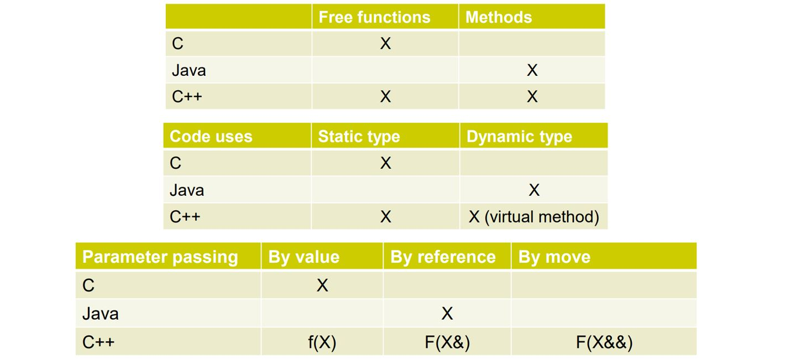

# C++ (Overview)

Common remarks on C++:
* complicated and difficult to learn
* unsafe (can scribble over memory and crash your program)
* incoherent mashup of every other programming language

These are all true; but still, C++:
* remains the language of choice
  * ahead of Java and in 3rd place on Tiobe Language Popularity index
* most of the advanced difficult features are for writing libraries. This can make writing applications in C++ easier
than in other languages

## C++ Standards

* 1979: "C with classes" invented by Bjarne Stroustrup
* 1998: the first standard
* 2011: C++11 standard..."a whole new language"
* 2017: C++17
  * medium-sized release containing library improvements: parallel algorithms, filesystem, string_view, optional, any, variant (tagged unions). Class Template Argument Deduction
* 2020: C++20
  * major release focused on Concepts, a major rearchitecture of templates and std::format, which makes formatting no longer suck
* 2023 (expected): C++23
  * Ranges and Modules will become useful
  * std::expected is a new paradigm for error handling

## C++ gaps

* no networking
* no thread pools
* asnychronous programming broken
* no sender-receiver
* no reflection (therefore no serialization, RPC, etc)
* way too many things still require unsafe code

## C++ safety

* C++ isn't safe
  * lets you access any memory location directly by its address ("pointers"), which by definition is unsafe
  * best known security CERTs are ascribed to unsafe memory usage in C and C++
* isn't as unsafe as people think either
  * modern C++ language and best practices vastly improve the situation
* still a long way to go

## C++ is not a standard

Some things are not mentioned in the C++ standard:
* bits in an integers
* DLLs
* whether characters are signed or unsigned
  * (signed int means e.g. ranges from -2147483648, 2147483647; unsigned 32-bit int ranges from 0,4294967295)
* common saying: "there are no interesting standards-compliant programs"

This reduces portability and is fragile; to combat the issue, if you need to rely on non-standardized behavior, try to rely on "implementation-defined" rather than "undefined" behavior so at least it is defined somewhere.

## C++ characteristics

* compiled
* multiparadigm (e.g. supports object-orientation)
* lightweight abstractions (supports low-level system programming and high-level abstractions)
* statically type safe and (largely) type inferenced
* Exceptions, Expected, and RAII

## C++ Compilation

* Java, Javscript use "Just in Time" (JIT) compilation
* C++ uses __"Ahead of Time"__ compilation (other examples: C, Rust, Swift)
  * may be less convenient because it means you must compile before running it
  * but the performance is faster because teh compiler can take its time to analyze the program in depth
  * enables metaprogramming for the compiler to control its code generation

## C++ use case

* C++ is a lightweight abstraction language that strikes a balance between being good for programmers (abstract) and good for the computer (i.e. low-memory, fast, low-level)
  * unlike almost any other language, C++ allows creation of powerful abstractions that are lightweight by having all the abstraction "compiled-away" during the build using __"`templates`"__. So, there is no performance penalty associated with using/creating abstractions.
* C++ offers low-level manipulation of code and data
  * no virtual machine, manual memory management, etc
* C++ offers abstraction through C++ generics, which use compile-time computation to generate optimal code

If you want code that is:
* good for the programmer (clear consistent, abstract, and extensible libraries)
* good for the computer (great time and space performance; low-level customizability)
Then C++ is most often the right language. Many programs don't need C++; i.e., it has no equivalent of scripting or notebooks for high-level programs.

https://www.youtube.com/watch?v=X4q1OM0voO0&list=PLRAV69dS1uWSR89FRQGZ6q9BR2b44Tr9N&index=1

Called "Golang" to avoid confusion caused by searching "Go" on search engines.

Features:
- Low Latency (if you are concerned about latency; adopted by twitch)
- Garbage Collection (if you want very fast and lots of support)
- GPU (if concerned about GPU power and utilization)
- Concurrency Support (built-in support)

# C++ Compilers

Common compilers for Windows:
* `Mingw`
* `MSVC`
* `clang llvm`

Common compilers for Linux:
* `GCC`
* `clang llvm`

to see what features each compiler supports, visit https://en.cppreference.com/w/cpp/compiler_support

For a windows machine, can go here to get `clang llvm` and `Mingw`: 

Can confirm installation successful at windows cmd: https://winlibs.com/
```
C:\Users\ascla>g++ --version
g++ (MinGW-W64 x86_64-ucrt-posix-seh, built by Brecht Sanders) 12.2.0
Copyright (C) 2022 Free Software Foundation, Inc.
This is free software; see the source for copying conditions.  There is NO
warranty; not even for MERCHANTABILITY or FITNESS FOR A PARTICULAR PURPOSE.


C:\Users\ascla>clang++ --version
(built by Brecht Sanders) clang version 15.0.6
Target: x86_64-w64-windows-gnu
Thread model: posix
InstalledDir: C:/mingw64/bin
```
For a windows machine, download microsoft visual studio to get the `MSVC compiler`. Can confirm installation by opening the newly installed "developer command prompt for VS 2019" and querying the compiler version:

```
**********************************************************************
** Visual Studio 2019 Developer Command Prompt v16.9.3
** Copyright (c) 2021 Microsoft Corporation
**********************************************************************

C:\Program Files (x86)\Microsoft Visual Studio\2019\BuildTools>cl.exe
Microsoft (R) C/C++ Optimizing Compiler Version 19.28.29913 for x86
Copyright (C) Microsoft Corporation.  All rights reserved.

usage: cl [ option... ] filename... [ /link linkoption... ]
```

https://godbolt.org/ is a pretty good online compiler that allows you to compile and run C++ code with various compilers. you can also share code snippets with others.

# running compilers and program

gcc
```
g++ -std=c++20 vector_simple_demo.cpp -o vector_simple_demo && vector_simple_demo
```

# Basics

## First program

```c++
#include <iostream>

int main(){
    std::cout << "num1" << std::endl;
    std::cout << "num2" ;
    std::cout << "num3" << std::endl;
    return 0;
}
```

`include` statement copies in a bunch of code at the top of the file before compilation. Like an import statement. The `return 0` statement tells the operating system the program exited successfully.
`iostream` is a header file that contains functions for basic I/O operations.

## Comments

* `//` for single-line comments.
* `/*` and `*/` for multi-line comments ("block comments").
* can't nest comments

## Errors

* Compile time errors
  * occurs during compilation... (e.g. missing semi-colon); causes compilation to fail. this is good.
* Runtime errors
  * logical error in your program; can cause a program to fail and crash
* Warnings
  * not serious enough to halt compilation; the compiler is telling you something about a problem that can be serious if not fixed soon. (division by 0 can actually be a warning)

## Functions

Functions have the following structure:
```c++
int addNumbers(int first, int second){
  int sum = first + second;
  return sum;
}

int main(int argc, char **argv)
{
  int first = 10;
  int second = 0;
  int sum;
  sum = addNumbers(first,second);
  std::cout << sum << std::endl;
  return 0;
}
```

## I/O

* `std::cout`: print data to console (terminal)
* `std::cin` read data from terminal
* `std::cerr` print errors to console
* `std::clog` print log messages to console

```c++
std::cout << "Hello World!" << std::endl;
std::cout << 12 << std::endl;
int age {21};
std::cout << "my age is " << age << std::endl;
// error
std::cerr << "std::cerr output: something went wrong " << age << std::endl;
// log
std::clog << "std::clog output: this is a log message " << std::endl;
```

### Output

```c++
std::cout << "Hello World!" << std::endl;
std::cout << 12 << std::endl;
int age {21};
std::cout << "my age is " << age << std::endl;
```

### Input

* use `std::cin` to get input from user
```c++
int age;
std::string name;

std::cout << "please enter your last name" << std::endl;
std::cin >> name;

std::cout << "please enter your age" << std::endl;
std::cin >> age;
```

* can chain getting input from user
```c++
int age;
std::string name;

std::cout << "please enter your last name and age, separated by spaced" << std::endl;
std::cin >> name >> age;
```

* can read a line of text from console like so
```c++
std::string full_name;
std::cout << "please enter your full name" << std::endl;
std::getline(std::cin, full_name);
```

## C++ program execution model

https://www.youtube.com/watch?v=8jLOx1hD3_o
jump to 02:49:57

## C++ Core Language vs Standard Library vs STL

* __Core Features__: core building block that makes up the C++ language; for example, how to define variables, the rules that make up how you can define and use functions, the rules about what you can and cannot do in C++, etc.. 
  * e.g. how functions are written, the built-in types
* __Standard Library__: a set of ready-to-use highly specialized components that we can use in our programs. e.g. `iostream`, `string`.
* __STL__: highly specialized part of the C++ standard library. collection of container types.

# Variables and Data Types

Common types
* `int`
* `double`
* `float`
* `char`
* `bool`
* `void` (represents a typeless type)
* `auto` (not a type; a keyword to deduce other types)

All data is stored in e.g. 32 bit wide (or 64 bit wide) registers. So the question is, how are ints, decimals, strings, etc represented in these registers.

a 32 bit wide register has 4 sections of 8 bits, which are called `bytes`.

## Number systems

Number systems transform data from forms readable to humans (e.g. `2`, `20.3`, `"Steve"`) into forms convenient for computers

* __base 10__:
  * `2371 = 2*10^3 + 3*10^2 + 7*10^1 + 1*10^0`
* __base 2 (binary)__:
  * `100101 = 1*2^5 + 0*10^4 + 0*2^3 + 1*2^2 + 0*2^1 + 1*2^0`

Generally, if we have `n` binary digits we can use to store 0's and 1's, then we can represent numbers from 0 all the way up to `2^n-1`.

For reference:
*  8 digits -> 1 byte  -> 0~255
* 16 digits -> 2 bytes -> 0~65535
* 32 digits -> 4 bytes -> 0~34359738367
* 64 digits -> 8 bytes -> 0~18446744073709551615

* __Hexadecimal system__: technique we use to shorten the length of a binary number. take a number and split it into groups of 4 bits:
  * 0000 -> 0 -> 0
  * 0001 -> 1 -> 1
  * 0010 -> 2 -> 2
  * 0011 -> 3 -> 3
  * 0100 -> 4 -> 4
  * 0101 -> 5 -> 5
  * 0110 -> 6 -> 6
  * 0111 -> 7 -> 7
  * 1000 -> 8 -> 8
  * 1001 -> 9 -> 9
  * 1010 -> 10 -> A
  * 1011 -> 11 -> B
  * 1100 -> 12 -> C
  * 1101 -> 13 -> D
  * 1110 -> 14 -> E
  * 1111 -> 15 -> F

Example: huge number in hexadecimal: `0x 6E30F13F`. We use `0x` in front to mean it is a hexadecimal number Each character represents 0-15 in base 10, which requires 4 bits in binary 0000-1111. So, rather than represent the large number as a 32 bit binary number, we can display it as a hexadecimal number and use fewer digits.

There also exists the seldom used __Octal system__, which groups numbers into 3 bits. Example: `0 15614170477`. `0` represents octal number system.

To represent numbers in C++ using various number systems, do it like so:
```c++
int num1 = 15; //15 in decimal
int num2 = 017; //15 in octal
int num3 = 0x0f; //15 in hexadecimal
int num4 = 0b00001111; //15 in binary - doable since C++14
```

In summary, hexadecimal system makes it a little easier for humans to handle streams of data with 1's and 0's. Octal system has the same goal but is seldom used anymore.

## basics

__variable__ a named piece of memory that you use to store specific types of data
* must start with lowercase letter or underscore
* are case sensitive

## braced variable initialization

initializing a variable has the form:
```c++
typename variable_name {intializer_value};
```

```c++
// compiler will put in garbage value
int elephant_count; // declare a variable
int elephant_count{}; // declares and initializes to 0
int elephant_count{10}; // declares and initializes to 10
int elephant_count{dog_count + cat_count}; // initializes with expression
int elephant_count{2.9}; // 2.9 is of type double, with wider range than int. will yield int.ERROR or WARNING
```

## functional variable initialization

```c++
int apple_count(5);
int orange_count(10);
int fruit_count (apple_count + orange_count);
int bad_initialization (doesnt_exist3 + doesnt_exist4);
// information loss. less safe than braced initializers.
int narrowing_conversion_functional (2.9); // implicit conversion; will happen silently. curly braces {} are preferred
```

## variable assignment initilization

```c++
int bike_count = 2;
int truck_count = 7;
int vehicle_count = bike_count + truck_count;
int narrowing_conversion_assignment = 2.9;
```

## size of a type in memory

Query the size of a type in memory with
```c++
std::cout << "sizeof int : " << sizeof(int) << std::endl;
std::cout << "sizeof int : " << sizeof(truck_count) << std::endl;
```

## `int`

* typically occupies 4 bytes (32-bits) or more in memory
* whether an int is signed or unsigned, it will still occupy the same amount of space in memory

## integer modifier (__`signed`__, __`unsigned`__, __`short`__, __`long`__)

* can make ints __`signed`__ or __`unsigned`__, which denotes whether to represent positive or negative or only positive integers
* `unsigned int`: can only be positive
  * unsigned int range: `[2,2^n-1]`, where `n` is the number of bits available in memory
  * e.g. 4 bytes in memory: `[0,4294967295]`
* `signed int`: can be positive or negative
  * signed int range `[2^(n-1), 2^(n-1)-1]`
  * e.g. 4 bytes in memory: `[-2147483648, 2147483647]`

* can make ints __`short`__ or __`long`__ to decrease or increase how much memory they take up
* `short int`: e.g. uses 2 bytes
* `int`: uses 4 bytes
* `long int`: uses 4 or 8 bytes
Can combine modifiers; for example: `signed long int myNumber {1234};`

These modifiers only work on integral types (data types in which you can store decimal numbers)
* can use `sizeof()` to confirm the memory occupied

## Fractional Numbers (__`float`__, __`double`__, __`long double`__)

__Floating Point Types__
* `float`: 4 bytes, 7 digits precision (number of bits you can represent)
* `double`: 8 bytes, 15 digits precision (may vary with compiler)
* `long double`: 12 bytes, precision > double
  * to create a float or long double literal, you MUST include the suffices (i.e. `1.022f` and `1.022L`)

```c++
float num1 {1.12345678901234567890f};
double num2 {1.12345678901234567890};
long double num3 {1.12345678901234567890L};

std::cout << std::setprecision(20) // sets the precision you want to see when printing numbers
std::cout << num1 << std::endl; // 7 digits
```

* things will change based on the compiler implementation

Floating point numbers are stored in memory using a specific floating point number memory representation (`IEEE_754`).
* if you take a floating point number and divide by 0, you will get `infinity(+/-)`
* `0.0/0.0` gives `NaN`; avoid this

## boolean (`bool`)

* a `bool` occupies 8 bits (1 byte) in memory; this seems wasteful, since a byte can store 256 states
* if you are working on a device with limited memory, there are techniques to store the boolean with less memory

example of bracket initialization:
```c++
bool redLight {true};
```

## Characters and Text (`char`)

* `char` data type is meant to store a single character; is wrapped in single quotes `'a'`
* occupies 1 byte of memory. Since 1 byte can represent 256 states, 1 byte is enough memory to represent the 128 __ASCII__ characters
* __unicode__ is a more extensive character set of almost 150,000 characters that includes letters in e.g. Arabic, East Asian Languages

```c++
char character1 {'a'}; // a character; wrapped in single quotes
char value = 65; // compiler will interpret 65 as a char, which represents A in the ASCII table
static_cast<int>(value) // transform char into an int 65 <= 'A'
```

## __`auto`__

__`auto`__ is a keyword that tells the compiler to deduce the type

```c++
auto var1 {12};
auto var2 {12.0};
auto var3 {12.0f};
auto var4 {12.0l};
auto var5 {'e'};
// int modifier suffices
auto var6 {123u};  // unsigned
auto var7 {123ul}; // unsigned long
auto var8 {123ll}; // long long
``` 

## Assignments

* `variablename = newvalue;`
* careful of assignments on variables declared with `auto` (e.g numeric types).

```c++
int var{123}; // declare and intialize
var = 55; // assignment
bool state{false};
state = true;
```

```c++
auto var3{333u};
var3 = -22; // danger! will get compile-time error, but you may not! compiler may do its best and put in a garbage value 
```

# Operations on Data

## basic operations (`+` `-` `*` `/` `%`)

* note: integer division truncates the remainder (`31/10==3`)

```c++
int product {num1 * num2};
int other_product = num1 * 2 * num2;

int quotient {num1 / num2};
int other_product = num1 * 2 * num2;
```

## Precedence and Associativity

multiple operators are executed by a specific precedence:
* __Precedence__: which operation to do first
* __Associativity__: which direction or which order
* it is best to make the intent in your code as clear as possible by clearly using `()` to indicate which operations to do first--rather than rely on precedence rules and make the evaluation ambiguous to the reader.
* there is a C++ operator precedence table with different precedence: https://en.cppreference.com/w/cpp/language/operator_precedence


## Postfix and Prefix addition, subtraction (`val++`,`++val`)

* in __postfix__ addition/subtraction, the expression evaluates first, then the expression increments (`val++`,`val--`)
* in __prefix__ addition/subtraction, the expression increments first, then the expression evaluates (`++val`, `--val`)
* the _postfix_, _prefix_ operations only exist for addition, subtraction
```c++
int value {5};
value = value + 1;
value++; // postfix addition; evaluates first, then increments
++value; // prefix addition; increments first, then evaluates

value = value - 1;
value--; // postfix subtraction; evaluates first, then decrements
--value; // prefix subtraction; decrements first, then evaluates
```

## Compound Assignment Operators (`+=`, `-=`, `*=`, `/=`, `%=`)

* Compound assignment operators allow you to shorthand an operation with an assignment
```c++
int val {4};
val+=1; // val = val+1; 4+1 == 5
val-=1; // val = val-1; 5-1 == 4
val*=2; // val = val*2; 4*2 == 8
val/=2; // val = val/2; 8/2 == 4
val%=3; // val = val%3; 4%3 == 1
```

## Relational Operators (`<`, `<=`, `==`, `>=`, `>`, `!=`)

## Logical Operators (`&&`, `||`, `!`)

## Output Formatting (`<ios>`, `<iomanip>`)

* `std::endl` adds a newline character; similar but not the same thing as `\n`
* `std::flush` sends whatever is in the output buffer to the terminal. causes immediate sending of data to the device connected to the stream
  * what is a buffer? when you send something to e.g. `std::cout` it does not go straight to the terminal. It goes to an intermediary buffer. It is like a storage unit in which data goes before going to the terminal.
* `std::setw()` sets a width for whatever text you want to send
* `std::right` sets a justification to the right
* `std::left` sets a justification to the right
* `std::internal` sets an internal justification
* `std::setfill('-')` sets a fill character
* `std::boolalpha` shows boolean output in the form of true and false; normally bools show as 1's and 0's
* `std::showpos` to show or hid + sign for positive numbers
* `std::dec`, `std::oct`, `std::hex` shows numerics in different number systems
* `std::showbase` shows the base (ie the number system) of any numerics printed
* `std::uppercase` has data printed out in uppercase
* `std::scientific`, `std::fixed` shows numbers in scientific notation, fixed-format notation
* `std::setprecision` sets the number of digits to print out for a floating point number. Default is 6.
* `std::showpoint` show trailing zeros if necessary


```c++
std::cout << std::setw(10) << "lastname" << std::setw(10) << "firstname" << std::endl;
std::cout << std::setw(10) << "clark" << std::setw(10) << "austin" << std::endl;
```

## determine limits of what is represented by a data type`<limits>`

helpful library for seeing the limits of what can be represented by data types
* `std::numeric_limits<T>::min()`: smallest positive number you can represent in type `T`
* `std::numeric_limits<T>::max()`: largest positive number you can represent in type `T`
* `std::numeric_limits<T>::lowest()`: lowest negative number you can represent in type `T`
```c++
// e.g. floating point
std::numeric_limits<float>::lowest() // -3.40282E+38
std::numeric_limits<float>::min() // 1.17549E-38
std::numeric_limits<float>::max() // 3.40282E+38

// e.g. signed integer
std::numeric_limits<float>::lowest() //
std::numeric_limits<float>::min() // -32768 ... will be negative if using signed integer
std::numeric_limits<float>::max() // 32767

// e.g. unsigned integer (short)
std::numeric_limits<float>::lowest() //
std::numeric_limits<float>::min() // 0
std::numeric_limits<float>::max() // 65535
```

## Math Functions (`<cmath>`: `floor()`, `ceil()`, `abs()`, `pow()`, `exp()`, `...`)

```c++
double x {-4000};
std::abs(x);
std::exp(x); // e^x
std::pow(x,2); // x^2
std::log(x); // base e log
std::log10(x); // base 10 log
std::sqrt(x);
std::round(x);
std::sin(x);
std::cos(x);
std::tan(x);
// ... other trig functions

```

## Weird Integral Types (dtypes w/ <4 bytes `char`, `short int`)

Cannot do arithmetic operations on datatypes represented by fewer than 4 bytes in size
* `int` was chosen as the smallest type for which they can do arithmetic operations.
* `char` is 1 byte in size
* `short int` on most processors is 2 bytes
* if you want to do arithmetic operations on these types, compilers are smart enough to implicitly convert these types from the smaller types to ints
```c++
short int var1 {10}; // 2 bytes
short int var1 {20};
char var3 {40}; // 1 byte
char var4 {50};
auto result1 = var1 + var2; // conversion to int; compiler has result be an int
auto result2 = var3 + var4; // conversion to int; compiler has result be an int
```
* the same behavior is present on other operators like bitwise shift operators (`>>`, `<<`)

# Flow Control

## `if`

```c++
if(condition){ // condition is any bool expression or variable
  //...
}
```

## `else`

```c++
if(condition){
  //...
} else {
  //...
}
```

## `else if`

```c++
if(condition){
  //...
} else if (condition2) {
  //...
} else {
  //...
}
```

## `switch`, `break`, `continue`

* a `break` statement after each case is very important. It stops processing the switch blcok when a successful case has been found. If the break statement is not there, all the cases following the current case will be executed.
* the condition inside a switch statement MUST be an _integral type_ or _enum_: `int`, `long`, `unsigned short`, etc
```c++
int Pen {1};
int Marker {2};

int tool {Pen};
switch (tool) {
  case Pen: {
    // ...
  }
  break; // NEED THIS ELSE INNER BODY WILL CONTINUE TO EXECUTE
  case Marker: {
    // ...
  }
  break;
  // ...
  default: {
    // ...
  }
}
```

## ternary operator (`... ? ... : ...`)

* __ternary operator__: shorthand notation for an if-else clause
* has form `result = (condition) ? option1 : option2;`
* __ternary intialization__: using ternary operator in intialization: `int speed {fast ? 300 : 150};`

# Loops

## `for` loop

pillars of any loop
* iterator
* starting point
* test (controls when the loop stops)
* increment (decrement)
* loop body

basic structure
```c++
for (unsigned int i{}; i< 10; ++i) {
  // ...
}
```
1. initialize `i`
2. run test: if true jump into loop body
3. run loop body
4. execute incrementation part
5. jump back to (2)

* can use `size_t` to declare iteration variable.
* `size_t`: type alias for some unsigned int representation (may be ~8 bytes on a system)
```c++
for (size_t i{0}; i<10; ++i){
  //...
}
```

* can leave out curly braces `{}` if you have only one statement to run in the loop
```c++
for (size i{}; i<5; ++i)
  //...
```

* note, the iterator variable is scoped to only be the body of the loop; declare the iterator variable outside the loop if you want to reference it after the for loop body
```c++
size_t j{};
for ( ; j<10; ++j)
  // ...
```

## `while` loop

```c++
while (condition){
  // ...
}
```

example
```c++
const unsigned int COUNT {10};
unsigned int i {0};
while (i < COUNT){
  // ...
}
```

## `Do while` loops

* the do-while loop runs the body first, then checks the test
```c++
const unsigned int COUNT {10};
unsigned int i {11}; // initialization

do{
  // ...
  ++i; // increment
} while (i < COUNT); // test

```

# Arrays

## array basics `array[]`

arrays are a way to setup collections in a program. for example, we may want to represent a collection of ints; each int is 4 bytes, or 64 bits.
* arrays store elements of the same type
* declare an array: `type arrayname[size];`
  * it will be filled with garbage values
* declare and initialize an array with values: `type arrayname[size] {val1, val2, ...};`
* can declare and initialize the array omitting the size at declaration; size will be inferred: `type arrayname[] {val1, val2, ...};`
* access an element at a specific index with: `arrayname[idx]`
* write data into an array with: `arrayname[idx] = newval`
* use `auto` when looping over an array to make code more adaptable to change
* can declare an array `const` to prevent writing to the arra

```c++
int scores[10]; // declares (allocates space in memory
double salaries[5] = {12.7, 7.5, 13.2, 8.1, 9.3}; // declare and initialize an array with values
scores[0] = 120; // write data to array
std::cout << scores[0]; // access data from array
int classSizes[] {10, 12, 15, 11, 18, 17}; // declare and intialize, omitting size (size will be inferred)

for (auto val: classSizes){
  // ...
}
```

## `range-based` for loop

```c++
int classSizes[] {10, 12, 15, 11, 18, 17}; // declare and intialize, omitting size (size will be inferred)

for (auto val: classSizes){
  // ...
}
```

## `std::size()`, `sizeof()` with arrays

* query for the size of an array at runtime with `std::size()` (c++17)
```c++
int scores[] = {10,12,15,11,18,17,22,23,24};
std::cout << std::size(scores);
for (size_t i{0}; i < std::size(scores); ++i)
  // ...
```

* before c++17, the `sizeof()` operator was used.
* `sizeof(array)` returns the entire size of the array
* `sizeof(array)/sizeof(array[0])` returns the size of the array because total memory / memory of 1 element == number of elements in the array
```c++
int scores[] = {10,12,15,11,18,17,22,23,24};
size_t count {sizeof(scores)/sizeof(scores[0])};
for (size_t i{0}; i < count; ++i)
  // ...
```

* nowadays, we can just use a range-based for loop to iterate over elements

## character array `char array[]`, null termination strings `\0`,

* character arrays are similar to other arrays for the most part:
```c++
char message[5] {'H','e','l','l','o'};
for (auto c : message){
  // ...
}
message[0] = 'h';
```

* character arrays are a little special in that the arrays themselves can be directly printed to the console without printing:
```c++
std::cout << "message: " << message;
```
* sometimes, this won't do what you expect because only proper C strings can be printed on the console
* a proper C string ends with `\0`, the __null termination string__: it tells C++ that we have hit the end of the string when e.g. printing to console
* if `\0`, it may sometimes print fine; other times, it may print garbage characters. The `\0` indicates the end of the string has been reached
```c++
char message[5] {'H','e','l','l','o','\0'}; // add '\0' to ensure the string will be printed properly
std::cout << message;
```

* if you initialize a char array and give it values, the remaining values will be filled with `\0`:
```c++
char message2[6] {'H','e','l','l','o',}; // last element ends up being '\0'
std::cout << message;
```

* if you initialize a char array with a string value (double-quotes) an implicit `\0` character is appended to the end of the string to make it a c string
```c++
char message4 [] {"Hello"}; // implicit '\0' character appended to the end of the string,
                            // making it a c string
```

## bounds of an array

when you declare an array, a block of unused memory will be found and allocated to store the (elements in the) array
* indexing out of bounds is still allowed by the compiler, but you should not do so because the memory location may
be used for some other purpose. other programs may modify the data you have written outside the bounds, or the program
may read bogus data at a later time. You may even corrupt data used by other parts of your program

# Pointers

## pointer basics
variables you use in code live in an address in memory


__pointer__: variable that stores the memory address of another variable

## declare and use pointer (address-of operator `&`, dereference operator `*`)

* declare a pointer with: __`type* ptrName;`__
* declare and initialize a pointer to be a null pointer: __`type* ptrName {nullptr}`__
* all pointers take up the same amount of space in memory (are the same size)
* position of the `*` does not matter when declaring a pointer
  * can declare with `type* ptr;`, `type * ptr;` or `type *ptr;`. it doesn't matter

```c++
int* pNumber {}; // can only store an address of a variable of type int
double* pFracNumber {}; // can only store an address of a variable of type double

// explicitly intialize a null pointer
int* pNumber1 {nullptr};
double* pFracNumber1 {nullptr}

// all the same
int*  pNum2{nullptr}
int * pNum2{nullptr}
int  *pNum2{nullptr}
```

* declare and initialize a pointer with memory address of another variable: `type* ptrName {&var};`
* `&` the memory __address-of__ operator returns the address of a variable in memory: `&var`
* `*` the `dereference operator` returns the object (value) held at a specific memory location: `*ptrName`
```c++
int var {43};
int* pVar &{var}; // have pointer hold address of var

int var2 {10};
pVar = &var2; // have pointer hold address of a different variable
std::cout << *pVar // 10`
```

## char pointers (`char*`)

* has similar behavior to pointers to other types
```c++
char* pChar{nullptr};
char charVar {'A'};
pChar = &charVar;
```

* char pointers are special because you can intialize them with a string literal
  * when you do this, the string is going to be expanded into a character array
  * the pointer points to the location of the first character created by the array
* as a result, strings can basically be treated as character arrays
  * however, some compilers will refuse to compile the below expression because the compiler will expand the string into a character array of `const char`, and the pointer declared is not for a `const char` but rather just `char`
```c++
char* pMessage {"Hello world!"}; // a char array will be created. pMessage holds mem address of 'H', the first char in the array created
// may not compile with every compiler because some compilers will expand the string into an array of const char, and the pointer
// is only for char--not const char

// instead, do this:
const char* {"Hellow word!"};
```
* to be explicit and not run into trouble, instead write `const char* pMessage {"mystr"};`

* note: you can modify a pure array intialized with a string literal
```c++
char message2[] {"Hello there"};
message2[0] = 'T';
```

## Program Memory Map

workflow: `type up source code --> compiler --> executable --> run executable`
* the source code (a compiled program) lives in a file on your _hard drive_
* when you run the program, you create a _process_. compiled program as a list of statements gets loaded into RAM into a dedicated section of memory for the process for storing program instructions (_code_ / _program area_)
  * so far we have been thinking that the instructions are loaded into our real memory (RAM) on our computer, but that's not the case.
  * the operating system is running a lot of programs, if the OS loads all the instructions for every program into RAM, we would run out of RAM.
  * so, the computer uses __virtual memory__: a trick that fools a program into thinking it is the only program running on the OS, and all memory resources belong to it. The view that each program has of its allocated memory is called the __memory map__.
  * each program is abstracted into a process, and each process has its own memory map and access to the memory range `0 ~ 2^N-1` where N is 32 on 32 bit systems and 64 on 64 bit systems. So each program thinks it owns the entire memory.
  * so, we have __Real Memory (RAM)__, which is all the memory the computer has, and we have __Virtual Memory (2^N-1)__, which is the memory a program has

* when we compile a program (e.g. on a 64 bit system), we generate a binary file, which will be a representation of how things are going to be layed out in memory in our program
* if we run the program, it will go through a section of the CPU called the __Memory Management Unit (MMU)__, which transforms between the memory map of each process and the real memory layout we have in RAM
* so, the entire program is not loaded in real memory by the CPU and MMU. Only parts that are about to be executed are loaded; this makes effective use of real memory, a valuable and lacking resource


example: we have 4 processes with their own memory maps (0~2^N-1), which will go through the MMU, and the MMU will assign them sections in the real RAM.
* __virtual Memory__: the memory map is a standard format defined by the OS. All programs written for that OS must conform to it. It is usually divided into some sections. This is why you can't take an executable compiled on windows and run it on a linux system.

Memory Map

* we have `0~2^N-1` address locations
* __stack__: where local variables are stored
* __heap__: additional memory that can be queried for at runtime; important for dynamic memory
* __text__: load the actual binary of the program so the CPU can execute it

## Dynamic Memory Allocation

This is a way to use heap storage for a c++ program
* so far, we've used pointers to refer to locations of variables living in stack memory
* generally, it is REALLY badd to use a pointer that is not initialized
```c++
int* pNum; // contains junk address: could be anything
*pNum = 55; // writing into junk address. BAD!
```
* do NOT use a pointer initialized to null
```c++
int* pNum3 {}; // intialized with pointer equivalent of zero: nullptr. a pointer pointing nowhere
*pNum = 33; // BAD! CRASH
```

So:
1. initialize your pointers before using them. Don't use a pointer that you did not initialize
2. don't try to work with a pointer that is a `nullptr`

Differences between stack and heap:

__stack__
* memory is finite
* developer isn't in full control of the memory lifetime
* lifetime is controlled by the scope mechanism
__heap__
* memory is finite
* developer is in full control of when memory is allocated and when it is released
* lifetime is controlled explicity through `new` and `delete` operators

> if you can avoid using _heap_ memory, you should. Use stack memory as much as possible

## creating a variable with limited lifetime using `{}` to scope

```c++
int main(){
  {
    int localScopedVar {33};
  }
  // localScopedVar no longer exists
  return 0;
}
```

## allocate dynamic memory (`new`)

use `new` keyword, which allocates a portion of memory and returns the address of the newly allocated space
```c++
// initialize pointer with dynamic memory.
// dynamically allocate memory at runtime and make a pointer point to it
int* pNum {nullptr};
pNum = new int; // dynamically allocate space for a single int on heap.
                // this memory bellongs to our program from now on.
                // the system can't use it for anything else, until we return it
                // after this line executes, we will have a valid memory location allocated.
                // the size of teh allocated memory will be such that it can store
                // the type pointer to be the pointer
*pNum = 55; // writing to dynamically allocated memory
```

* can declare and initialize pointers with `new` keyword
```c++
int* pNum1 {new int};
int* pNum2 {new int(22)};
int* pNum3 {new int{23}};
// ...
delete pNum1;
pNum1 = nullptr;
delete pNum2;
pNum2 = nullptr;
delete pNum3;
pNum3 = nullptr;
```

* note: it is REALLY bad to call delete twice on a pointer
  * will lead to undefied behavior. program may crash. avoid this like the plague.

example of stack vs heap
```c++
int main(){
  {
    int localScopedVar {33}; // only lives in the scope of the brackets; removed from stack memory when } reached
    int* localPtrVar = new int;
  }
  // localScopedVar no longer exists
  // still have access to the memory that localPtrVar was pointing to
  return 0;
}
```

## Releasing and resetting dynamic memory (`delete`)

use `delete` keyword, which frees the memory at the location to the operating system
```c++
int* pNum{nullptr};
pNum = new int;
// ... use memory
delete pNum; // returns the memory to the operating system
pNum = nullptr; // good practice is to set a pointer to nullptr to indicate there is no longer valid data at that location
```

## Dangling Pointer

__Dangling Pointer__: pointer that doesn't point to a valid memory address. Trying to dereference and use a dangling pointer will result in undefined behavior
* a dangling pointer is ALWAYS created when after removing memory from the heap
```c++
int* pNum {new int{3}};
//...
delete pNum; // freed memory on heap. pNum is now a dangling pointer!
```

3 kinds of dangling pointers
* __uninitialized pointer__
* __deleted pointer__
* __multiple pointers pointing to same memory__

_non-initialized pointer_
```c++
int* pNum; // dangling uninitialized pointer
std::cout << pNum << std::endl;  // junk value
std::cout << *pNum << std::endl; // might lead to CRASH
```

_deleted pointer_
```c++
int* pNum {new int{34}};
// ...
delete pNum; // freed memory on heap. pNum is now a dangling pointer!
std::cout << *pNum << std::endl; // might lead to CRASH
```

_multiple pointers pointing to same memory_
```c++
int* pNum1 {new int{53}}; 
int* pNum2 {pNum1};  // pNum2 points to same object on heap
// ...
delete pNum1; // freed memory on heap. now we have 2 dangling pointers!
std::cout << *pNum1 << std::endl; // CRASH!
std::cout << *pNum2 << std::endl; // CRASH!
```

## Remedies to Dangling Pointers

1. initialize your pointers; when you declare a pointer, immediately initialize it. if you don't know what to initialize it with, put in `nullptr` first and later put in an actual address. This also allows programmers to check a pointer against `nullptr` to see if the pointer contains something valid before using it
2. reset pointers to `nullptr` after you `delete` them in memory (always set a pointer to `nullptr` after a `delete` call)
3. for multiple pointers to same address, make sure the owner pointer is very clear. choose one pointer to be the master of the controller of the memory. all other pointers are going to be slaves. They can use that memory, but they don't have the task of releasing that memory

1. _intializing pointers_
```c++
int* pNum1{}; // good. initializes with nullptr
int* pNum2{new int{56}} // good. initializes with 56

// check for nullptr before use
if(pNum != nullptr)
  // ...
```

2. _resetting pointers to `nullptr` after `delete`_
```c++
int *pNum{new int{32}};
// ...
delete pNum;
pNum = nullptr;

// check for nullptr before use
if(pNum != nullptr)
  // ...
```

3. _designate master pointer_
```c++
int* pNum1 {new int{382}}; // say pNum1 is the master pointer
int* pNum2 {pNum1};
// ...
delete pNum1; // master releases memory
pNum1 = nullptr;

// only use slave pointers when master pointer is valid!!!
if (!(pNum1 == nullptr))
  std::cout << pNum2 << std::endl;
```

## when `new` fails (`try-catch`, `exceptions`)

`new` fails very rarely in practice, and you'll see many programs that assume that it always works and don't check for memory allocation failure in any way
* depending on the application, failed memory allocations can be very bad, and you need to check and handle them.

```c++
int* lotsOfInts {new int[1000000000000]}; // may give error about exceeding array size
// use huge loop to try and exhaust the memory capabilities of your system.
// when new fails, your program is going to forcefuly terminate.
for (size_t i{}; i<100000000; ++i){
  int* lotsOfInts2 {new int[100000]};
}
```

handle this issue
1. through exception mechanism. a built-in way to check for errors and handle them
2. can `std::nothrow` setting to not throw an exception and instead give a `nullptr`

1. _exception mechanism_
```c++
// handle the problem in a way that makes sense for the application.
// for example, if you were trying to allocate memory to store color information
// for your application, and allocation fails, you could opt for showing some
// feedback message to the user and rendering your app in black/white
for (size_t i{}; i<10000000; ++i){
  try {
    int* lotsOfInts {new int[100000]};
  } catch(std::exception& ex){
    std::cout << "caught exception ourselves: " << ex.what() << std::endl;
  }
}
```

2. _`std::nothrow`_
```c++
for (size_t i{}; i<10000000; ++i){
  int* lotsOfInts {new(std::nothrow) new int[100000]};

  if (lotsOfInts == nullptr){
    // don't try to dereference and use lotsOfInts in here.
    // you'll get UB. No memory has reall ybeen allocated here.
    // it failed and returned nullptr because of teh std::nothrow setting
    std::cout << "mem allocation failed" << std::endl;
  } else {
    std::cout << "mem allocation succeeded" << std::endl;
  }
}
```

## Null pointer safety

__null pointer safety__: refers to practices that make sure you are working with pointers containing valid memory addresses
* can confirm a pointer points to a valid memory address with a null-pointer check

_verbose nullptr check_
```c++
// verbose nullptr check
int* pNum{}; // initialized to nullptr
if (!(pNum == nullptr)){
  std::cout << "pNum points to a VALID address" << std::endl;
} else {
  std::cout << "pNum points to an INVALID address" << std::endl;
}
```

_compact nullptr check_
```c++
// compact nullptr check
int* pNum{}; // initialized to nullptr
if (pNum){ // pointer gets implicitly converted into a boolean expression
  std::cout << "pNum points to a VALID address" << std::endl;
} else {
  std::cout << "pNum points to an INVALID address" << std::endl;
}
```

* __Note__: it is safe to call `delete` on a pointer containing `nullptr`
```c++
int* pNum {}; // initialized to nullptr
delete pNum; // this won't cause any problem if pNum contains nullptr

// so, no need to overdo with something like
if(pNum){
  delete pNum;
  pNum = nullptr;
}
```

## Memory Leaks

__Memory Leak__: when you lose access to memory that was dynamically allocated

```c++
int* pNumber {new int{67}};
int number{55};
pNumber = &number; // we have a memory leak now!
// no longer have a way to release memory because the pointer that was pointing to that memory location has now been repurposed

int* pNumber {new int{55}};
pNumber = new int{44}; // memory leak!

{
  int* pNumber {new int{57}};
} // memory leak when scope closes because pNumber is deleted!
```

# Dynamic Arrays

__dynamic array__: array allocated on the heap with the `new` operator. can also use `std::nothrew` version of new

```c++
size_t size{10};

double* pSalaries{ new double[size]}; // will have garbage values
int* pStudents{ new(std::nothrow) int[size]{}}; // all values initialized to 0
double* pScores { new(std::nothrow) double[size]{1,2,3,4,5}};
```

* pointers initialized with dynamic arrays are different from arrays
* `std::size` does not work on them, and they do not support rnage based for loops
```c++
double* temps = new double[size] = {10.0, 20.0,30.0,40.0,50.0,60.0};

for (double temp : temps){
  std::cout << "temp : " << temp << std::endl;
}
```
* we say a dynamically allocated array has decayed into a pointer

## deleting dynamic arrays

```c++
delete[] pScores;
pScores = nullptr; // do this to be a good c++ programmer

delete[] pStudents;
pStudents = nullptr;

delete[] pSalaries;
pSalaries = nullptr;
```

# References

a way to set up aliases for variables that already exist
* note if a reference is destroyed (e.g. its scope closes), the variable it references does not also get destroyed. a reference does not manage the lifetime of the object it refers to.

## declaring and using references

```c++
int value {45};
int& valueRef{value}; // create a reference
int& valueRef = value; // alternate notation
```

## references vs pointers

* __pointer__: stores address of a variable; we can go through a pointer to access and modify a variable
* __reference__: pretty much same thing as a  variable, except that it does not manage the 
memory lifetime of the variable 

__the differences__:
* references don't use dereferencing for and reading and writing
* references can't be changed to reference something else
* references must be initialized at declarations
* pointers must go through dereference operator to read/write through pointed to value
* can be changed to point somewhere else
* can be declared un-initialized (will contain garbage addresses)

```c++
double value {12.34};
double& valueRef {value};
double* valuePtr {&value};
double otherValue {100.0};

// legal, but actually changes the value referenced by valueRef to be 100.0
valueRef = otherValue;

// if valueRef changes now, otherValue remains unchanged.
valueRef = 333.33;
```

a reference behaves like a constant pointer, but with a friendlier syntax as they don't require dereferencing to read and write through referenced data.

## references and `const`

### non-const reference

a non-constant reference is the typical kind
```c++
// non-const reference
int age{26};
int& refAge{age}; // basic
// can use refAge just like a variable
// age and refAge refer to the same variable
```

### const reference
```c++
int age{26};
const int& refAge{age};
refAge = 30; // Error
// can't modify original variable
```

### const pointer

remember a reference by default is just like a constant pointer
* a constant reference can be achieved with a constant pointer to constant data
```c++
int age {20};
const int* const agePtr{&age};
*agePtr = 10; // error
```

# Character manipulation and Strings

## Character manipulation

* `std::isalnum`
* `std::isalpha`
* `std::isblank`
* `std::islower`
* `std::isupper`
* `std::isdigit`
* `std::tolower`
* `std::toupper`

## C-string manipulation

a less safe way of using strings. avoid
skipped: https://www.youtube.com/watch?v=8jLOx1hD3_o

## C-string concatenation and copying

a less safe way of using strings. avoid.
skipped.

## `std::string`

`std::string` is a safe standard library toolset for working with strings
* with c-strings, you have to remember the size of strings, and the null character
* `std::string` is a high level type that hides the annoying low-level details involved with C-strings
```c++
std::string fullName;
std::string planet{"earth"};
std::string letters{5,"e"};
```

# Functions

## One definition rule

__One definition rule__: definitions can't show up more than once in an entire program or translation unit. Applies to
* free standing variables
* functions
* classes
* class member functions
* class static member variables
The exception to the rule is the definition for a class. it can show up in multiple translation units.
* for example, we can have a class `Point` in two separate files and can build the files together fine. we can have the same definition for a class appear in two different translation units

## basics

__Function__: reusable piece of code that can take a number of optional inputs and produce some desieable output
* a function can optionally take parameters
* a function can optionally return something; it is `void` if it does not return something
```
returnType functionName (param1, param2,...){
  //operations
  return returnType;
}
```
```c++
void function1 (){
  //operations
}

void function1 (int x1) { // allowed bc signature different
  //operations
}

int add(int x1, int x2) {
  return x1 + x2;
}
```

__function signature__: function name + function parameters
* every function signature in a program must be unique

## implicit conversions in functions

when making a function call, implicit conversions may occur:

```c++
double f{20.21};
double g{51.26};
min(f,g); // takes ints as arguments. will result in narrowing and precision loss
```

## parameter passing (default copy behavior)

by default, arguments are copied into the function stack when a function is invoked, so you are working with a copy
```c++
double incrementMultiply(double a, double b){
  double res = (++a)*(++b); // this mutates the local copy of a,b but not the a and b in the calling scope that were passed in
  return result
}
```

## function declarations and definitions

sometimes it is more flexible to split the function into it's header and body to keep the code for each in different places. Can separate a function into two parts
* __declaration (prototype)__: has a return type, function name, parameters, and a semicolon (e.g. `int max(int a, int b);`)
* a prototype must come before the function call in the file; compilation error otherwise
* __definition__: has the full implementation
```c++
int max(int a, int b); // DECLARATION

int main(){
  // operations...
  return 0;
}

int max(int a, int b){ // DEFINITION
  if (a>b){
    return a;
  }
  return b;
}
```

## function across multiple files: compilation model revisited

basic compilation: compiler compiles a single cpp file into a binary executible

compilation consists of preprocessing, compilation, and linking:
1. preprocessing
2. compilation
3. linking

* say we have multiple cpp source files
* in __preprocessing__: the compiler looks for all the `#include` statements and performs copy pasting to copy paste in the mentioned code
```c++
#include <iostream> // will be deleted and replaced with a lot of copy-pasted source code; this copies everything in the source file into this location.
```
* the outcome of the preprocessing phase is the creation of `translation units`
* in __compilation__, the compiler will generate an `object file` for every translation unit (20 translation units become 20 object files)
* the __linker__ stitches together object files to create a single executible binary that runs on a specific operating system

example project
```
comparisons.h    // contains 2 function declarations
comparisons.cpp  // implementations
operations.h     // contains 1 function declaration
operations.cpp   // implementations
main.cpp
```
* remember the _one definition rule_: the same function implementation can't show up in the global namespace more than once
* the linker searches for definitions in all translation units (.cpp) files in the project. the function definition doesn't have to live in a .cpp file with the same name as the header (e.g. the definition for a function in `compare.h` could live in `comparisons.cpp`)
* a translation unit is mostly equivalent to a cpp file

```c++
// compare.h
int min(int a, int b);
int max(int a, int b);

// compare.cpp
int max(int a, int b){ // definitions do not need to live in header file
  if (a>b){
    return a;
  }
  return b;
}
int min(int a, int b){
  if (a<b){
    return a;
  }
  return b;
}

// operations.h
int incrMult(int a, int b);

// operations.cpp
int incrMult(int a, int b){
  return ((++a)*(++b));
}

// main.cpp
#include "compare.h" // preprocessor copy-pastes compare.h here;
                     // this is a preprocessor directive
#include "operations.h"

int main(){
  // operations...
  return 0;
}
```
* it is the linker phase that looks through e.g. `main.cpp`, sees the invocation of a function, and then looks through the translation units to find the function definition; so you will get linker error if the definition does not exist / cannot be found

## passing parameter (by value)

passing a parameter by value: a copy of a variable is made and passed into a function
* happens by default
```c++
void sayAge(int age);

int main(){
  int age {23};
  sayAge(age);
  // age is still == 23

  return 0;
}

void sayAge(int age){
  ++age; // local variable (age) is a copy of the variable passed in from the calling scope
  cout << "my age is " << age << endl;
  // age copy will be deleted when function scope closes
}
```

## passing parameter (by pointer)

passing a parameter by pointer: a copy of a pointer variable is made and passed into a function; we are still making and working with a copy of a variable in the function body, but because we made a copy of the pointer, i.e. the variable holding the memory address of another variable, we can still use that memory address to refer to the existing object, meaning we can mutate it if we want:
* happens whenever we have a pointer argument; we can use the pointer to mutate and access an underlying, existing object (i.e. the original variable)
```c++
void sayAge(int* age);

int main(){
  int age {23};
  sayAge(&age);
  // age is now modified

  return 0;
}

void sayAge(int* age){
  ++(*age); // local variable (age) is a copy of the variable passed in from the calling scope, so it is a copy of the memory address, but a copy of a memory address can still be used to access the underlying variable at that memory address. the thing located at location "age" has now changed.
  cout << "my age is " << *age << endl;
  // age copy will be deleted when function scope closes (the copy of the pointer passed in)
}
```

## passing parameter (by reference)

passing a parameter by reference: the compiler will make a reference variable which will allow the function scope to be able to reference an existing object, meaning we can mutate it if we want:
* happens whenever we have a reference argument; we can use the reference to mutate and access an underlying, existing object (i.e. the original variable to which the reference refers to)
* allows us to not have to dereference pointers to e.g. access an existing object
```c++
void sayAge(int& age);

int main(){
  int age {23};
  sayAge(age);
  // age is now modified

  return 0;
}

void sayAge(int& age){
  ++age; // local reference variable (age) is a new reference variable that allows us to work with a reference to an existing variable in the calling scope. this call mutates the underlying object referred to by age.
  cout << "my age is " << *age << endl;
  // the "age" reference variable will be deleted when function scope closes
}
```

## input and output parameters

prefixing a parameter with `const` makes it such that e.g. a reference variable may not be modifiable
```c++
void maxStr(const std::string& input1, std::string& output); // can't modify 'input1'; can modify 'output' variable
```
generally, it is advisable that:
* output parameters should be passed in such a way that you can modify the arguments inside the function.
  * accomplish with _pass by reference_ or _pass by pointer_
* input parameters shouldn't be modifiable from inside a function. the function really needs to get input (read) from the arguments. you can enforce modifications with the `const` keyword
  * accomplish with _const reference_, _pointer to const variable_, or _const pointer to const variable_

for output parameters, a different approach is to rather return an output from the function, rather than pass an output variable into the function with the intention of having the function store the result in that variable.

__NOTE__: modern compilers commonly take return by value and optimize it out when possible. Rather, the compiler modifies the function behind your back to return by reference, avoiding unnecessary copies. E.g., the compiler has the local variable returned by reference; the memory address of the local variable in the function is the same as the result variable in the calling scope.

## function overloading

function overloading is allowed in C++, which means that multiple functions can be named the same function; they only need to have different signatures
```c++
int max(int a, int b);
// double max(int a, int b); // can't overload by return type
double max(double a, double b);

```
* the compiler uses static analysis at compilation to understand which function to call during execution
* functions can not be overloaded by return type

overloading can be achieved with the:
* __order of the arguments__ (e.g. `int a, double b` versus `double b, int a`)
* __number of the arguments__ (e.g. `int a` versus `int a, int b`)
* __types of the arguments__ (e.g. `int a` versus `double a`)

# Lambda Functions

## basics (declaring, using)

__Lambda function__: mechanism to set up anonymous functions (without names). once set up, they can be given names and can be called, or we can even get them to do things directly.

_lambda function signature_
```
[capture_list] (parameters) -> returntype{
  // function body
}
```
* _capture list_: where you can say what existing variables in the outer scope you want included in the scope of the lambda function
* _parameters_: where you can pass arguments into your lambda function
* _returntype_ is optional
* _function body_: where function body is written
```c++
auto func = [](){
  std::cout << "hello world!" << std::endl;
};
func();
// nothing in capture list, no parameters, assigned to func variable
// with auto assignment.
```

can also define and execute a lambda function without even giving it a name
```c++
// call lambda function directly after definition
[](){
  std::cout << "hello world!" << std::endl;
}();
```

example with parameters
```c++
auto result = [](double a, double b){
  return (a+b);
}(2,4);
```

can also place definition and execution of a lambda value in a place where e.g. a result is expected
```c++
cout << [](double a, double b)->double{return (a+b);}(2,4) << endl;
```

specifying a return type will lead to implicit type conversions
```c++
// prints result of adding ints as a double
cout << [](int a, int b)->double{return (a+b);}(2,4) << endl;
```

## capture lists `[]`

__capture list__: allows variables existing in the scope of where a lambda function is defined to be put into the scope of the lambda function
* default behavior is that a variable is `captured by value` (makes a copy)
* putting a `&` in front of a variable captures it by reference: `captured by reference` (makes a reference to variable in outer scope)
* Capture everything in a context by value with `[=]`
* Capture everything in a context by reference with `[&]`
```c++
double a{20};
double b{32};

auto func = [a,b](){ // capture a,b by value (a copy)
  return a+b;
};
func(); // a,b unchanged in this scope
```

```c++
double a{20};
double b{32};

auto func = [&a,&b](){ // capture a,b by reference
  return a+b;
};
func(); // a,b have changed in this scope
```
```c++
double a{20};
double b{32};

auto func = [=](){ // capture everything by value
  return a+b;
};
func();
```

# Function Templates

## basics

Use __function templates__ to remove code repitition; function templates help with this
* whereever the compiler sees invocations of the template function, it will look at the types used
in that function call to generate an overloaded method to support that type
* function templates are NOT actual c++ code; rather, they are recipes for the compiler to generate code
* the real c++ function generated by the compiler is called a __template instance__
* a template instance will be reused when a similar function call (argument types) is issued. No duplicates are generated by the compiler
* the arguments passed to a function template must support the operations that are done in the body of the function
```c++
// this template below allows you to define a generic maximum function
// for each invocation of this function, the compiler will perform code generation
// of the necessary function for you (i.e. it will create multiple overloads)
template <typename T>
T maximum(T a, T b){
  return (a > b) ? a : b; // a and b must support the > operator. Otherwise, hard ERROR
}

int main(){
  int a{10};
  int b{23};
  double c{34.7};
  double d{23.4};
  std::string e{"hello"};
  std::string f{"world"};

  maximum(a,b); // int version created
  maximum(c,d); // double version created
  maximum(e,f); // string version created
  return 0;
}
```
* `T` is an example of a symbol that acts as the place holder for the type

## Type deducation and explicit arguments `<>`

__template type deduction__: the mechanism the compiler uses to deduce the type it would use to setup the template instance from the arguments passed to a function call (to a function template)
* automatic template type production can sometimes lead to problems, so explicit type deduction can increase clarity
* to force a compiler to create a certain kind of template instance, use the `<type,...>` with the function call
* __template parameter__: what is written in the template definition (e.g. `T a, T b`)
* __template arguments__: the arguments involved in the function call to the template function (e.g. `maximum(c,d)`)
```c++
template <typename T>
T maximum(T a, T b){
  return (a > b) ? a : b; // a and b must support the > operator. Otherwise, hard ERROR
}

int main(){
  int a{10};
  int b{23};
  double c{34.7};
  double d{23.4};
  std::string e{"hello"};
  std::string f{"world"};

  auto max1 = maximum<double>(c,d); // explicitly say that we want double version called. 
                                    // will create this function: double maximum(double a, double b)
  auto max2 = maximum<double>(a,c); // works, even if parameters of different types.
                                    // since a is an int, there will be an implicit type conversion of a to a double first.
                                    // then the double maximum(double a, double b) will be used
  auto max3 = maximum<double>(e,f); // Error : can't convert std::string to double
  return 0;
}
```

## Template Type Parameters by value `T`, by reference `&T`

By default, template accept arguments by value `T`:
```c++
template <typename T>
T maximum(T a, T b){ // accepts variables by value, returns variable by value
  return (a > b) ? a : b;
}
```
* a template can accept arguments by reference instead `&T`
```c++
template <typename T>
const &T maximum(const &T a,const &T b){ // accepts variables by reference. const added for good measure to ensure variables are not mutated
  return (a > b) ? a : b;
}
```
* a compiler will become confused if you overload a function to have a version involving accepting arguments by value and another version involving accepting arguments by reference
```c++
// this confuses the compiler since it does not know when you invoke a function whether you want to pass by value or lvalue reference
template <typename T> T maximum(T a, T b){ return (a > b) ? a : b; }
template <typename T> const &T maximum(const &T a,const &T b){ return (a > b) ? a : b; }
```

## Template Specialization

__Template Specialization__: allows a programmer to define certain templates very specifically (for instance maybe the function needs to work differently with a particular variable type)
```c++
// function template
template <typename T> T maximum(T a, T b){ return (a > b) ? a : b; }

// function template specialization
template <> const char* maximum<const char*> (const char* a, const char* b){ 
  return (std::strcmp(a,b) > 0) ? a : b;
}

// when the function template is invoked with a const char*, the specialized method
// will be used instead of the default function template

// if calling with int, double, etc... it will use the regular function template
// but if we pass a const *char into the maximum function, the function will compare pointers 
// and not give us the behavior we want (it won't compare the length of the strings)
// so we want to define a specialized function implementation for const char*
```

## `concepts` (standard)

__concepts__: mechanism to place constraints on template type parameters
* e.g. only call this function with an int parameter
* only available in c++20
```c++
#include <concepts>

template <typename T>
void printNumber(T n){
  static_assert(std::isIntegral<T>::value, "must pass in an integral argument");
  std::cout << n << std::endl;
}
```

two kinds of concepts
* __standard built-in concepts__: come with the c++ language
* __custom concepts__: can build your own concepts

__built-in concepts__
* `same_as`: specifies a type is the same as another type
* `dervied_from`: specifies that a type is derived from another type
* `convertible_to`: specifies that a type is implicitly convertible to another type
* `common_reference_with`: specifies that two types share a common reference type
* `common_with`: specifies that two types share a common type
* `integral`: specifies that a type is an integral type
* `signed_integral`: specifies that a type is an integral type that is signed
* `unsigned_integral`: specifies that at ype is an integral type that is unsigned
* `floating_point`: specifies that a type is a floating-point type

### syntax1: (`requires std::integral<T>`)

__`requires`__ keyword is one way to specify a concept constraint on a template
* specify the (1) template declaration `template <typename T>`
* then specify the (2) the requires clause
```c++
template <typename T>
requires std::integral<T> // creates compiler error if the generated function template instance uses a type violating this constraint
T add (T a, T b){
  return a + b;
}
// e.g. works with char and int but does not work with double
```

using __type traits__
* you can also specify the requires statement with a statement that results in a boolean (and can be evaluated at compile-time)
```c++
template <typename T>
requires std::is_integral_v<T> // concept succeeds if statement returns true at compile-time
T add (T a, T b){
  return a + b;
}
```

### syntax2: template declaration with concept (`template <std::integral T>`)

when writing the template declaration, add the concept to the type parameter declaration
```c++
template <std::integral T>
T add (T a, T b){
  return a + b;
}
```

### syntax3: concept with auto (`auto add (std::integral auto a, std::integral auto b)`)

there is a syntax that can be used if using the `auto` keyword
```c++
auto add (std::integral auto a, std::integral auto b){
  return a + b;
}
```

### syntax4: add `requires` statement after parameter list
```c++
template <std::integral T>
T add (T a, T b) requires std::integral<T>{
  return a + b;
}
```

## `concepts` (custom)

define your own concepts
```c++
template <typename T>
concept MyIntegral = std::is_integral_v<T> // using a type trait

template <typename T>
concept Multipliable = requires (T a, T b){
  a * b; // just makes sure the syntax is valid
}

template <typename T>
concept Incrementable = requires (T a){
  a+=1;
  ++a;
  a++;
}
```

using custom concepts
```c++
// syntax 1
template <typename T>
requires MyIntegral<T>
T add1(T a, T b){
  return a + b;
}

// syntax 2
template <MyIntegral T>
T add2(T a, T b){
  return a + b;
}

// with auto syntax
auto add3(MyIntegral auto a, MyIntegral auto b){
  return a + b;
}
```

## `requires` (detailed)

four kinds of requirements
* __simple requirements__
* __nested requirements__
* __compound requirements__
* __type requirements__

### simple requirement

This requires that a particular syntax involving type `T` is legal
```c++
template <typename T>
concept TinyType = requires (T t){
  sizeof(T) <=4; // simple requirement: only checks syntax. does not enforce that the expression evaluates to true
};
```

### nested requirement

To make additional confirmations about a type, you need a nested requirement
```c++
template <typename T>
concept TinyType = requires (T t){
  sizeof(T) <=4; // simple requirement: only checks syntax is legal
  requires sizeof(T) <= 4; // nested requirement: checks the expression is true
};
```

### compound requirement

```c++
template <typename T>
concept Addable = requires (T a, T b){
  // (noexcept is optional)
  {a + b} noexcept -> std::convertible_to<int> // compound requirement
  // checks that
  // (1) a + b is valid syntax,
  // (2) the operation doesn't throw exceptions (optional),
  // (3) the result is convertible to int (optional)
};

Addable auto add( Addable auto a, Addable auto b){
  return a + b;
}
```

## logical combinations of concepts

concepts can be combined with the logical operators __`&&`__ and __`||`__
* e.g. `T func(T t) requires std::integral<T> || std::floating_point<T>`
* e.g. `T func(T t) requires std::integral<T> && TinyType<T>`
```c++
template <typename T>
T func(T t) requires std::integral<T> && TinyType<T> {
  std::cout << "val: " << t << std::endl;
  return (2*t);
}
```

## `concepts` with `auto`

in prior section, we saw basic use of concepts and auto
```c++
std::integral auto add(std::integral auto a, std::integral auto b){
  return a + b;
}
```

you can declare a constraint for a variable to ensure certain properties
```c++
std::integral auto x = add(10,20);
std::floating_point auto x = add(10,20); // compiler error
std::floating_point auto y = 7.7; // can work with literal...may not be super helpful
```
* this might come in handy if you define a concept that requires a type to have certain member functions. it is kind of like specifying an interface without creating an abstract class

# Classes

## basics (`public`, `private`)

c++ comes with certain basic built-in types, but sometimes we will want to create larger, more complex types
* `int`, `float`, `double`, `char`, `std::string`

__classes__: a mechanism in c++ to build our own types
* a class is a blueprint for a class type, which we can use to build objects in our program
* classes have __member variables__ and __member functions__
* the `public`, `private` keywords determine whether the member variable / function is publically accessible or hidden from outside the class scope
* by default, member variables and member functions are `private`

```c++
// class declaration and definition
class Cylinder {
  public:
    double baseRadius{1.0}; // declares member variable and provides default initialization
    double height{1.0}; // declares member variable and provides default initialization
  
    double volume(){ // public member function
      return PI * baseRadius * baseRadius * height;
    }
};

int main(){
  Cylinder cylinder1; // creates a Cylinder instance
  cylinder1.baseRadius = 3.0;
  cylinder1.height = 2;
  return 0;
}
```
* class member variables can either be raw stack variables or pointers
  * members can't be references; this is because references can never be left uninitialized, and in classes when we declare member variables the ability to leave them uninitialized, and we can't really do that with references
* classes have functions (methods) that let them do things
* class methods have access to member variables, regardless of whether they are `public` or `private`
* private members of classes (variables and functions) aren't accessible from outside the class definition

## Class Constructors

__Constructor__: special kind of method that is called when an instance of a class is created
* no return type
* they have the same name as the class
* can have parameters. can also have an empter parameter list
* usually used to initialize member variables of a class 

```c++
class Cylinder {
  private:
    double baseRadius{1.0};
    double height{1.0};
  
  public: 
    Cylinder() {
      baseRadius = 2.0;
      height = 2.0;
    };

    Cylinder(double radiusParam, double heightParam){
      baseRadius = radiusParam;
      height = heightParam;
    }

    double volume(){
      return PI * baseRadius * baseRadius * height;
    }
};

int main(){
  Cylinder cylinder1; // creates a Cylinder instance
  cylinder1.baseRadius = 3.0;
  cylinder1.height = 2;
  return 0;
}
```

### Default Constructor (`default`)

normally, the compiler will generate a default constructor if you do not specify one
* but if you want to define a new constructor and still get the original default constructor that would be generated by the compiler, use `default` 
```c++
class Cylinder {
  private:
    double baseRadius{1.0};
    double height{1.0};
  public:
    // constructors
    Cylinder() = default;
    Cylinder(double radiusParam, double heightParam){
      baseRadius = radiusParam;
      height = heightParam;
    }
    double volume(){
      return PI * baseRadius * baseRadius * height;
    }
    // ...
};
```

### getters, setters

good practice is to use getter and setter methods to access attributes indirectly, rather than allowing client code to access and modify attributes directly.
* define the class's data as `private`, but define a publid `getter` and `setter` method that allows access and modification to that variable
* this allows the programmer to control how the attribute should be presented to the outside world (i.e. in the getter method) or changed internally (i.e. in the setter method), without the client code needing to know.

### split a class across multiple files

it is good practice to move implementation details into other cpp files, and then define header files that client code can import to use features in their program (and without needing to know the implementation details)
* typically code is split into a header and cpp file. it is up to you to decide how much implementation you want written in the header file
```c++
constants.h // contains PI
cylinder.h // contains class declaration
cylinder.cpp // contains class implementation details

// main.cpp
#include "constants"
#include "cylinder"
...
```

constants.h
```c++
// add a guard to prevent this file from being included more than once
#ifndef CONSTANTS_H // do something or only include this code if CONSTANTS_H is not defined yet by the pre-processor
#define CONSTANTS_H
const double PI {3.14159};
#endif
```

cylinder.h
```c++
#ifndef CYLINDER_H
#define CYLINDER_H
#include "constants"

class Cylinder {
  private:
    double baseRadius{1.0};
    double height{1.0};
  public:
    // constructors
    Cylinder() = default;
    Cylinder(double radiusParam, double heightParam); // just a declaration
    double volume();
    // ...
};
#endif
```

cylinder.cpp
```c++
#include "cylinder.h"


// :: is a scope resolution operator. it's saying the scope where the RHS thing should live in
Cylinder::Cylinder(double radiusParam, double heightParam){ // compiler knows this is an implementation of a function declared in the header file
  baseRadius = radiusParam;
  height = heightParam;
}

double Cylinder::volume(){
  return PI * baseRadius * baseRadius * height;
}
```

main.cpp
```c++
#include "constants"
#include "cylinder"
// ...
```

## managing class objects through pointers

If using classes through dynamic memory allocation, you may need to use objects with pointers
* objects are created on the heap when they need to outlive the function they are created in
```c++
int main() {
  // stack object
  Cylinder c1(10,2);
  c1.volume();

  // heap object
  Cylinder* c2 = new Cylinder(11,20);
  (*c2).volume();
  c2->volume();

  // remember to delete heap object when done (release the memory from the heap)
  delete c2;

  return 0;
}
```

## Destructors

__Destructor__: special methods that are called when an object dies
* needed when object needs to release _dynamically allocated memory_, or for some other kind of clean up
* because if heap memory is allocated in the constructor, the default destructor won't release that memory, so we need to define the destructor method and release that memory
* declare destructor with `~Classname()`

```c++
class Dog {
  public:
    Dog(){//...
    };
    Dog(std::string nameP, std::string breedP, int ageP){
      name = nameP;
      breed = breedP;
      age = new int; // memory allocated on heap...need to release from heap when this object destroyed!
      *age = age;
    };
    ~Dog() { // declare and define destructor; needed to release dynamic memory allocated when class was constructed
      delete age;
    }; 
  private:
    std::string name;
    std::string breed;
    int* age;
}
```

destructors are called when
1. an object is passed by value to a function
  * passing an argument by value creates a local stack variable within the function scope; that local variable gets deleted when the scope closes 
2. when a local object is returned from a function (for some compilers)
  * sometimes a copy of the return value will be made and returned, which means the local return value gets killed when the function scope closes; however, this doesn't always happen because a compiler may optimize your code to return an object by reference, which results in the original object not becoming destroyed
3. when a local stack object goes out of scope (dies)
4. when a heap object is released with the `delete` keyword

## Constructor, Destructor ordering

* the order in which destructors are called will be the inverse order in which the constructors were be called

## the `this` pointer

__`this`__: each class member function contains a hidden pointer called `this`. That pointer contains the address of the current object for which the method is being executed. This also applies to constructors and destructors
```c++
// example
Dog::Dog(){
  name = "none";
  breed = "none";
  age = new int;
  *age = 0;
  std::cout << this << std::endl; // prints memory address of this class instance
}
```

sometimes the `this` must be used to resolve name conflicts (for example, when a method parameter has the same name as a class member variable)
```c++
// method parameter 'name' is the same name as the class member variable 'name'
void setName(const std::string& name){
  // name = name; ??? Error. ambiguous
  this->name = name; // no ambiguity
}
```

If we have the class member functions return a pointer, we can create chained calls using pointers
```c++
class Dog{
  //...
  Dog* setName(const std::string& name){
    this->name = name;
    return this;
  }
  // ...
}


// in main
Dog* dogPtr = new Dog("milo","shepherd",3);
dogPtr->printInfo();

// pointer version
dogPtr->setName("mario")->setBreed("terrier")->setAge(4); // the setters return a pointer to the current object
dogPtr->printInfo();
delete dogPtr;
```

If we have teh class member functions return a reference, we can chain method calls using references too
```c++
class Dog{
  //...
  Dog& setName(const std::string& name){
    this->name = name;
    return *this;
  }
  // ...
}

// in main...
dogPtr->setName("mario").setBreed("terrier").setAge(4); // the setters return a reference to the current object
```

## `struct`

`struct`: an alternative way to making class (a blueprint for creating instances of more complex objects)
* its only difference from classes is that by default all members (variables and functions) are `public`
* `struct` is convenient for data objects; i.e., convenient when we just want to package data and don't care about encapsulation. We just want a mechanism to transport data

## size of class objects

__Boundary Alignment__: something compilers do when they have member variables of different types for a class
* memory variables that have the size of 4 bytes in memory are going to be stored at memory locations that are multiples of 4
* so, we might have gaps in memory if we have variables that have size of say 2 bytes and 4 bytes in memory. So the amount of memory taken up might be more than what we would suspect from adding up the memory of all the members of the class
* adding member functions to a class does not change how much memory it takes up
* note, c++ stores strings as `const char*`, so size of a string does not effect how much memory the class uses

Intuitive example
```c++
// whole class ends up being 8 bytes!
class Dog{
  public:
    Dog() = default;

  private:
    size_t legCount; // 8 bytes
}

int main(){
  Dog dog1;
  sizeof(size_t); // 8 bytes
  sizeof(dog1); // 8 bytes!
  return 0;
}
```

peculiar example
```c++
// whole class ends up being 8 bytes!
class Dog{
  public:
    Dog() = default;

  private:
    size_t legCount; // 8 bytes
    int* ptr // 8 bytes
    std::string myStr // 8 bytes...const char* under the hood
}

int main(){
  Dog dog1;
  sizeof(size_t); // 8 bytes
  sizeof(int*); // 8 bytes
  sizeof("hello"); // 8 bytes
  sizeof("hello woooooooooooooorld..."); // 8 bytes
  sizeof(dog1); // 8 bytes!
  return 0;
}
```

# Inheritance

## basics (`friend`,public inheritance)

__inheritance__: 
* defining feature of object oriented programming in c++
* involves building types on top of other types
* inheritance hierarchies can be set up to suit your needs
* code reuse is improved

to implement inheritance, use a __`:`__ in a class header of the subclass
* we use __public inheritance__ with the `public` keyword
```c++
#include "person.h" // contains 'class Person'

// syntax to derive from another class. Person information now embedded inside Player.
// but you can also override methods in Person
class Player : public Person {  // use ':' to derive from a base class
  friend std::ostream& operator<<(std::ostream& out, const Player& player);

  public:
    Player()=default;
    Player(std::string gameP);
    ~Player();

  private:
    std::string mGame{"none"};
    // all other information is baked into the Player object
}
```
* __public inheritance__: derived classes can access and use public members of the base class, but the derived class can't directly access private members
* __`friend`__: has access to private members of the derived class but don't have access to the private members of a base class
* you can still access private members of the base class by using public member functions from the base class (e.g. `getName()`, `setName()`). These will be available in public inheritance because these member functions are `public`

## `protected`

__`protected`__ access specifier for members in a base class that allows derived classes to access the members (variables or functions) but does not allow the members to be accessed from the outside
* this is a convenient way to allow a derived class to access members from the base class without also exposing the base class members to the outside world

```c++

class Person {
  public:
    Person()=default;
    Person(std::string firstName, std::string lastName);
    ~Person();

  protected:
    std::string firstName;
    std::string lastName;
}

class Player : public Person {
  friend std::ostream& operator<<(std::ostream& out, const Player& player);

  public:
    Player()=default;
    Player(std::string gameP);
    ~Player();

  private:
    std::string mGame{"none"};
    // all other information is baked into the Player object
}

Player::Player(std::string gameP) : mGame(gameP) {
  firstName = "John"; // can access protected members from base class
  lastName = "Snow"; // can access protected members from base class
}
```

## base class access specifiers

__base access specifier__: defines how accessible base class members will be in a derived class
* `public` (public inheritance): anything `public`, `protected`, or `private` in the base class stays that way in the derived class
* `protected` (protected inheritance): everything `public` and `protected` in the base class becomes `protected` in the derived class; `private` members in the base class are `private` to the derived class; this only makes the members less accessible to the public
* `private` (private inheritance): everything `public`, `protected`, or `private` in the base class becomes `private` in the derived class; the derived class basically can't use any of the members it inherits, therefore.

The base class access specifier controls how relaxed or constrained the access of the base class members are from the derived class
* regardless of the access specifier, private members of the base class are never accessible from derived classes.

## resurrecting access to members with `using`

can resurrect access to members with the `using` keyword to get private inheritance while also raising the access to certain variables (i.e. not everything from the base class becomes private access in the derived class)
* don't do this though. it makes the code confusing to read
```c++
class Person; 
class Engineer : private Person {
  friend std::ostream& operator<<(std::ostream& out, const Engineer& operand);

  public:
    Engineer()=default;
    ~Engineer();

  protected: // resurrect members to a more relaxed access level: protected access
    using Person::getFullName();
    using Person::getAge();
    using Person::getAddress();

  public: // resurrect members to a more relaxed access level: public access
    using Person::mFullName;
    using Person::mAddress; // compiler error. CANT RESURRECT SOMETHING PRIVATE TO A MORE PUBLIC ACCESS
    using Person::addNumbers;

  protected:
    int contractCount{0};
}
```

## Default arg constructors with inheritance

say `CivilEngineer` inherits from `Engineer`, which inherits from `Person`
* creating a CivilEngineer will call the constructors for `Person`, then `Engineer`, then `CivilEngineer`
* It is good practice to always provide a default constructor for your classes, especially if they will be part of an inheritance hierarchy

## Custom Constructors for inheritance hierarchies

say `CivilEngineer` inherits from `Engineer`, which inherits from `Person`
* what if we want to build the underlying objects using other constructors (not the default constructors)?

__initializer lists__: allows us to pass arguments to call base class constructors
* can call the base class constructor after the constructor header (after the colon, before the initializer list) to forward information
* the initializer list only has business initializing member variables for the class to which it belongs (can't initialize base class member variables)
```c++
Engineer::Engineer(const std::string& fullName, int age, const std::string address, int contractCount)
  : // start of initializer list
  Person(fullName,age,address), // calls the person constructor in the intializer list
  contractCount(contractCount) // initializes a member variable of the Engineer class
  {

  };

CivilEngineer::CivilEngineer(const std::string& fullName, int age, const std::string address, int contractCount, std::string speciality)
  : // start of initializer list
  Engineer(fullName,age,address,contractCount), // calls the Engineer constructor in the intializer list
  mSpeciality(speciality) // initializes a member variable of the CivilEngineer class
  {

  };
```

## copy constructor with inheritance

a copy constructor is created by default
* because we should be able to make calls like: `Dog dogDup = dogOriginal` (which makes a copy of `dogOriginal`)
* if the object happens to use dynamically allocated memory (i.e. creates an object on the heap when created), then you will likely need to write a custom copy constructor to prevent weird behavior when copying a class instance

```c++
// copy constructor MUST receive argument by reference--because
// passing by value would invoke the copy constructor, whic
Person::Person(const Person& source)
  : fullName{source.FullName}, age{source.age}, address{source.address}
  {
    std::cout << "Person copy constructor called" << std::endl;
  };

// for the copy constructor of a derived class you may need to recreate the base class:
Engineer::Engineer(const Engineer& source)
  : Person(source.FullName,source.age,source.address),
  contractCount{source.contractCount}
  {
    std::cout << "Engineer copy constructor called" << std::endl;
  };
```

NOTE: the `Engineer` copy constructor has issues
* not reusing the copy constructor we have in `Person`
* `address` is private to Person, so it can't be directly accessed from `Engineer` object
* we could set up a public method to return the address that could go against your design guidelines

__Proper copy constructor for a derived class__
```c++
// a proper copy-constructor implementation
Engineer::Engineer(const Engineer& source)
  : Person(source), // compiler is smart enough to "strip away" the Engineer object into a Person object, which it can use to build a new Person
  contractCount{source.contractCount}
  {
    std::cout << "Engineer copy constructor called" << std::endl;
  };
```

## Inheriting a Base Constructors ("`using Person::Person;`")

you can inherit and use a constructor from a base class in a derived class

base constructors are not inherited by default
* i.e. by default it is not possible for derived classes to inherit base constructors to setup things
* but it is possible to use base constructor to setup our own objects
* when a base class constructor is inherited, it is with the same exact access specifier it had in the base class
```c++
class Person {

  friend std::ostream& operator<<(std::ostream&, const Person& person);

  public:
    Person()=default;
    Person(std::string fullName, int age, const std::string address);
    Person(const Person& source); // copy constructor
    ~Person();

  // members
  public:
    std::string fullName{"none"};
  protected:
    int age{0};
  private:
    std::string address{"none"}
}

// Inherit Person constructor
class Engineer : public Person {
  using Person::Person; // inheriting constructor: WHEN BUILDING ENGINEER OBJECTS SETUP A BASE-LIKE CONSTRUCTOR THAT'LL ONLY INITIALIZE THE BASE MEMBER VARIABLES
  friend std::ostream& operator<<(std::ostream&, const Engineer& person);
  public:
    Engineer(const Engineer& source);
    ~Engineer();
  protected: 
    int contractCount{999}; // default value
}

// the generated constructor will look something like
Engineer::Engineer(const std::string& fullName, int age, const std::string& address)
  : Person(fullName,age,address)
  {

  }
```

* copy constructors are not inherited, but you won't usually notice this as the compiler will insert an automatic copy constructor
* inherited constructors are base constructors. They have no knowledge of the derived class. Any member from the derived class will just contain junk or whatever default value it is initialized with.
* constructors are inherited with whatever access specifier they had in base class
* on top of derived constructors, you can add your own that possibly properly initialize derived membeer variables
* inheriting constructors adds a level of confusion to your code. It's not clear which constructor is building your object. It is recommended to avoid them and only use this feature if no other option is available.

## Destructors with inheritance

destructors for an inheritance hierarchy are called in the reverse order that the constructors were called
* derived classes are destructed first; then base classes
* if you resuse a member name in a derived class (and the member is still accessible in the derived class), c++ will "hide" the parent class member and guess that you want to refer to the derived class member
* e.g. calling a method on in the parent class will call the parent method; calling a method on a child class will call the child method
```c++
int main(){
  Child child(33);
  child.printVar();
  child.Parent::printVar(); // calls the method in Parent, value in parent just contains junk or whatever the value at initialization was
  // objectname.ParentClassName::ParentClassFunction
  return 0;
}
```

## Reused Symbols in Inheritance

member variables, member functions, and even exactly the same method signatures can be reused in derived classes
* e.g. `ParentClass` may have members `void printVar()`, `int mVar`; `ChildClass` may as well


# Polymorphism

__polymorphism__: a concept that allows use to a use a pointer to a base class or a base class reference to interact with objects that may be of various subtypes (derived classes)
* example: `Shape`<-`Oval`<-`Circle` class hierarchy
```c++
// base pointers managing derived objects
Shape* shape1 = new Circle; // shape pointer managing a circle; we are 'viewing' the Circle through the lense of it being a Shape
Shape* shape2 = new Rectangle;
Shape* shape3 = new Oval;

// base references managing derived objects
Shape& shape1ref = *shape1; // shape reference managing an existing circle object
Shape& shape2ref = *shape2;
Shape& shape3ref = *shape3;

// ... delete object
```

can define functions to take objects by pointer or reference to some type, which makes the function flexible
```c++
void drawShape(Shape* shapePtr){
  shapePtr->draw(); // calls the method for the kind of object passed in
}

void drawShape(const Shape& shape){
  shapePtr.draw(); // calls the method for the kind of object passed in
}
```

This also allows us to store many objects of different subtypes (but all the same base type) to be held in a collection holding base type objects:
```c++
Circle c1(7,"circle1");
Circle c2(3.2,"circle2");
Circle c3(12,"circle3");
Oval o1(7,"oval1");
Oval o2(2,"oval2");
Shape* shapes[] {&c1,&c2,&c3,&o1,&o2};
// can iterate
for (Shape* shapePtr : shapes){
  shapePtr->draw();
}
```

## we don't get polymorphism by default (static binding)

normally, the compiler looks at the type of the pointer or reference to decide which method to call
* if derived classes are referenced statically by a base class, the compiler will think the base class method should be invoked
* _"I have an object of static type `BaseClass`, so I will call `BaseClass::method()`"_
```c++
Shape s1("shape1");
Circle c1(7,"circle1");
Oval o1(7,"oval1");

// now, when we have each shape execute draw(), we want the derived method to be called
// (the overloaded method in the derived class--not the method of the base class, Shape)
// however, by default, the Shape.draw() method will be called for all objects.
Shape* shapePtr = &shape1;
shapePtr->draw(); // want Shape::draw() called
shapePtr = &c1;
shapePtr->draw(); // want Circle::draw() called, but Shape::draw() called instead
shapePtr = &o1;
shapePtr->draw(); // want Oval::draw() called, but Shape::draw() called instead

// also applies to references
Shape& shapeRef = shape1;
shapeRef.draw(); // want Shape::draw() called
shapeRef = c1;
shapeRef.draw(); // want Circle::draw() called, but Shape::draw() called instead
shapeRef = o1;
shapeRef.draw(); // want Oval::draw() called, but Shape::draw() called instead
```

## achieving polymorphism with `virtual` functions (dynamic binding)

declare a member function as `virtual` to allow for derived class member functions to be invoked when there is a static type variable like a base class pointer or base class reference handling a derived class object instance
```c++
class Shape{
  public:
    Shape()=default;
    Shape(const std::string& description)
    ~Shape();

    virtual void draw() const{ // VIRTUAL allows derived class methods to be invoked instead
      std::cout << "Shape::draw() called..." << std::endl;
    }

  protected:
    std::string description{""};
}
```

## Size of polymorphic objects and slicing

* You can achieve static binding through regular inheritance. The compiler using the static type to determine which method to invoke
* You can achieve dynamic binding through inheritance with `virtual` keywords (gives polymorphism). but this comes at a cost of memory
```c++
Shape  s1("shape1");     // 40 bytes; with dynamic binding (virtual)
Circle c1(7,"circle1");  // 56 bytes; with dynamic binding (virtual)
Oval   o1(7,"oval1");    // 56 bytes; with dynamic binding (virtual)

// removing the virtual keywords from class definitions
Shape  s1("shape1");     // 32 bytes; no dynamic binding (no virtual)
Circle c1(7,"circle1");  // 48 bytes; no dynamic binding (no virtual)
Oval   o1(7,"oval1");    // 48 bytes; no dynamic binding (no virtual)
```
__slicing__: occurs when we take a derived class object and hold it in a base class reference or base class pointer; the compiler will be smart enough to strip the unecessary data from the derived class object. Occurs if the data in the class is very clearly row based data.
```c++
Shape shape2 = circle1; // strips data off circle to only grab data needed for Shape
shape2.draw() // calls Shape::draw(); the information that was unique to Circle derived class is lost
```

## Polymorphic objects stored in a collection

be careful about storing derived class objects in an array holding base class objects...information will be lost (UNLESS YOU USE POINTERS)
* as soon as the data has been sliced off, the information is lost
* to prevent losing the data of the derived classes, you need to manage the objects with pointers (you can't use references!)
```c++
Circle c1(7,"circle1");
Circle c2(3.2,"circle2");
Circle c3(12,"circle3");
Oval o1(7,"oval1");
Oval o2(2,"oval2");
Shape shapes[] {c1,c2,c3,o1,o2}; // now, we only have Shape objects; data was sliced off
```
* unfortunately, you cannot store an array of references to manage a collection of derived classes:
```c++
Circle c1(7,"circle1");
Circle c2(3.2,"circle2");
Circle c3(12,"circle3");
Oval o1(7,"oval1");
Oval o2(2,"oval2");
Shape& shapes[] {c1,c2,c3,o1,o2}; // WON'T COMPILE
```
* you can't do this because of the __left assignability rule__. references are not left-assignable
  * an array is designed to modify the data of what is stored inside, so if you setup an array like `Shape& shapes[] {c1,c2,c3,o1,o2}`, the compiler thinks that at some later point you will want to assign other data to what is already stored in the array, but a requirement of collections is that they are left assignable, so we can't use references
```c++
int a = 56; // create stack var
int& b = a; // create a reference variable to the object
b = 60; // this will actually change the underlying data, it won't create a new object
// so, references are not left assignable
```
* you can store the derived class objects in an array with smart pointers:
```c++
std::shared_ptr<Shape> shapes[] {
  std::make_shared<Circle>(12.2,"circle4")
  //...
};
```

## `override`

__Override__: specification that you can use to avoid errors in your inheritance hierarchies if using `virtual` functions to setup polymorphic behavior
* add the `override` keyword to a function to specify explicitly that it is meant to be overriding a base class method; it throws an error if the same method signature does not exist in the base class
* beaware: as soon as `override` is used in a derived class for a method signature overload, all other method overloads in the base class get hidden from the derived class
* so, once you override a single overload from a base class, all other overloads from the base class become hidden to the derived class
* so, if you want all the overloaded methods in the parent class, you need to explicitly write `override` methods for each of them

```c++
class Oval : public Shape {
  public:
    Oval()=default;
    Oval(double xRad, double yRad, const std::string& description);
    ~Oval();

    virtual void draw() const override { // OVERRIDE
      std::cout << "Oval::draw() was called" << std::endl;
    }

  private: 
    double xRad{0.0};
    double yRad{0.0};
}
```

## Inheritance and Polymorphism at different levels

Reminder: if using `virtual` for a member function, you will likely want to make the destructor `virtual` too. It is good practice to have base classes with `virtual` destructors

## Inheritance and Polymorphism with `static` members

```c++
// base class with a static variable
class Shape {
  public:
    Shape(); // constructor will increment mCount
    Shape(const std::string& description); // constructor will increment mCount
    ~Shape();

    void draw() const {
      std::cout << "Shape::draw() called" << std::endl;
    }

    virtual int getCount() const{
      return mCount;
    }

    static int mCount;

  protected:
    std::string description;
}

// derived class. static variable is inherited
class Ellipse : public Shape {
  public:
    Ellipse(); // static variable in parent class will also be incremented
    Ellipse(double xRad, double xRad, const std::string& description); // static variable in parent class will also be incremented
    ~Ellipse();

  virtual int getcount() const override{
    return mCount;
  }

  static int mCount;

  private:
    double xRad;
    double yRad;
}
```

## `final`

can use `final` specifier to
* restrict how you override method in derived classes
  * e.g. `void run() const override final` prevents others from overriding the `run` method in downstream classes
  * `virtual` keyword makes no sense when the method is final; still legal
* restrict how you can derive from a base classes (can restrict inheritance of a class)
  * e.g. `class Cat final : public Feline` will cause a compiler error if anyone inherits from `Cat`
  * `virtual` methods make no sense when the class is `final`; still legal though
  * `override` still makes sense if a class if `final`

restrict methods from being overrided in downstream classes
```c++
class Dog : public Feline {
  public:
    Dog() = default;
    Dog(const std::string& furStyle, const std::string& description);
    ~Dog();

    virtual void bark() const {
      std::cout << "Dog::bark called" << std::endl;
    }

    void run() const override final { // no downstream class will be able to override run() method (not going to be final)
      std::cout << "Dog::run called" << std::endl;
    }
}
```

restrict class from being inherited
```c++
class Cat final : public Feline {
  //...
}
```

## `virtual` functions with default arguments

`virtual` functions can include default arguments
* it is important to realize that the compiler uses _static binding_ to determine the default arguments for a function call
* in other words, if the `Base` class has a virtual method with default parameters, those default parameters will be used in the call to the derived class's method--it won't use the default parameters defined in the `Derived` class's method signature

in summary
* default arguments are handled at compile time
* virtual functions are called at run time with polymorphism
* if you use default arguments with `virtual` functions, you might get weird (erroneous) results with polymorphism
* __a good guideline might be to NOT use default arguments with a virtual function__
```c++
class Base {
  public:
    Base();
    ~Base();

    virtual double add(double a = 5, double b = 5) const{
      std::cout < "Base::add() called" << std::endl;
      return (a + b + 1);
    }
}

class Derived : public Base {
  public:
    Derived();
    ~Derived();

    virtual double add(double a = 5, double b = 5) const override{ // NOTE! 
      std::cout < "Derived::add() called" << std::endl;
      return (a + b + 1);
    }
}
```

## `virtual` destructors

it is VERY important that destructors of base classes (i.e. classes that will be derived) be virtual
* this is because it will likely be the case that a derived class is being managed by a reference or pointer to the base class
* in this situtation, if the object is created on the heap and then removed, only the base class destructor will be called--and none of the derived classes in the heirarchy will have their destructors called
```c++
Animal* animal = new Dog("dark yellow", "dog1");
delete animal; // If animal's destructor is not virtual, this will be bad! It will only delete the Animal data
```
* solution: __mark destructors in base classes `virtual`__

## `Dynamic_cast<>()`

if we have a reference or pointer to a base class that is managing a derived class, we may want to "get back" the derived class object.
* want to transform from base class pointer or base class reference to a derived class pointer or derived class reference at runtime
* makes it possible to call non polymorphic methods on derived objects (methods that only the derived object knows)

`Dynamic_cast<>()`: allows us to cast a base class pointer or base class reference to a derived class pointer or derived class reference
* overusing down casts is a sign of bad design.
* if you find yourself doing a lot of down casts, perhaps consider making that function polymorphic in the first place

```c++
// base class pointer
Animal* animalPtr = new Feline("stripes", "feline1"); // Animal* (stack variable) pointing to object on heap

// base class reference
Feline feline2("stripes","feline2");
Animal& animalRef = feline2; // Animal reference (stack variable) pointing to existing stack variable 

// casting pointers
// if cast succeeds, we get valid pointer to derived class
// if it fails, we get nullptr. So we can check before calling stuff on returned pointer
Feline* felinePtr = dynamic_cast<Feline*>(animal1);
if (felinePtr) {
  felinePtr->doSomeFelineThing();
} else {
  std::cout << "couldn't cast Animal* to Feline*" << std::endl;
}

// casting references
Feline& felineRef {dynamic_cast<Feline&>(animalRef)}; // cast the Animal& to a Feline&
felineRef.doSomeFelineThing(); // not recommended unless you know it will succeed

// don't have nullptr equivalent to references, 
// so there is no way to directly check the return value like we did with pointers
// but the reference can be turned into a pointer and then we can do the cast
Feline* felinePtr2 {dynamic_cast<Feline*>(&animalRef)};
if (felinePtr2) {
  felinePtr->doSomeFelineThing();
} else {
  std::cout << "couldn't cast Animal& to Feline&" << std::endl;
}
```

## Warning: never call `virtual` functions from constructors, destructors!

With a `Base` and `Derived` class, the call order for creation, deletion is:
1. Base constructor
2. Derived constructor
3. use objects
4. Derived Destructor
5. Base Destructor
__Never call virtual functions from constructors or destructors__

if the Base constructor has a virtual function, we will call that virtual function when we hit the base constructor, but by this time the derived object has not been created yet, so if we need to call a polymorphic function that needs to call the derived implementation, that won't be available and so the compiler is going to use the base class version of the method. The same phenomenon is true when destructing objects. When the Base destructor is called, the derived object will no longer exist so instead the Base class destructor will be called. In other words, you won't get the virtual functionality desired in your constructors and destructors

* calling a `virtual` function from a constructor or destructor won't give you polymorphic results
* the call will never go to a more derived class than the currently executing constructor or destructor
* in other words you will get static binding results

The next best thing you can do is to call your virtual functions AFTER you've created your derived object
```c++
Base* b = new Derived;
b->setup();
int n = b->getValue();
b->cleanUp();
delete b;
```

## Pure virtual functions and Abstract classes

* __pure virtual function__: mechanism to indicate the method is meant to be implemented in the base class
  * define a pure virtual function by assigning using the `virtual` keyword and assigning the function to `0`
* __Abstract class__: a class with at least one pure virtual function
  * attempting to construct an Abstract class will throw a compiler error

```c++
class Shape { // Abstract class. 
  protected:
    Shape()=default;
    Shape(const std::string& description);
  
  public:
    virtual ~Shape()=default;

    virtual double perimeter() const = 0; // PURE VIRTUAL function
    virtual double surface() const = 0; // PURE VIRTUAL function
  
  private:
    std::string mDescription;
};
```

```c++
Shape* shape = new Shape(); // error. Shape is an abstract class. Can't create objects out of it
```

in summary
* if a class has at least one _pure virtual function_, it becomes an _abstract class_
* you can't create objects of an abstract class. If you do that, you'll get a hard compiler error
* derived classes from an abstract class must explicitly override all pure virtual functions from the abstract parent class. If they don't, then the derived class also becomes Abstract
* pure virtual functions don't have an implementation in the abstract class. They are meant to be implemented by deriving classes
* you can't call the pure virtual functions from the constructor of the abstract class
* the constructor of the abstract class is used by the deriving class to build up the base part of the object

## Abstract classes as Interfaces

* __Abstract class__: an abstract class with only pure virtual functions and no member variables can be used to model an _interface_
* __Interface__: specialization of something that will be fully implemented in derived class, but the specification itself resides in the abstract class

an __Interface__ can be created by defining a class with __only__ _pure virtual functions_ and __no__ _member variables_
example
```c++
class StreamInsertable{ // is an interface. no member variables. only pure virtual functions
  friend std::ostream& operator<<(std::ostream& out, const StreamInsertable& operand) {
    operand.streamInsert(out);
    return out;
  };

  public:
    virtual void streamInsert(std::ostream& out) const=0;
}

class Point : public StreamInsertable{
  public:
    Point()=default;
    Point(double x, double y): mX(x), mY(y) {}

    virtual void streamInsert(std::ostream& out)const override{
      out << "Point [x: " << mX << ",y: " << mY << "]";
    }

  private:
    double mX;
    double mY;
}
```

# SHORT GUIDE BELOW:

# Variables, Basic Data Types, basic I/O

There are two steps in variable creation. __declaration__ and __assignment__
* __declaration__: giving it a name and type
* __initialization__: giving it a value

* `int`: defines a numeric value holding whole numbers
* `float`: defines a numeric value with floating decimal points
* `bool`
* `string`: (double quotation marks `""`); not built in by default. include with `<string>`
* `char`: data type designed for the storage of a single character (single quotation marks `''`)

```c++
// integers (whole numbers)
int x; // declaration
x = 5; // assignment
int x,y; // multi line declaration
int y = 6;
int sum = x + y;
int days = 7.5; // leads to truncation

// double (number including decimal)
double price = 10.99;
double gpa = 2.5;

// char (single character)
char grade = 'A';
char initial = 'B';
char letters = 'BC'; // leads to overflow error. chars can only store one letter

// boolan (true or false)
bool student = true;
bool power = true;
bool forSale = true;

// string (object that represents a sequence of text)
std::string name = "bro";
std::string day = "friday";
std::string food = "pizza";

std::cout << "hello " << name << std::endl;
```

boilerplate handling multiple input from user may be errors:
```c++
int n, x;
cin >> n; // if n cannot be interpretted as an int there will be an error;
cout << n;
cin.clear(); // clears the failure from console input stream; however, does not remove the text error typed in to the console
cin.ignore(1000, '\n'); // (up to) 1000 characters to ignore; to ignore the characters typed in
cin >> x;
cout << x;
```

# Naming Conventions

variables:
* __camelCase__ is the preferred convention (`myJob`)
* __snake_case__ less accepted (`my_job`)

# `const` keyword

* `const` keyword specifies that a variable's value is constant
* tells the compiler to prevent anything from modifying it (read-only)
* frequently the variable is written in `ALL_CAPS`

```c++
int main (){
  const int LIGHT_SPEED = 300000000
  const double PI = 3.14159;
  double radius = 10;
  double circumference = 2 * pi * radius;
}
```

# Namespace

A __`Namespace`__ provides a solution for preventing name conflicts in large projects. Each entity needs a unique name. A namespace allows for identically named entitties as long as the namespaces are different.
* declarative region that provides a scope to the identifiers (the names of types, functions, variables, etc) inside it.

```c++
#include <iostream>

int main() {
  int x = 0;
  int x = 1; // leads to compile time error
}
```

creating and using namespaces
```c++
namespace first{ // creates a namespace
  int x = 1;
}

namespace second{ // creates a namespace
  int x = 2;
}

int main() {
  int x = 0;
  std::cout << first::x; // refer to x in the 'first' namespace
  std::cout << second::x; // refer to x in the 'first' namespace
}
```

using namespaces
```c++
namespace first{ // creates a namespace
  int x = 1;
}

namespace second{ // creates a namespace
  int x = 2;
}

int main() {
  using namespace first; // an entity without a namespace will be assumed to be in the 'first' namespace
  std::cout << x; // 1
  std::cout << second::x; // 2
}
```

some people include the statement `using namespace std` to save typing, but it is generally not recommended since the namespace includes many variables and you don't want to overwrite such variables.

# Typedef and Type-Aliases

__`Typedef`__: reserved keyword used to create an additional name (alias) for another data type. It is a new identifier for an existing type, and it helps with readability and reducing typos. Like a nickname

Example: you might have a really long data type like `std::vector<std::pair<std::string,int>>`, and you want to create an alias for it so it is easier to reference.

* create an alias with `typedef type newAliasName;`
* it is common to end the new alias name with `_t`
```c++
#include <iostream>
#include <vector>

typedef std::vector<std::pair<std::string,int>> pairlist_t;
typedef std::string text_t;
typedef int number_t;

int main() {
  text_t firstName = "bro"; // behaves exactly like a string
  number_t age = 21; // behaves exactly like a string
  return 0;
}
```

Instead of using _`typedef`_, it is recommended to use the `using` keyword:
* this is because it is more suitable for use in templates (later)
```c++
#include <iostream>
#include <vector>

using pairlist_t = std::vector<std::pair<std::string,int>>;
using text_t = std::string;
using number_t = int;

int main() {
  text_t firstName = "bro"; // behaves exactly like a string
  number_t age = 21; // behaves exactly like a string
  return 0;
}
```

# arithmetic operators

* `+ - * /`
* can use compound operators like `+=`, `-=`, `*=`, `/=`, `var--`, `--var`

```c++
#include <iostream>

int main(){
  int students = 20;
  std::cout << students;

  students = students + 2;
  students+=2;
  students++; // increment by 1

  students = students - 1;
  students-=1;
  students--; // decrement by 1

  students = students * 2;
  students*=2;

  students = students / 2;
  students/=2; // dividing integers leads to truncation

  int remainder = students % 3; // remainder when dividing by 3  
}
```

# Type conversion

type conversion is the conversion of a value of one data type to another
* implicit conversion is conversion that occurs automatically
* explicit conversion is conversion that is done by programmer

```c++
int main(){
  int x = 3.14; // implicit conversion; is 3;
  int x = (int) 3.14 // explicit type conversion; is 3;

  char x = 100; // implicitly convert 100 to char; ASCII table indicates this is 'd'
  char x = (char) 100; // explicit

  // why is this useful? may need to do inline type conversion
  int correct = 8;
  int questions = 10;
  double score = correct/(double)questions * 100;
  std::cout << score << "%";
}
```

# basic I/O

* use `cout` and  `<<` (insertion operator) to direct to std out.
* use `cin` and `>>` (extraction operator) to get from std in.

```c++
int main()
{
  std::string name;
  int age;

  // obtain string from user (no spaces)
  std::cout << "what's your name?: ";
  std::cin >> name;

  // obtain int from user
  std::cout << "what's your age?: ";
  std::cin >> age;

  // obtain strings from user (with spaces)
  std::getline(std::cin >> std::ws,name); // puts result into name
  // >> std::ws will remove any new line characters or white spaces before any user input

  std::cout << "hello " << name << ". you are " << age << " years old.";
}
```

# useful math functions

* `std::max()`
* `std::mix()`
* `pow()` from `<cmath>`
* `sqrt()` from `<cmath>`
* `abs()` from `<cmath>`
* `round()` from `<cmath>`
* `ceil()` from `<cmath>`
* `floor()` from `<cmath>`


```c++
#include <iostream>
#include <cmath>

int main()
{
  double x = 3;
  double y = 4;
  double smallest;
  double largest;
  double z;
  largest = std::max(x,y);
  smallest = std::min(x,y);
  z = pow(2,3); // 2^3
  z = sqrt(9); // 3
  z = abs(-3); // 3
  z = round(3.14); // 3
  z = ceil(3.14); // 4
  z = floor(3.14); // 3
}
```

# conditional logic 


## `if` statements

if statements have structure:
```c++
if(condition){
  statements..
}
```

if-else if-else statements have structure:
```c++
if(condition){
  statements..
}
else if(age < 0){
  statements..
}
else {
  statements..
}
```

```c++
if(age>=18){
  std::cout << "welcome to the site!";
}
else if (age < 0){
  std::cout << "you have not been born yet";
}
else {
  std::cout << "you are not old enough to enter!";
}
```

## `switch` statements

The switch statement shortens code involving many if statements
```c++
switch(month){
  case 1:
    std::cout << "it is january";
    break;
  case 2:
    std::cout << "it is feburary";
    break;
  //...
  default:
    std::cout << "Please enter in only numbers (1-12)";
}
```

```c++
char grade;

switch(grade){
  case 'A':
    std::cout << "you did well!";
    break;
  case 'B':
    std::cout << "you did good";
    break;
  //...
  default:
    std::cout << "Please only enter a letter grade (A-F)";
}
```

# Ternary Operator

__ternary operator__ shortened notation for an if-else statement
* has the form `condition ? expression1 : expression2;`

```c++
char grade = "A"
grade == "A" ? std::cout << "great job!" : std::cout << "do better."

// w bools
bool hungry = true;
hungry ? std::cout << "you are hungry" : std::cout << "you are full";

// can also do
std::cout << (hungry ? "you are hungry" : "you are full");
```

# Logical operators

* `&&`: and
* `||`: or
* `!`: not

```c++
if(temp > 0 && temp < 30){
  std::cout << "temperature is good!"
}
else {
  std::cout << "the temp is bad"
}
```

# Useful string methods

* `string.length()` 
* `string.size()` does same thing as length?
* `string.empty()` returns true if length of string is 0
* `string.clear()` 'empties' a string to the empty string
* `string.append("apple")` appends a string on the end of another string
* `string.at(idx)` reutrns the character at position in string
* `string.insert(idx,"apple")` inserts a string at a position in string
* `string.find("a")` finds the index of the first occurence of the substring
* `string.erase(0,3)` eliminates the characters between the first index (inclusive) and the last index (exclusive)
* when accessing a specific letter in a string with indexing, it must be a char
  * `char letter = myStr[2];`

```c++
std::string name;
std::cout << "enter your name: ";
std::getline(std::cin,name);

if (name.length() > 12){
  std::cout << "your name is too long";
}
```

# while loop

```c++
while(condition){
  // statements...
}
```

# do while loop

```c++
do {
  // statements...
}
while(condition);
```

# for loop

```c++
for(int i = 1; i <= 3; i++){
  std::cout << "happy new year!\n";
}

// can count by 2
for(int i = 1; i <= 3; i+=2){
  std::cout << "happy new year!\n";
}

// can count down
for(int i = 10; i >= 3; i--){
  std::cout << "happy new year!\n";
}
```

# break, continue

* `break` will break out of the nearest loop
* `continue` will skip the current iteration of nearest loop

# random numbers

for pseudo-random numbers, use `srand`
```c++
srand(time(NULL)); // uses current calendar time as the seed
int num = rand() % 6; // rand() generates number between [0, 32767]
// ^ gives number between 0 and 5
```

# user-defined functions

* has the form `returntype functionname(type arg,...){}`
```c++
void happyBirthday(){
  std::cout << "happy birthday!\n";
}
```

if the function is defined after the entrypoint function `main()`, there will be a compile-time error because the compiler works linearly through the program. To combat this, you can declare the function at the top of the file and then define it later.

```c++
#include <iostream>

void happyBirthday(std::string name); // function declaration

int main()
{
  std::string name = "bro";
  happyBirthday(name);
  return 0;
}

void happyBirthday(std::string name){ // function definition
  std::cout << "happy birthday " << name << "!\n";
}
```

# Return keyword

```c++

std::string concatStrings(std::string string1, std::string string2){
  return string1 + " " + string2;
}

int main(){
  std::string first = "bro";
  std::string last = "code";
  std::string fullName = concatStrings(first,last);
}
```

# function overloading

* this is when you have multiple functions with the same name but different parameters, and the compiler interprets at compilation based on types which function to call
* a function's __signature__ encompasses its function name and all its function arguments.

```c++
void bakePizza(){
  std::cout << "here is your pizza!\n";
}
void bakePizza(std::string topping1){
  std::cout << "here is your " << topping1 << " pizza!\n";
}
void bakePizza(std::string topping2, std::string topping2){
  std::cout << "here is your " << topping1 << ", " << topping2 << " pizza!\n";
}
```

# function scope

you should avoid using global variables, but you can make them by declaring them outside all the functions:
```c++

int myNum = 3; // a global variable; can be referenced in functions

void printNum();

int main()
{
  printNum();
  std::cout << myNum; 
  return 0;
}

void printNum(){
  std::cout << myNum;
}
```

avoid using global variables because
* they pollute the global namespace
* increase the complexity of code

when local and global variables with the same name exist, you can use the __scope resolution operator__ `::`
* precede the variable with `namespace::`
* to reference a global variable, precede the variable with just `::`

```c++
int x = 1 // global variable in global namespace

int main(){
  int x = 2; // local variable
  thermodynamics::x // refers to variable in 'thermodynamics' namespace
  ::x // refers to variable in global namespace; 1
  x // refers to local variable; 2
}
```

# arrays

data structure that can hold multiple values, which can be accessed with an index
* can declare and initialize with starting values
* can declare (must define size) and then define values later.
* NOTE: when an array is passed to a function, you only need to pass the name of the array, but it "decays" into a pointer; the function e.g. no longer knows the size of the array, so it should be passed as an additional argument so that the function can e.g. iterate over the array
* downside of an array is that they are statically sized
* declare/intialize like:
  * `type arr[size];` (`int arr[3];`)
  * `type arr[] = literalarray;` (`int arr[] = {2,3,4};`)
* getting the size of an array is not so trivial
  * to get the size, use `sizeof()`, which returns the bytes taken up by array
    * `size = sizeof(arr)/sizeof(arr[0]);`
    * `size = sizeof(arr)/sizeof(elemtype);`

```c++
std::string cars[] = {"corvette", "mustang", "camry"};
std::cout << cars << "\n"; // prints 0xf4bddff630. the memory address
std::cout << cars[0]; // prints "corvette"
cars[0] = "camaro";

// declare first, initialize values later, but must include size
std::string cars[3]; // sets size to 3
```

# sizeof() operator

`sizeof()` returns the size in bytes of a: variable, data type, class, object, etc.

* `char` typically occupied by 1 byte of memory
* can determine the size of an array with:
```c++
char grades[] = {'A','B','C','D','F'};
std::cout << sizeof(grades)/sizeof(char); // prints out 5
```

# iterate over an array (`sizeof()`)

using `sizeof()`
```c++
char grades[] = {'A','B','C','D','F'};

for(int i = 0; i < sizeof(grades)/sizeof(char); i++){
  std::cout << grades[i] << '\n';
}
```

# for each loop

* less syntax, but less flexible version of the for-loop
```c++
char lettergrades[] = {'A','B','C','D','F'};
for(char letter : lettergrades) {
  std::cout << student << '\n';
}

int grades[] = {65,72,81,93};
for(int grade : grades) {
  std::cout << grade << '\n';
}
```

# `fill()`

`fill()` fills a range of elements with a specified value
* usage `fill(begin, end, value)`
  * `begin` beginning address of a data structure
  * `end` ending address of a data structure

```c++
const int SIZE = 100;
std::string foods[SIZE];
fill(foods, foods + SIZE/2, "pizza"); // fill first half with pizza
fill(foods + SIZE/2, foods + SIZE, "burger"); // second half with burger
```

# multi-dimensional array

* declared with `type name[rowSize][colSize];`
* `rowSize` optional
```c++
std::string cars[3][3]; // row size, column size
std::string cars[][3];
std::string cars[][3] = {{"mustang", "escape","f-150"},
  {"corvettee", "equinox","silverado"},
  {"challenger", "durango","ram 1500"}};

int rows = sizeof(cars)/sizeof(cars[0]);
int columns = sizeof(cars[0])/sizeof(cars[0][0]);

// iterates over inner arrays (will print the memory addresses)
for(int i = 0; i < rows; i++){
  std::cout << cars[i] << '\n';
  // 0xf4861ffa90
  // 0xf4861ffaf0
  // 0xf4861ffb50
  for(int j = 0; j < columns; j++){
    std::cout << cars[i][j] << " ";
  }
}

// e.g.
std::string questions[] = {"1. askdfajlsdk?",
  "2. askdfajlsdk?",
  "3. askdfajlsdk?",
  "4. askdfajlsdk?"};

std::string options[][4] = {
  {"A. dfs", "B. asd", "C. fds", "D. dfs"},
  {"A. dfs", "B. asd", "C. fds", "D. dfs"},
  {"A. dfs", "B. asd", "C. fds", "D. dfs"},
  {"A. dfs", "B. asd", "C. fds", "D. dfs"}
};
```

# Memory Address

__memory address__: location in memory where data is stored
* can be accessed wtih `&` (address-of operator)

```c++
std::string name = "bro";
int age = 21;
bool student = true;

std::cout << &name << '\n';    // 0xbd8a1ff600 --> 814066169344
std::cout << &age << '\n';     // 0xbd8a1ff5fc --> 814066169340 (gap of 4 memory addresses w/ above)
std::cout << &student << '\n'; // 0xbd8a1ff5fb --> 814066169339 (gap of 1 memory address w/ above; bool only take up one byte of memory)
```
* integers (`int`) takeup 4 bytes of memory typically
* booleans (`bool`) takeup 1 byte of memory

# pass by value, pass by reference

* always try to pass by reference unless you have a good reason to pass by value.

```c++
int main()
{
  std::string x = "kool-aid";
  std::string y = "water";
  swap(x,y); // will make copies of the two above strings (passed by value).
  // the values of x and y in this scope have not been swapped. 
  swapPtr(x,y); // will make copies of the addresses (passed by reference).
  // the values of x and y in this scope have HAVE been swapped. 
  
}

void swap(std::string x, std::string y){
  std::string temp;
  temp = x;
  x = y;
  y = temp;
}

void swapPtr(std::string &x, std::string &y){
  std::string temp;
  temp = x;
  x = y;
  y = temp;
}

```

# `const` keyword

* `const` in a variable declaration ensures that the variable will not be mutated (read-only)
* can precede function parameters with the `const` to ensure the body of the function does not mutate the function arguments:
```c++

void printInfo(std::string name, int age); // add const keywords to display intent

void printInfo(std::string name, int age){
  name = " " // programmer can do this, which we may not want
  age = 0; // programmer can do this, which we may not want
  std::cout << name << '\n';
  std::cout << age << '\n';
}

void printInfo(const std::string name, const int age); // add const keywords to display intent

void printInfo(const std::string name, const int age){
  name = " " // will throw error
  age = 0; // will throw error
  std::cout << name << '\n';
  std::cout << age << '\n';
}
```

* it is a VERY good idea to add const keywords to function parameters if the parameters are pointers to objects; this helps ensure a function does not mutate an object that belongs in the calling scope.
```c++
void printInfo(const std::string &name, const int &age); // add const keywords to display intent

void printInfo(const std::string &name, const int &age){
  std::cout << name << '\n';
  std::cout << age << '\n';
}
```

* `const` keyword is useful for __references__ (so no one can change the value at that reference)
* `const` keyword is useful for __pointers__ (so no one can change the address of where a pointer is pointing to)

# references

* __Reference__: is kind of an "operator" that can "calculate/find" memory address of a variable

* __alias__: name that refers to a previously defined type
* __reference__: reference datatype that is less powerful but safer than the pointer type inherited from C
  * `int a = 2; int &b = a;` ("b is a reference to a")
    * if we modify `b`, we will also modify `a`; if we modify `a`, we will also modify `b`
  * `int a = 2; int b = a;`
    * this will make a copy of whatever `a` is storing and it will store that in the variable `b`

```c++
int a = 2;  // a --> [   2   ]
int &b = a; // b points to a: b --> [   2   ]
int &c = b; // c points to a: c --> [   2   ]
```

* to access the memory address that these references are pointing to:
```c++
int a = 2;  // a --> [   2   ]
int &b = a; // b points to a: b --> [   2   ]
&a // 0x61feb8
&b // 0x61feb8

int a = 2;  // a --> [   2   ] 
int b = a;  // b --> [   2   ] (copy)
&a // 0x61feb8
&b // 0x61febc
```

* to create a reference, you MUST initialize it
  * `bool &y` illegal; must declare and initialize at the same time
  * `bool &y = x;` legal
  * can't initialize with null: `bool &y = NULL`

# pointers

__pointer__: variable that stores a memory address of another variable
* sometimes, it's easier to work with an address
* `&` address-of operator (returns the memory address to which a reference refers to)
* `*` dereference operator (returns the value at the memory address)

* so, _we save the address found by "address-of" operator in a special type of variable called a pointer_.
* create a pointer with `type *ptrname`
  * `int *z = &x;` 
    * use the "address-of" operator to get the memory address and we store it in a pointer variable.


```c++
std::string name = "bro";
std::string *pName = &name;
std::cout << pName << '\n'; // 0xb15fbff760
std::cout << *pName << '\n'; // accesses the value at the address stored in the pointer; "bro"

int age = 21;
int *pAge = &age;
std::cout << *pAge << '\n'; // accesses the value at the address that's stored within the pointer; "21"

// array of strings
std::string freePizzas[5] = {"p1","p2","p3","p4","p5"};
std::string *pFreePizzas = freePizzas; // don't need to use the address-of operator because freePizzas is already a pointer
```

# null pointers

`Null` value is a special value that means something has no value
* when a pointer is holder a null value, that pointer is not pointer to anything ("null pointer")
* `nullptr` keyword that represents a null pointer literal
* null pointers are helpful when determining if an address was successfully assigned to a pointer
* when using pointers, be careful your code isn't dereferencing null or pointing to free memory;
this will cause undefined behavior

* if we create a pointer but don't assign it a value, we don't know where it points to. for good practice it would be good to know it doesn't point anywhere:
```c++
int *pointer = nullptr;
// ...
int x = 123;
pointer = &x;
```

* dereferencing a null pointer can lead to undefined behavior:
```c++
int *pointer = nullptr;
*pointer; // attempting to dereference a null pointer
```

* you can check to see if a pointer
```c++
int *pointer = nullptr;
int x = 123;
pointer = &x;
if(pointer == nullptr){
  std::cout << "address was not assigned"
}
else {
  std::cout << "address was assigned!"
  std::cout << *pointer
}
```

# dynamic memory

__dynamic memory__ is memory that is allocated after the program is already compiled and running
* use the `new` operator to allocate memory in the heap rather than the stack
* useful when we don't know howm uch memory we will need. makes programs more flexible.
* to create a variable to be stored on the heap, use the expression `new datatype`
  * `new` will return an address
* whenever you use the `new` operator, it is expected you also use the `delete` operator to remove that space (which frees up the memory at this address); if you do not
  * to delete (free up memory from) an array, use `delete[] arrayName`

dynamic memory is allocated on the __heap__, rather than the __stack__.

```c++
int main () {
  int *pNum = NULL; // common practice when initializing a pointer and not ready to assing a value
  pNum = new int; // new operator will allocate enough space on the heap for 1 int and return the address
  *pNum = 21;

  std::cout << "address: " << pNum << "\n"; //0x217247119b0
  std::cout << "value: " << *pNum << "\n"; //21

  delete pNum; // HIGHLY ENCOURAGED, FROWNED UPON IF YOU DO NOT DO THIS

  // other ex:
  char *pGrades = NULL;
  int size;
  std::cout << "how many grades to enter in?: ";
  std::cin >> size;
  pGrades = new char[size];
  for (int i = 0; i < size; i++){
    std::cout << "Enter grade #" << i + 1 << ": ";
    std::cin >> pGrades[i]
  }
  for (int i = 0; i < size; i++){ // display
    std::cout << pGrades[i] << " ";
  }
  
  delete[] pGrades;
}
```

# function templates

`function templates` describe what a function looks like
* allows you to generate as many overloaded functions as needed, each using different data types

example: you may want a function you can apply to many different data types. It would be cumbersome to write each function signature needed.
```c++
int max(int x, int y){
  return (x>y) ? x : y;
}

double max(double x, double y){
  return (x>y) ? x : y;
}

int main(){
  std::cout << max(1,2) << '\n';
  return 0;
}
```

This is remedied with a function template. In `C++20`:
```c++
auto max(auto x, auto y){
  return (x>y) ? x : y;
}

int main(){
  std::cout << max(1,2) << '\n';
  return 0;
}
```

In older C++ verisons:
```c++
template <typename T> // template parameter declaration
T max(T x, T y){ // function template definition: will work with many data types
  return (x>y) ? x : y;
}

int main(){
  std::cout << max(1,2) << '\n';
  return 0;
}
```

* Note: problem with the above code is that it only works with two parameters of the same data type. what if you wanted to mix and match types--like find the max of an integer or double?
```c++
template <typename T, typename U> // template parameter declaration (T, U, X, ...)
T max(T x, U y){ // function template definition: will work with many data types
  return (x>y) ? x : y;
}

int main(){
  std::cout << max(1,2) << '\n';
  return 0;
}
```

There's still one more problem, the return type is conditional (either returns type `T` or `U`);
* using the keyword `auto`, the compiler will deduce what the return type should be.

# struct

__`struct`__ a structure that groups related variables under one name
* can contain many different data types (string, int, bool, double,...)
* variables in a struct are known as _"members"_
* members can be accessed with `.`-- the _"Class Member Access Operator"_
* made with form: `struct student{}`

```c++
// create a struct with 3 members
struct student{
  std::string name;
  double gpa;
  bool enrolled = true; // set a default value; then you won't need to explicitly state that
}; // end struct with semi-colon!

int main()
{
  student student1; // declare
  student1.name = "Spongebob";
  student1.gpa = 3.2;
  student1.enrolled = true;

  student student2;
  student1.name = "Patrick";
  student1.gpa = 2.1;
  student1.enrolled = true;

  student student3;
  student1.name = "Squidward";
  student1.gpa = 1.5;
  student1.enrolled = false;
}
```

# passing structs as arguments

* structs are passed by value, rather than by reference
* if you pass a struct as an argument, you create a copy of the original struct.
* if instead the parameter to the function is a pointer to a struct, then, you only create a copy of the address

```c++
struct Car{
std::string model;
int year
std::string color;
};

void printCar(Car &car);
void paintCar(Car &car);

int main(){
  Car car1;
  Car car2;

  car1.model = "mustang";
  car1.year = 2023;
  car1.color = "red";
  car2.model = "corvette";
  car2.year = 2024;
  car2.color = "blue";

  return 0;
}

void printCar(Car &car){
  std::cout << car.model << '\n';
  std::cout << car.year << '\n';
  std::cout << car.color << '\n';
}

void paintCar(Car &car, std::string color){
  car.color = color;
}
```

# enums

__enums__: user-defined data type that consists of paired named-integer constants
* good if you have a set of potential options
* declare enums at the top of the program with the `enum` keyword
* if you don't assign values manually to enums, then implicitly 0,1,2,... will be assigned

```c++
enum Day {sunday = 0, monday = 1, tuesday = 2, wednesday = 3,
  thursday = 4, friday = 5, saturday = 6};

int main(){
  switch(today){
    case sunday: std::cout << "it is sunday!\n";
      break;
    default: std::cout << "it is NOT sunday!\n";
      break;
  }
}
```

# Object-Oriented Programming

* `class` is similar but different than a `struct`
* objects can perform methods (invoke with `object.method()`)
* any methods or attributes defined without a `public` or `private` header are `private` by default
* can also use the `protected` keyword (like private, but CAN be accessed by a subclass; allows subclass to be able to access parent class variable)

```c++
class Human{
  public: // public access modifier. publically accessible attributes and methods here
    std::string name; // declared public attribute
    std::string occupation;
    int age = 21; // can define default attribute

    // public methods
    void eat(){
      std::cout << "This person is eating";
    }
    void drink(){
      std::cout << "This person is drinking";
    }
    void sleep(){
      std::cout << "This person is sleeping";
    }
}

int main(){
  // create (instantiate) a human
  Human human1;
  human1.name = "Rick";
  human1.occupation = "scientist";
  human1.age = 70;
}
```

# Constructor

__Constructor__: special method that is automatically called when an object is instantiated
* useful for assigning values to attributes as arguments
* behind the scenes there exists a constructor if you have not defined one, but you can manually create your own
* constructor has the same name as the class

```c++
class Student{
  public:
    std::string name;
    int age;
    double gpa;

  Student(std::string name, int age, double gpa){ // constructor
    this->name = name; // only need 'this->' if the attribute names are 
    this->age = age;   // the same as the parameter names for constructor
    this->gpa = gpa;
  }

  // OR
  Student(std::string x, int y, double z){ // constructor
    name = x;
    age = y;
    gpa = z;
  }
}

int main(){
  Student student1("Sponge",25,3.2);
  std::cout << student1.name << '\n';
}fs
```

# Overloading Constructors

can have multiple constructors with the same name but different parameters
* allows for varying arguments when instantiating an object

```c++
class Pizza{
  public:
    std::string topping1;
    std::string topping2;

  Pizza(){

  }

  Pizza(std::string topping1){
    this->topping1 = topping1;
  }

  Pizza(std::string topping1, std::string topping1){
    this->topping1 = topping1;
    this->topping2 = topping2;
  }
}

int main() {
  Pizza pizza1("pepperoni");
  Pizza pizza2("mushrooms","peppers");
  Pizza pizza2;
}

```

# Getters, Setters

* allows you to make a private attribute readable and writeable

```c++
class Stove {
  private:
    int temperature = 0; // private; not directly accessible outside class

  public:

    Stove(int temp){
      setTemperature(temp);
    }

    int getTemperature(){
      return temperature;
    }

    void setTemperature(int temp){
      if(temp<0){
        this->temperature = 0;
      }
      else {
        this->temperature = temp;
      }
    }  
}

int main() {
  Stove stove;
  // stove.temperature = 10000;
  stove.getTemperature();
}
```

# inheritance

```c++
class Animal{
  public:
    bool alive = true;

    void eat(){
      std::cou  t << "this animal is eating\n";
    }
}

class Dog : public Animal {
  public:
    void bark{
      std::cout << "woof!\n";
    }
}

class Cat : public Animal {
  public:
    void meow{
      std::cout << "meow!\n";
    }
}

int main() {
  Dog dog;
  Cat dog;
  std::cout << dog.alive;
  dog.bark();
  cat.meow();
  return 0;
}
```

calling super class constructor within subclass constructor
```c++
class Employee {
  private:
    string Name;
    string Company;
    int Age;

  public:
    Employee(string Name, string Company, int Age){
      this->Name = Name;
      this->Company = Company;
      this->Age = Age;
    }

    void IntroduceYourself() {
      std::cout << "my name is " << Name << std::endl;
    }

    void AskForPromotion() {
      std::cout << "may I have a promotion?" << std::endl;
    }
}

// inheritence is private by default
class Developer : Employee { // this causes inheritence but public methods of Employee are now private
  public:
    string FavLanguage;

    Developer(string Name, string Company, int Age, string FavLanguage)
      :Employee(Name, Company, Age)
    {
      this->FavLanguage=FavLanguage;
    }
}

class Developer : public Employee { // this allows client code to access public methods/properties of Employee
  public:
    string FavLanguage;

    Developer(string Name, string Company, int Age, string FavLanguage)
      :Employee(Name, Company, Age)
    {
      this->FavLanguage=FavLanguage;
    }
}
```

# Abstract Classes (Interfaces)

* To create a contract that ensures a class will have a method, make an Abstract class
* c++ does not have an `interface` like Java and C# does. The equivalent mechanism is done by making an abstract class
* force a subclass to implement a function by making it a virtual function with the `virtual` keyword
  * adding the `virtual` keyword to a function makes that function a pure virtual function, and it makes that class abstract 
* when a virtual function is invoked, it will check for implementation of the function in derived classes; if there exists one, execute that. Otherwise, execute this. Like an abstract method in java.

```c++
class AbstractEmployee { // IEmployee is another naming option
  virtual void AskForPromotion()=0; // make the method obligatory by making it a pure virtual function
}

class Employee: AbstractEmployee { // Employee has now signed the AbstractEmployee contract
  private:
    string Name;
    string Company;
    int Age;

  public:
    void IntroduceYourself() {
      std::cout << "my name is " << Name << std::endl;
    }

    void AskForPromotion() {
      std::cout << "may I have a promotion?" << std::endl;
    }

    virtual void Work() { // when a virtual func is invoked, it will check for implementation of this function in derived classes; if yes, execute that. Otherwise, execute this
      std::cout << " is checking email, task backlog, performing tasks...";
    }
}
```

# Polymorphism

```c++

Developer d = Developer("austin","youtube",27,"C++");
Teacher t = Developer("saldina","youtube",35,"history");
Employee *e1 = &d // pointer to an employee, the base class
Employee *e2 = &t // pointer to an employee, the base class

e1->Work(); // -> is used when you want to access members using a pointer
e2->Work();
```

# Vectors

* __Vectors__ are sequence containers representing arrays that can change in size
  * kind of like wrapping an array in a container
* be aware: when you remove a lot of elements from a vector, you could be using a lot of space in memory, so periodically or situationally use `shrink_to_fit()`

```c++
#include <iostream>
#include <vector>

int main() {
  vector<int> v1 = {1,2,3}; // create like an array
  v1[1] // 2
  v1.front() // 1
  v1.back() // 3
  v1.size() // 3
  v1.capacity() // 4 for now; how many elements it can currently hold; size == numu elements its actually holding
  v1.push_back(9) // adding to the end of the vector; this will increase the capacity from 4 to 8
  v1.push_back(9)
  v1.push_back(9)
  v1.push_back(9) // now vector is of size 8; capacity is 8;
  v1.push_back(9) // when the 9th element added, it doubles the size of the vector
  v1.pop_back() // removes element from back of vector, and returns the elem removed
  // if we pop a lot of elements off, it will reduce the size but capacity will stay the same.
  // to decrease the capacity of the vector so that space can be freed:
  v1.shrink_to_fit() // capacity will now shrink to the size of the vector

  // insert, erase
  v1.insert(v1.begin(),5) // insert at front
  v1.insert(v1.begin()+1,5) // insert at 2nd spot
  v1.erase(v1.begin()) // erase element at first position.

  // iteration
  for (int i = 0; i < v1.size(); ++i){
    cout << v1[i] << endl;
  }

  for (auto itr = v1.begin(); itr != v1.end(); ++itr){
    cout << *itr << edl; // iterates over elements
  }

}
```

# C++ program structure

Every c++ program MUST have the `int main()` entrypoint function

# Tuple

* like an array, but the elements do not need to be the same type
* ordered collection of elements
* initialize empty tuple: `tuple <type1,type2,...> varname;`
* initialize w/ values: `tuple <type1,type2,...> varname(val1,val2,...);`
* use `get` to access elements: `get<idx>(varname)`
* use `get` to set elements: `get<idx>(varname) = newVal`
* use `make_tuple()` to make a tuple later in code
* can have 2 tuples swap contents with `swap()`; must have same tuple type
* can decompose a tuple with `tie()` to put contents into variables
* can concatenate tuples with `tuple_cat()`

```c++
#include <tuple>

int main(){
  // initialize empty tuple
  tuple <int, string> person;  // says first item is int, second is string,

  // initialize wtih values
  tuple <int, string> person(20, "Tim");

  // access values
  get<0>(person) // get 1st item
  get<1>(person) // get 2nd item

  // set values
  get<1>(person) = "billy";

  // declare and then initialize with values
  tuple <int, char, bool, float> thing; // declare
  thing = make_tuple(20, 'h', true, 24.3); // initialize

  // can do in one line
  tuple <int, char, bool, float> thing = make_tuple(20, 'h', true, 24.3); // initialize and init
  
  // what happens when you declare but don't initialize a tuple?
  tuple <int, char, bool, float> thing; // declare
  // attempting to access will return 0's

  // can swap the contents of tuples
  tuple <int, int> t1 = make_tuple(1,2);
  tuple <int, int> t2 = make_tuple(3,4);
  t1.swap(t2) // will swap the contents

  // can decompose a tuple
  tuple <int, int> t1 = make_tuple(1,2);
  int x,y;
  tie(x,y) = t1;
  // now x, y hold 1, 2

  // can concatenate tuples
  tuple <int, char> t1(20, 'T');
  tuple <char, string> t2('R', "Hello World");
  tuple <int,char,char,string> t3 = tuple_cat(t1,t2);
  // can use auto to have the compiler figure out for you the appropriate type
  auto t3 = tuple_cat(t1,t2);
}
```

# Maps

* associative data structure for key->value mappings
* create a map literal: `map<keytype, valtype> varname = {{k1,v1}{k2,v2},...};`

```c++
#include <map>

int main()
{
  // create map literal
  map<char, int> mp = {
    {'T', 7},
    {'S', 8}
    {'a', 4}
  };

  // insert
  mp['u'] = 9;
  mp.insert(pair<char,int>('j',5)); // create a pair with pair<char,int>('j',5)

  // indexing a key that is not in the map returns 0!
  // must explicitly check if key exists in map

}
```

# Casting

__Implicit cast__: when you manually store an object of one type into a reference for an object of another type:
```c++
double x = 5.25;
int y;
y = x; // compiler may give warning...it'll transform the double value into an int for you
```

__Explicit cast__
```c++
double x = 5.25;
int y;
y = (int)x; // tells the compiler you're okay with the loss of precision
```


# __`unique_ptr`__ (Lec)

C++ has lightweight abstractions that will automatically correctly manage the lifetimes of an object in memory
* __`unique_ptr`__ is one of the abstractions

### creating `unique_ptr`

create with `make_unique<T>`. creates an object in memory on demand and returns a kind of handle to the object of type `unique_ptr<T>` that can be used to reference the object
```c++
// create an int in memory and return an associated unique_ptr
unique_ptr<int> ui = make_unique<int>(5);
```
* `unique_ptr` gives access to the data in the object
  * when you need a reference to the object managed by the `unique_ptr`, use the `*` operator
```c++
unique_ptr<int> ui = make_unique<int>(5);
cout << *ui; // prints 5
```
* manages the lifetime of the object
  * when the `unique_ptr` goes away, it will automatically free up the memory of the object that it is managing

### updating `unique_ptr`
if you bind a `unique_ptr` to point to a new object, it will free up the old one before it starts to manage the new one
```c++
auto ui = make_unique<int>(5);
cout << *ui; // prints 5
ui = make_unique<int>(2);
cout << *ui; // prints 2
```
* `unique_ptr` automatically releases the memory of the first object (the one with value 5) before it starts managing the new object (the one with value 2)

`NOTE`: low-level concepts like `pointers`, `new`, `delete`, `malloc`, `free` should not be used outside systems programming that has a specific need for low-level manipulation; normal programming should stick with lightweight abstractions like `unique_ptr`


### transfering ownership (`unique_ptr`)
it is a little tricky to transfer ownership from one `unique_ptr` to another
* can't do assignment `up2 = up1; // oops! two "unique" owners`
* use `move()`:
```c++
up2 = move(up1); // up2 is owner, don't use up1
```

```c++
auto ui = make_unique<int>(5);
cout << *ui; // prints 5
ui = make_unique<int>(2);
cout << *ui; // prints 2
```
* `unique_ptr` automatically releases the memory of the first object (the one with value 5) before it starts managing the new object (the one with value 2)

### youtube tutorial

when you have a normal pointer like `int* x = new int`, for every `new` keyword you're going to need to have a `delete`. With smart pointers, they're not just a variable that holds a memory address, they are objects. So, they can do more: they have methods, constructors, templates.

`unique_ptr` is 1 of the 3 available smart pointers available in c++11 or later (c++14, c++20 has changes)
* doesn't allow "sharing" objects (prevents multiple smart pointers from owning the object)
  * still quite commong to use `std::unique_ptr` to indicate an owner for the object but to pass around raw pointers (obtained with `std::unique_ptr::get()`) to code that needs access to the object
* automatic frees memory
* `#include <memory>`

```c++
#include <iostream>
#include <memory>
#include <vector>

int main()
{
  // unique_ptr<type> name(memoryaddress);
  unique_ptr<int> p(new int); // object in memory that has the memory address for the dynamically allocated variable
  *p = 99; // get the thing located at the address with the dereference operator
  std::cout << *p << std::endl;; // 99

  unique_ptr<int> a(new int {88});
  *a = 77;

  unique_ptr<int[]> arr(new int[5] {8,6,7,5,3});
  for (int i = 0; i < 5; i++)
    std::cout << p[i] << std::cout

  unique_ptr<vector<int>> p(new vector<int> {8,6,7,5,3});
  for (int i : *p)
    std::cout << i << std::endl
}
```

# Classes (lec)
If we could only use a language’ built-in types
and couldn’t define any of our own, the power of
the language would be very much restricted to
what was built-in

can define your own type aliases like so, but only gives a new name to an existing type
```c++
using Row = vector<int>; // Row is now an alias for vector<int>
```

### Classes
create your own type in C++ by defining a class
```c++
struct Student_info {
  string name;
  double midterm, final;
  vector<double> homework;
}; // Semicolon is required!

class Student_info {
public:
  string name;
  double midterm, final;
  vector<double> homework;
};
```
the only difference between a `class` and a `struct` is the visibility of members
* for `struct`, fields and methods are `public` by default
* for `class`, fields and methods are `private` by default

* `public` members are visible to everyone
* `protected` members are visible to subclasses
* `private` members are only visible within the class

example
```c++
class A {
  void f() {
    cout << pub; // OK
    cout << prot; // OK
    cout << priv; // OK
  }
  public:
    int pub;
  protected:
    int prot;
  private:
    int priv;
};

class B : public A {
  void g() {
    cout << pub; // OK
    cout << prot; // OK
    cout << priv; // Error
  }
};

void h(A a)
{
  cout << a.pub; // OK
  cout << a.prot; // Error
  cout << a.priv; // Error
}
```

can also add __member functions__ (__methods__) to go along with the __data members__ (__fields__)
```c++
struct Student_info { // In header
  string name;
  double midterm, final;
  vector<double> homework;
  // Method to calculate the student’s grade
  double grade() const {
    return (midterm + final + median(homework))/3;
  }
};
```

* __note__: the code for how to calculate the grade was put right inside the class definition; it is also possible to put it in a separate file (to avoid cluttering the interface)
```c++
// In .h file
struct Student_info {
  string name;
  double midterm, final;
  vector<double> homework;
  double grade() const;
};

// In .cpp file
double Student_info::grade() const
{
  return (midterm + final + median(homework))/3;
}
```

access methods and fields with the `.` operator
```c++
Student_info s;
s.name = "Mike";
s.midterm = 70;
s.final = 85;
s.homework.push_back(60);
s.homework.push_back(75);
cout << s.grade();
```

### Static vs Dynamic Types (lec)
a program uses expressions to refer to objects in memory
* `static` type is the type of the expression (known at compile time)
* `dynamic` type is the type of the actual object referred to by the expression (only knowable at run-time)
static and dynamic type generally only differ due to inheritance

```c++
int i = 5; // S = int, D = int
Gorilla g; // S = Gorilla, D = Gorilla
Animal &a = g; // S = An&, D = Gor
Animal a2 = g; // Oops! Can’t copy a Gorilla into an Animal
unique_ptr<Animal> ua = make_unique<Gorilla>(); // Static type of *ua is Animal but Dynamic is Gorilla
ua = make_unique<Falcon>(); // Now S = Animal, D = Falcon
```

### inheritance (lec)
can use inheritance to model an "isA" relationship
* `struct Animal {/* ... */};`
* `class Gorilla : public Animal {...};`
  * This means that a `Gorilla` “isA” `Animal` and can be referred to by `Animal` references

### Virtual vs non-virtual method (lec)
* __virtual method__ uses the dynamic type
* __non-virtual method__ uses the static type

```c++
struct Animal {
  void f() { cout << "animal f"; }
  virtual void g() { cout << "animal g"; }
};

struct Gorilla : public Animal{
  void f() { cout << "gorilla f"; }
  void g() { cout << "gorilla g"; }
  void h() { cout << "gorilla h"; }
};

void fun() {
  unique_ptr<Gorilla> g = make_unique<Gorilla>;
  Animal &a = *g;
  a.f(); // Not virtual: Animal’s f
  a.g(); // Virtual: Gorilla’s g
  a.h(); // Error: h is not in animal
  (*g).f(); (*g).g(); (*g).h(); // Gorilla’s f, g, and h
}
```

### `->` operator

you might frequently use expressions like `(*g).f()` to call the `f` method of the object managed by `unqiue_ptr g`
* `(*g)` is a reference to the Gorilla object managed by g
* `(*g).f()` calls its f method
* this is so common that there is a special shortcut notation for it
```c++
g->f(); // same as (*g).f()
```

### Constructors

* `make_unique<Student_info>()` leaves `midterm`, `final` with nonsense values.
(Use the original version. The one with the “pure virtual” method can’t be new’ed!)
* but not `homework`!
* fix as follows
```c++
struct Student_info {
  Student_info() : midterm(0), final(0) {}
};
```

# REEL LEARNING (YOUTUBE)

# Scope, Lifetime & Call Stack
https://www.youtube.com/watch?v=1cPSeJLspT8&list=PL3345A50B73C26A6F&index=16

* __scope__: where in a program a variable can be reference (e.g. "the scope of a variable")
* __lifetime (duration)__: how long a variable exists in memory

__local variables__: variables that are declared within a function or block of code
* their _scope_ is limited from the point of declaration to the end of the function or block in which they are declared
* their _lifetime_ is from entering the function/block to the termination of the function/block

__global variables__: variables declared outside of any function
* accessible in every scope
* persist in memory for the duration of the program

When the c++ compiles a program, it will allocated space in memory for different things:
* __code__ (text...the "code store")
* __static__
* __globals__
* __heap__ (free store)
* __stack__

* when you call a function, a portion of the _stack_ memory is allocated for that function

# Header Files
https://www.youtube.com/watch?v=jz0k_uHbwnk&list=PL3345A50B73C26A6F&index=19

Often you will write utility functions you will want to reuse

__header file__: contains interface information; often times, it includes function headers and constants

To create a header file:
1. create a source file (e.g. `MyMathFunctions.cpp`); include your function headers, your functions, and constants. it has no main function though so it can't be run
2. can create an interface type file where you can get the function declarations, constants, etc. and we can include that information in a main.cpp.
3. convention is to name the header file the same as the source file containing the information: `MyMathFunctions.h` (use default header file template)

```c++
/*
 * MyMathFunctions.h
 *
 * Created on: ..
 * Author: ..
 */

#ifndef MYMATHFUNCTIONS_H_ // if not defined
#define MYMATHFUNCTIONS_H_ // then define this symbol; this makes sure that we don't include the same header file more than once

const double PI = 3.14159;

int getPosInt(string);
double areaOfCircle(int r);
double volOfSphere(int r);

#endif /* MYMATHFUNCTIONS_H_ */
```

4. now, include the header file in main.cpp by writing the statement at the top: `#include "MyMathFunctions.h"`

 The `#include` statements for our own header files is different than that for those in the standard library:
* including our own header files will have double quotes `""`
* including header files from the c++ standard library will have angle brackets `<>`

There is more to be said about this.

# Introduction to Pointers
https://www.youtube.com/watch?v=W0aE-w61Cb8&list=PL3345A50B73C26A6F&index=23

__pointer__: data type that _points_ to another value stored in memory
* declaring: `int* p;`, `int *p`, `string* q;`

examples (variable name / value / address)
* `p` / `0003` / `0000`
*  /  / `0001`
*  /  / `0002`
* `x` / `25` / `0003`
> `p` is an `int*` (integer pointer), meaning it is capable of storing addresses holding integer data
> `x` is an `int` (integer), meaning it is capable of storing integer data

## pointer operations

* `&` address of operator (address-of operator)
* `*` contents of operator (dereference operator)
  * allows us to get the value stored at the address held by the pointer

examples
* `int x = 25;`
* `int* xPtr = &x;`

pointers are used to 
* refer to new memory reserved during program execution
* refer to and share large data structures without making a copy of the structurs
* specify relationships among data -- linked lists, trees, graphs, etc.

# Pointers and Dynamic Memory in C++ (Memory Management Video)

https://www.youtube.com/watch?v=CSVRA4_xOkw

When a program compiles
* __code__: set aside for the instructions
* __static__/__globals__: for e.g. global variables 
* __heap__ (free store): memory left over after allocating for the code, static/global/ and stack areas. In C++, we have to manage this memory manually. It is our responsibility to manage this memory
* __stack__: set aside for all the local variables, return values, returns addresses, etc. for each time we call a function; the stack grows and shrinks

__NOTE__: good c++ code avoids using this kind of code, but here is how you do it anyway:
allocating memory on heap with `new`
* `new <type>`...e.g. `new vector<int>`
* `new int;` will allocate memory on the heap for a new `int` (in many systems this is 4 bytes but changes with compiler/processor)
* the value stored there is unknown and or not meaningful

* the `new` keyword not only allocates memory on the heap, but it also returns the memory address of the location to the allocated memory on the heap
  * we know with a pointer we can hold an address, so we can do: `int* p = new int;`
  * `p` is a variable that gets stored on the stack (the pointer). it holds the address to the new int on the heap
  * can manipulate what that int holds with: `*p = 5;`

__IMPORTANT__: it is very bad to create something on the heap that you can no longer reference. This is because if we do this a lot we can run out of heap space. So, you should delete the object first before you lose the reference.
example
```c++
int* p = new int;
*p = 5;
p = new int(10); // THIS IS BAD!!! because we've created something on the heap we can no longer reference; that's bad
```
* prevent the above problem by freeing up the space on the heap use the `delete` keyword:
* `delete p` deletes what `p` is pointing to on the heap; it does not delete `p` on the stack
* `p` will only be deleted off the stack when the function closes
```c++
int* p = new int;
*p = 5;
delete p; // p is now a dangling pointer; exists on the stack but does not point to anything
p = new int(10); // p now points to an int on the heap
```

__IMPORTANT__: a very common way programmers create garbage that should be avoided occurs when 

* __`new`__: allocate space dynamically on the heap (free store). returns the address of the allocated memory
  * use a __`pointer`__ to references the memory allocated on the heap
* __`delete`__: to deallocate memory on the heap
* __garbage__: created when we can no longer access previously allocated memory on the heap
* __dangling pointer__: pointer that no longer points to something valid on the heap. Not necessarily a bad thing. always happens whenever we delete something on the heap with the `delete` keyword. At that point, it should be re-assigned to another location (or to be assigned to `NULL`)


# Lec 3

## Passing Arguments to functions and methods

### Storage and Variables

If an expression or variable has a __value type__ (i.e., not a _reference type_), it gets its own storage
* Memory is allocated and a constructor is run
* When the variable or expression leaves scope, its destructor is run and the memory for the object is released

If the expression is a (lvalue) __reference type__, its storage needs to be supplied as part of initialization
* No memory management, construction, or destruction occurs either during initialization or upon leaving scope

```c++
#include<iostream>
using namespace std;
struct A {
    A() { cout << "Creating an A\n"; }
    ~A() { cout << "Destroying an A\n"; }
};

int main()
{
    A a;
    {
      A &a2 = a;
    }
    cout << "out of inner scope\n";
    return 0;
}

// Creating an A
// out of inner scope
// Destroying an A
```


### Passing Arguments

3 ways to pass arguments to a function in C++
* __By value__
  - `void f(X x);`
  - `x` is a copy of the caller’s object
  - Any changes `f` makes to `x` are not seen by the caller
* __By reference__
  - `void g(X &x);`
  - `x` refers to the caller’s existing object without creating a new copy
  - Any changes `g` makes to `x` also change what the caller sees
* __By move__ (later)
  - `void h(X &&x);`

```c++
void f(int x)
{ x = 3; cout << "f’s x is " << x << endl; }
void g(int &x)
{ x = 4; cout << "g’s x is " << x << endl; }

int main() {
  int x = 2;
  cout << x << endl; // prints 2
  f(x); // print’s f’s x is 3
  cout << x << endl; // prints 2
  g(x); // print’s g’s x is 4
  cout << x << endl; // prints 4
  return 0;
}
```

Most languages only have one way of passing arguments
* `C`: arguments are always passed by value; function always gets its own copy
* `Java`: arguments are always passed by reference; function sees the same object the caller passed (exception: built-in numeric types like int are passed by value)

### Pro's / Con's of passing by value, reference

__Passing by value__
*  <span style="color:blue">(+)</span> very safe to call a function that takes its arguments by value because the function you called can’t actually see the object you passed it
*  <span style="color:red">(-)</span> Copying an object may be very expensive (e.g. a map with a million key-value pairs)
*  <span style="color:red">(-)</span> Doesn’t work with inheritance/OO
  * If I copy an `Animal`, but it’s really a `Gorilla`, my copy will only have `Animal` fields (and virtual methods may try to reference non-existent `Gorilla` fields, crashing my program!)
*  <span style="color:red">(-)</span> can't modify the caller’s object 
*  <span style="color:red">(-)</span> Some objects are not copyable. E.g., `cout`, abstract types, `unique_ptr`

__Passing by reference__
*  <span style="color:red">(-)</span> dangerous to call a function that takes its arguments by reference because it may unexpectedly modify your object
*  <span style="color:blue">(+)</span> can fix this by passing the argument by `const` reference, which says the function is not allowed to modify it (e.g., by calling a non-const method on it)
  * `void f(int const &i) { i = 3; // illegal: i is const}`
*  <span style="color:blue">(+)</span> Efficient, since object doesn’t need to be copied
*  <span style="color:blue">(+)</span> Works with inheritance/OO (No slicing because I am working with the original object)
*  <span style="color:blue">(+)</span> can modify the object if desired and appropriate
*  <span style="color:red">(-)</span> Managing memory is difficult
  * if object has many owners, how do I now when it is safe to delete. Will learn best practices around this later

### Should `operator<<` be a class member?

It feels like it should, but the problem is that the first argument is `std::ostream&`, which means we would
have to make it a member of class `std::ostream`
* but can't modify standard library classes
* so, it is typically defined as a global
* however, there is an advanced way to put it inside the class
  * C++ lets us put global functions inside the class definition as long as we precede it by `inline friend`
  * https://stackoverflow.com/questions/10787655/c-friend-declaration-declares-a-non-template-function

### Compared to other languages



## Special Members

What can go in a class?
* __data members (fields)__
* __member functions (methods)__

Other Special class members:
* __Static members__ (static fields, static methods)
* Implicitly-generated default constructors
* Implicitly-generated copy constructors
* Implicit aggregate construction
* Implicitly-generated destructors
* Type conversions
* Overloaded operators
* Spoiler: Move constructors (later)

### Static Class members

* usually a class member depends on a class _object_
```c++
struct S { int i; double d };
S s; // Need an s to access i
s.i = 3; 
```
* Sometimes you want the same class member to be shared by all objects of a class
```c++
struct CountedObject {
  CountedObject() { objectCount++; }
  ~CountedObject() { objectCount--; }
  static size_t objectCount; // shared by all instances of CountedObject
};

CountedObject c1, c2;
cout << CountedObject::objectCount; // 2
```

### Initializing static class members

__warning__: for technical reasons, you may have to initialize static data members class types in a separate .cpp file
* So its memory is only allocated once, not every time the header is included
```c++
// A.h
struct A { static B ab; };
// A.cpp
B A::ab("xyz");
```

Methods can be static too
```c++
struct CountedObject {
  
  CountedObject() { objectCount++; }
  ~CountedObject() { objectCount--; }
  
  static size_t memUsed() {
    return objectCount * sizeof(CountedObject);
  }
  
  static size_t objectCount;
};

CountedObject c1, c2;
cout << format("{} objects using {} chars",
CountedObject::objectCount, // access class static field
CountedObject::memUsed()); // invoke class static method
```

## Constructors, Destructors

multiple ways to invoke constructor(s)
```c++
// construction.cpp on chalk
#include <initializer_list>
using std::initializer_list

struct A {
  A(int i, int j = 0); // #1
  explicit A(int i); // #2
};

struct B {
  B(int i, int j); // #3
  B(initializer_list<int> l); // #4
};

int main() {
  A a0 = 3; // A(3, 0) #1
  A a1(3); // A(3) #2
  A a1{3}; // A(3) #2. Uniform init: best practice but

  B b0(3, 5); // #3
  B b00 = {1, 2, 3, 4}; // #4
  B b1 = { 3, 5}; // #4
  B b2{3, 5}; // #4 Initializer list is preferred
}
```

### Constructor signatures

```c++
struct A {
  A(int _i = 0) : i(_i) {} // (initialize i in the initalizer list ?)
  A(int _i = 0) : i{_i} {} // Alternate (initialize i in the initalizer list ?)
  A(int _i = 0) { i = _i; } // // Alternate 2 (initialize i in the body)
int i;
};
```

### Constructors for fundamental types

fundamental types don't have constructors, creating one without an initializer gives you garbage values
```c++
int i; // i could be anything`
```
* Reading uninitialized memory like this is a common source of bugs
* If you explicitly pass it zero constructor arguments, the memory is zero-initialized
```c++
int i{}; // i is 0
```

### Special Constructors

to make it easier to create objects, C++ automatically generates some constructors for you
* Default constructor
* Copy constructor
* Aggregate construction
* Move constructor (later)

### Default constructor

Suppose I don’t declare any constructors for my class
```c++
struct S {
  int i;
  double d;
};
```
Will it be impossible to construct an object of type S? No! That would break compatibility with C and feel punitive
```c++
S s; // Valid C;
```
* If you don’t declare any constructors, C++ will create a no-argument constructor for you even though `S` was declared without an explicit constructor
* compiler generates a constructor as if you wrote:
```c++
struct S {
  S() {}
  int i;
  double d;
};
```

what if you don't want your own default constructor?
* For example, if I default-constructed an `S` object, I would get uninitialized memory
```c++
S s; // s.i and s.d are garbage
```
One option is to write your own default constructor, and the compiler won’t generate one
```c++
struct S {
  S() : i(), d(1.2) {

  }
  int i;
  int j;
};

S s; // s.i == 0, s.j =- 1.2
```

#### Non-Static Data Member Initializers

While the previous slide works, it “feels” like the problem isn’t with `S`’ constructor but with `i` and `d`
* you can provide default initializers for members and the compiler-generated default constructor will do the right thing
```c++
struct S {
  int i = 0;
  double j = 1.2;
};

S s; // s.i == 0, s.j = 1.2
```
* For technical reasons, static data members cannot be initialized in class (hence the name)

#### What if you don't want a default constructor at all?

* Our `Student_info` constructor expected a `name`
* If the compiler generated a default constructor, we would get invalid nameless students
* Fortunately, if you define any constructor, the compiler won’t generate a default constructor
```c++
Student_info si1("Mike"); // OK
Student_info si2; // ill-formed! Will not compile
```

#### What if you want a default constructor anyway?

* Suppose we were OK with nameless students
* We could write a default constructor, but the compiler-generated one is really what we wanted, so we just say it has the `default` definition
```c++
struct Student_info {
  Student_info(string n) : name(n) {}
  Student_info() = default; // what the compiler WOULD generate if an above constructor was not defined
  name = "Mofei";
  /* ... */
};
```

### Copy Constructor 

Besides default construction, you might construct a new `S` object by copying an existing one
```c++
S s;
S s2 = s; // "copying"
// this is valid c, so it is not illegal!
```
The compiler implicitly generates a copy constructor that copies all of the base classes and members (in the order described last
week), as if you wrote
```c++
struct S {
  S(S const &s) : i(s.i), d(s.d) {

  }
  int i{};
  double d = 1.2;
};
```

#### What if the compiler generates the wrong copy constructor?

* While convenient, the compiler-generated copy constructor is not always correct
* For example, suppose you have a binary tree class
* The compiler-generated copy constructor would only copy the root, leaving us with tangled trees
* can write our own like so:
```c++
struct BinaryTree {
  BinaryTree(BinaryTree const &b) { /* ... */ }
  /* ... */
};
```

#### What if I don’t want a copy constructor at all?

* One important design pattern is the “_Singleton Pattern_” that represents a class that only ever has one object
* For example, you may want to guarantee that all of your program uses the same Logger
* In this case, delete the copy constructor as below
```c++
struct Logger {
  Logger(Logger const &) = delete;
  static Logger myLogger;
private:
  Logger() { /* ... */; }
  /* ... */
};
```

#### Aggregate Construction

What if the user wanted to create `S` with specific values for `i` and `d`?
```c++
S s = { 5, 6.7 };
```
* If a class is like a simple data structure with public members, C++ considers that to be an __aggregate__ and generates a
constructor that takes `initializer`
* In effect, `S` behaves as if it had the following constructor
```c++
struct S {
  S(int const &i, double const &d) : i(i), d(d) {} 
};

S s = {1, 2.3}; // OK
S s2 = {.i =1, .d = 5.2 }; // OK. Designated initializer
```

> This is a little bit of an oversimplification as a constructor is not actually synthesized here for highly technical reasons, but “close enough for jazz.”

### Destructors

Classes have “__destructor__” methods that do any needed cleanup when the object goes away
* When an object in memory goes away, its destructor is always called
* can write a destructor for a class
```c++
struct A {
  ~A() {
  /* Code to cleanup resources used by A */
  }
  /* ... */
};
```
* If you don’t write one, the compiler will generate it for you, called the _default destructor_
  * This will simply destroy all of the fields and base classes in the reverse of the order we gave for
constructing them

#### Virtual Destructors

* Suppose we have a `unique_ptr<Animal>` managing an object of dynamic type `Gorilla` at runtime
* Which destructor will be called?
* Same rule as other methods. If `Animal`'s destructor is not `virtual`, it will be called. If it `virtual`, then `Gorilla`'s
* __Best Practice__: Classes that are meant to be inherited from should have a virtual destructor. `virtual ~Animal() = default;`
* You may have gotten some warnings that our Grading program neglected this best practice (didn't know about destructors yet!)

#### Review: `unique_ptr`

A `unique_ptr` is a class that manages an object in memory
* It can give you a reference to the object
* It cleans up the object it is managing when it goes away
```c++
void f() {
  // Create a unique_ptr with make_unique
  auto up = make_unique<vector<int>>({1, 5, 3});
  sort(up->begin(), up->end());
  // up cleans up the vector when you leave f
}
```

How does `unique_ptr` clean up memory?
* `unique_ptr` has a specially written destructor that calls the destructor of the managed object and then releases the object’s memory
* This is why memory management takes 40% of C development time but little in C++
* This same technique is useful for many purposes, so it has a special name – __RAII__, which we will discuss later today

## Type Conversions

### Implicit type conversions

__built-in__ type conversion
```c++
int i = 780;
long l = i;
char c = 7;
char c = i; // No warning, but dangerous!
```

__Polymorphism__ type conversion
```c++
unique_ptr<Animal> ap = make_unique<Dog>("Champ");
void f(Dog &dr) { Animal &ar = dr; }
```

__User-defined__ type conversion
* Constructors
* Operator overloading

__“Standard Conversions”__
* defined in clause 4 of the standard

#### Constructors and typecasts

```c++
struct A {
  A();
  A(int i); // Creates a type conversion
  A(int i, string s);
  explicit A(double d); // Does not create a conversion
};

A a;
A a0(1, "foo");
A aa = { 1, "foo"};
A a1(7); // Calls A(int)
a1 = 77;// ok
A a3(5.4); // Calls A(double)
a3 = 5.5; // Calls A(int)!!
```

#### Type conversion operators

```c++
struct seven {
  operator int() { return 7; }
};

struct A {
  A(int);
}

int i = seven();
A a = 7;
A a = seven(); // Ill-formed, two user-defined
// conversions will not be implicitly composed
```

### Explicit Conversion

__Old-style C cast__ (legal but bad!)
* `char *cp f(void *vp) { return (char *)vp; }`

New template casting operators:

__`static_cast<T>`__
* Like C casts, but only makes conversions that are always valid. E.g, convert
one integral type to another (truncation may still occur). 

__`dynamic_cast<T&>`__: 
* Casts between reference types. Can even cast a `Base&` to a `Derived&` but only does the cast if the target object really is a `Derived&`.
* Only works when the base class has a vtable (because the compiler adds a secret virtual function that keeps track of the real run-time type of the object).
* If the object is not really a `T&`, `dynamic_cast<T&>` throws `std::bad_cast`

__`reinterpret_cast<T*>`__:
* Does a bitwise reinterpretation between any two pointer types, even for unrelated types. Never changes the raw address stored in the pointer. Also can convert between integral and pointer types.

__`const_cast<T>`__
* Can change constness or volatileness only. There are usually better alternatives

## Operator Overloading

You can overload operators just like functions
* can overload the __unary operators__
  * `+ - * & ~ ! ++ -- -> ->*`
* can overload the __binary operators__:
  * `+ - * / % ^ & | << >>`
  * `+= -= *= /= %= ^= &= |= <<= >>=`
  * `< <= > >= == != && ||`
  * `, [] () <=>`
  * `new new[] delete delete[]`
* CANNOT overload `. .* ?: ::`

### Sometimes you have a choice whether to use a special member

```c++
class myString {
  myString(const char *cp);
  char operator[](size_t idx) const;
  myString operator+(myString const &addend) const; // the const keyword refers to const on the self passed in auto as first arg
  myString operator+=(myString const &addend);
};

// Alternatively
myString
operator+(const myString &s1, const myString &s2);

myString
operator+=(const myString &s1, const myString &s2);
```

Which way of overloading addition is better?
* Consider `"Hello " + myString("World")`
* Doesn’t work for the member function
  * The first argument isn’t even a class, so the compiler wouldn’t know where to look for a member function.
* What about `myString("World") + "Hello "`
  * adding as a member function to myString works, AND as a global function
* Using a global function makes sure both arguments are treated the same way, which fits the intuition that addition operators, which are generally commutative, should apply the same rules to each arguments.

e.g. printing
```c++
ostream&
operator<<(ostream &os, myString const &ms) {
  // ...
}
myString ms("foo");
cout << ms;
```

> In our Pascal’s triangle implementation, we wrote an `ostream` insertion operator
```c++
ostream&
operator<<(ostream &, Triangle const &);
```
* In our original implementation, `Triangle` was a type alias (synonym) for `vector<vector<int>>`
* This worked for `Triangle`s, but it also means that someone trying to print a `vector<vector<int>>` that is
not a Pascal’s triangle will be surprised that it is printed as a Pascal’s triangle
* By making Triangle as class, it ensures `operator<<` will only be used for printing Pascal triangles

#### Advanced: printing to general output streams

ostream is really an instance of a class template
```c++
using ostream = basic_ostream<char, char_traits<char>>
```
To be able to print to any output stream, use a function template
```c++
auto&
operator<<(basic_ostream<auto, auto> &os, A const &ms) {
  os << 5;
  return os;
}

void f() {
  A a;
  cout << a;
  wcout << a; // OK
}
```

#### How does an I/O manipulator get invoked

Recall that endl is defined (as modulo some template complication that is irrelevant here) follows
```c++
ostream&
endl(ostream &os) {
  os << '\n';
  os.flush();
  return os;
}
```
How come “`cout << endl;`” actually behaves as “`endl(cout)`”?
```c++
ostream&
operator<<(ostream&os, ostream&(&manip)(ostream &)) {
  return manip(os);
}
```

#### How does a `unique_ptr` work?

* Overloading `operator->()` and `operator*()` of course
* `operator->()` overloads with a unique rule; keep doing `->` until it is illegal
* the destructor calls the destructor of the managed object and releases its memory

## C++ Object Lifecycle

### Object duration

__automatic storage duration__
* local variables
* lifetime is the same as the lifetime of the function/method
__static storage duration__
* global and static variables
* lifetime is the lifetime of the program
__dynamic storage duration__
* lifetime is explicit
* created with commands like `make_unique`
* Programmer controls when it ends

In all cases, the constructor is called when the object is created and the destructor is called when the object is destroyed

#### Automatic Duration Objects

Automatic objects are destroyed at the end of their scope
```c++
struct A {
  A() { cout << "A() "; }
  ~A() { cout << "~A()"; }
};

struct B {
  B() { cout << "B()"; }
  ~B() { cout << "~B()"; }
};

void f() {
  A a;
  B b;
}

int main() {
  f(); return 0;
}
// Prints A() B() ~B() ~A()
```

Members have automatic duration too
```c++
struct A {
  A() { cout << " A() "; }
  ~A() { cout << " ~A()"; }
};

struct C {
  C() { cout << " C()"; }
  ~C() { cout << " ~C()"; }
  A a; // Goes away when C does
};

void f() {
  C c;
} // Prints A() C() ~C() ~A()
```

#### Static duration objects

* These objects have the same lifetime as the program
* They are created (and their constructors called) when the program starts
  * In the order they are declared within a file
  * Order is undefined if they are in separately linked files
  * Even before main()
* They are destroyed (and their destructors called) when the program ends
  * Right after main() returns

creating static storage duration
```c++
int i; // Created at program start

struct A {
  static int j; // Created at program start
  void f() {
    static int k{}; // Created first time f() is called.
    // Does not lose its value between calls
  }
};

A a; // Created at program start
static A a2; // Created at program start
// a2 not visible outside of current translation unit

void g() {
  static A a3; // Created first time g() is called
}
```

__Function-static lifetimes__
* A static variable in a function is initialized the first time the function runs
  * Even if the function is called from multiple threads, the language is responsible for making
sure it gets initialized exactly once
  * If the function is never called, the object is never initialized
  * As usual, static duration objects are destroyed in the reverse order in which they are created

#### Dynamic Duration objects

* These are created and destroyed under the control of the program
* Dynamic objects allow you to write programs whose data structures can be determined at runtime based on user input, etc.
* As we’ve mentioned, you can control their lifetimes with a `unique_ptr`

#### Case study: Why is cout safe to use?

* There's something a little worrisome here. cout is a global object defined in the C++ run-time
libary. The `<iostream>` header declares it as:
`extern ostream cout;`
* How do we know cout will be initialized before static_a?
* Remember, order of static initialization is undefined for global objects defined in different source files
* Advanced sharp corner but good for getting practice with object lifecycles

_When does the global variable cout get constructed?_
* If the standard library ignored the issue, it might or might not work, depending on whether cout or static_a is initialized first.
* Unacceptable for static constructors not to be allowed to write to cout.
* Fortunately, there is a static method `ios_base::init()` that initializes the standard streams.

_Can we force cout to be initialized before static_a?_
* Sure, use a static constructor ourselves
```c++
#include <iostream>
using namespace std;

struct ForceInitialization {
  ForceInitialization() {
    ios_base::Init(); 
  }
};

ForceInitialization forceInitialization;

struct A {
  A() { cout << "Creating an A object" << endl; }
};

A static_a;
```

_Abstracting into a header_
* We will need to include `ForceInit` in any file that might use cout during static initialization, so
extract it into a header `ForceInit.h`
```c++
#include <iostream>
struct ForceInit {
  ForceInit() { 
    std::ios_base::Init(); 
  }
}; 
```
* Oops, if the header is included multiple times in our .cpp file (including indirectly from other files we
include), we will inadvertently call `Init()` twice!
* We can fix with an (ugly) include guard
  * Modules will fix right as we will learn later
  * Most compilers also support #pragma once
```c++
#ifndef FORCE_INIT_H
#define FORCE_INIT_H
#include <iostream>
struct ForceInit {
  ForceInit() {
    std::ios_base::Init();
  }
};

static ForceInit forceInit;
#endif
```
* In the file above, we needed to make `forceInit` static, so multiple files didn’t define the same global variable.
* However, the previous file still isn’t right because `ios_base::Init()` will be called once for each source file, and we only want to call it once.

_Preventing multiple initialization_
```c++
#include <iostream>
namespace cspp51044 {
  struct ForceInit {
    ForceInit() {
      if(count == 0) {
        count = 1;
        ios_base::Init();
      }
    }
  private:
    static int count;
  };
static ForceInit forceInit;
}
```
This idiom is extremely useful, and is actually part of the iostream header, so as long as you include iostream above where you use
cout, you’re (almost) OK

_What if we want our object to outlive the automatic scope?_
* It might be that we want our dynamic object to be longer-lived than the unique_ptr that is managing it
* Just transfer ownership to another `unique_ptr`
  * `up2 = move(up);`
* This allows us to chain into new scopes while always maintaining an owner of the object


# Lec 4

## C++ Algorithms

* We have explored standard library algorithms like `transform`, `accumulate`, and `inner_product`
* C++ algorithms are designed to interact with `lambdas`
* There are some problems with the model of C++ algorithms (mainly lack of compositionality)

### Callables

* In our algorithms, it is often good to pass things that can be called
  * functions can be called, but there are other useful constructs too
  * functions:  `double f(int i) { return 3.2 * i; }`

#### Lambdas

* anonymous-like function; e.g. `[](int x)->int { return x*x; }`

Lambdas return values
* If your lambda does not contain return statements that return different types, the compiler can usually figure out the return type
without your saying anything
```c++
[](int x, int y) {
  int z = x + y; return z + x;
} // return type inferred
```
* If needed, you can explicitly specify the return type with the following notation
```c++
[](int x, int y) -> int {
  int z = x + y; return z + x;
}
```

--- 
__Capture Lists__
* To capture local variables by reference, use __`[&]`__
* To capture local variables by value, use __`[=]`__
```c++
auto f() {
  int i{3};
  auto lambda = [=](){ cout << i; }; // lambda has a copy of i
  return lambda;
}
// Even if the original i has gone away, you can still run lambda
f()(); // prints 3 even though original i no longer exists
```
* C++ annoyingly makes `const` copies, so they may be hard to modify. You can turn this off with the keyword __`mutable`__ as follows
```c++
int i{3};
auto lambda = [=]() mutable { cout << i++; }; // lambda has a copy of i
// Note: Only modifies lambda’s i, not the original variable
```
* for fancier capture rules https://en.cppreference.com/w/cpp/language/lambda 

---
__Lambdas and Algorithms__
* Now all of the standard library algorithms can be used as easy as for loops
```c++
std::vector<int> someVec;
int total = 0;
std::for_each(someVec.begin(), someVec.end(), [&](int x) { total += x; }); 
```

__Lambdas are not necessarily functions__
* While lambdas act a lot like functions, they may not actually be functions
```c++
int i = 7;
auto x = [&i](int j) { return i*j; }
/* ... */
cout << x(5);
```
* `x` isn’t really a function because it doesn’t just depend on its argument `j`, it also depends on
the captured reference to `i`

__How are lambdas implemented?__
* Lambdas are actually implemented as classes that overload `operator()`
* The lambda above actually has a type that looks something like
```c++
struct X {
  X(int &i) : i(i) {} // Captures i
  int operator()(int j) {
    return i*j;
  }
  int &i;
};
```

__Polymorphic Lambdas__
* Lambdas can take `auto` parameters and inference them
```c++
[](auto x) { return x*x; }(7); // 49
[](auto x) { return x*x; }(7.5); // 56.25
```
* How does this work? Again, the type of the above lambda is a class with an overloaded `operator()`
```c++
struct polymorphicSquare {
  auto operator()(auto x) { return x*x; }
};
```

__Using a Lambda with an algorithm__
```c++
// print the number of even members of a vector
// using a for loop
vector v = {2, 5, 6, 9};
size_t evenCount = 0;
for(int i: v)
  if(i % 2 == 0) evenCount++;
cout << evenCount;

// with algorithm
vector v = {2, 5, 6, 9};
cout << v.count_if([](int i) { return i%2 == 0; });
```

__Captures can be helpful too__
```c++
// draw a hand of cards for each player
// using a for loop
CardDeck d;
vector<Person> players;
for(auto p: players) {
  p.hand = d.draw();
}

// with algorithm
CardDeck d;
vector<Person> players;
for_each(players, [&](auto p) {p.hand = d.draw(); }
```

#### Functors

__functor__: a class with an overloaded operator()
* allows you to create stateful objects that can be called like functions
* lambdas are often implemented as functors
```c++
struct Accumulator {
  int()(int j) { i = i + j; return i }
  int i = 0;
};

Accumulator acc;
cout << acc(1); // Prints 1
cout << acc(2); // Prints 3 = 1+2
cout << acc(4); // Prints 7 = 1+2+4
```

### Notable C++ Algorithms

* `all_of`
* `any_of`
* `none_of`
* Check if all/any/none of the items in a container (or range) have a certain property
* `copy_n`
```c++
vector<int> v = getData();
// Print 5 elements
copy_n(v.begin(), 5, ostream_iterator<int>(cout, "\n"));
```
* `find_if_not`
```c++
vector<int> v = { 1, 3, 5, 6, 7};
// Print first elt that is not odd
cout << *find_if_not(v.begin(),v.end(),[](int i) {return i%2 == 1;});
```
* `partition_copy`
```c++
vector<int> primes;
vector<int> composites;
vector<int> data = getData();
extern bool is_prime(int i);
partition_copy(data.begin(),data.end(),back_inserter(primes),back_inserter(composites),is_prime);
```
* `minmax`, `minmax_element` (Gets both the biggest and smallest items in the range)
* `is_heap`, `is_heap_until`, `is_sorted`, `is_sorted_until`, `partial_copy`
* ranged versions of `move`

### Parallel Algorithms

many standard library algorithms can run in parallel
* Just pass them a parallel execution policy as a first argument `sort(execution::par_unseq, v.begin(), v.end());`
* This does a parallel sort that can even (in principle) take advantage of GPUs
* https://devblogs.microsoft.com/cppblog/using-c17-parallel-algorithms-for-better-performance/

### Drawbacks of C++ `algorithms`

They have several problems that are becoming increasingly problematic as functional programming becomes more popular
* They can’t be composed
  * In our transform then accumulate problem, we had to awkwardly create an (irrelevant) intermediate vector instead of just chaining 
  * They can’t work on infinite streams (it would take forever to create the intermediate vector)
  * cumbersome notation (Why do I have to say `sort(v.begin(), v.end())` instead of `sort(v)`?)

## `ranges`

Ranges are a work in process replacement for the C++ standard library algorithms
* ranges are composable so you can feed one algorithm into another
* Work directly on ranges rather than iterator pairs for natural usage
* ranges are Lazy for efficiency because you don’t have to create intermediate containers holding all of the elements from
each step
* Fully conceptized for improved safety and error messages

```c++
#include<ranges>
#include<vector>
#include<iostream>
#include<algorithm>
#include<iterator>
#include<string>
using namespace std::ranges;
using std::vector;
using std::string;
using std::ostream_iterator;

int main()
{
  vector vi{9, 3, 2, 8, 5, 6, 7, 4, 1, 10};
  std::ranges::sort(vi);
  auto rng = vi 
    | views::filter([](int i){ return i % 2 == 1; })
    | views::transform([](int i){ return i*10; });
  copy(rng, ostream_iterator<int>(std::cout, "\n"));
}
```

```c++
#include<ranges>
#include<vector>
#include<iostream>
#include<algorithm>
#include<iterator>
#include<string>
using namespace std::ranges;
using std::vector;
using std::string;
using std::ostream_iterator;

int main()
{
  copy(views::iota(1, 10)
    | views::transform([](int i) { return i*(i+1)/2; }), ostream_iterator<int>(std::cout, "\n"));
}
```

* a limited amount of ranges got into `c++20` (not enough to be useful)
* However, the open source implementation the standard is based on, Eric Niebler’s `Ranges v3` is very functional
```c++
#include <range/v3/all.hpp>
#include <iostream>
#include <vector>
#include <cmath>
// We will use ranges::accumulate and ranges::views::transform
using namespace ranges;
using std::vector;
using std::cout;

int square(int i) { return i*i; }
int main() {
    vector v = {4, 5, 6};
    // HW 2.1.1
    auto s = v | views::transform(square) | to<vector>();
    cout << "{ " << s[0] << ", " << s[1] << ", " << s[2] << "}\n"; 
     
    // HW 2.1.2
    cout << sqrt(accumulate(v | views::transform(square), 0.0));
}
```
* `C++23` should be good enough for it to be the main approach for algorithms (although it doesn't yet seem
implemented)
* Warning: The final standard may differ in important ways from `Ranges v3`, so beware of technical debt

## Best Practices on Special Member Functions

### Rule of Three

Even if you don't write them, the compiler automatically generates a
* __copy constructor__
* __copy assignment operator__
* __destructor__

```c++
// copy constructor
struct X {
  X(X const &); /* ... */ 
};
X x2(x1);

// copy assignment operator
struct X { 
  X& operator=(X const &); /* ... */ 
};
x2 = x1;

// destructor
struct X { 
  ~X(); /* ... */ 
};
```

trick question, which is called in the following operation: `X x2 = x1;`?
* Answer. Copy constructor! Although it looks like an assignment, it is constructing a new object, not copying over an existing object

* Although the compiler generates these 3 functions, the built-in ones often aren't what you want
* This typically occurs when you need special copying behavior like a deep copy
  * Which usually means you need to do a deep copy-assignment and a deep

__Rule of Three__: if you class defines any of the following:
1. copy constructor
2. copy assignment constructor
3. destructor
you should consider whether you need to define all three

Example: in animal game example, our Node class is not copyable
```c++
class Node {
public:
	Node(string name);
  Node(unique_ptr<State> s) : state(move(s)) {}
	void reset(string name);
  void process();
  unique_ptr<State> state; // CANT BE COPIED!
};
```
We could make it copyable like so:
```c++
class Node {
public:
	Node(string name);
  Node(unique_ptr<State> s) : state(move(s)) {}
  Node(Node const& src) {}
	void reset(string name);
  void process();
  unique_ptr<State> state;
};
```

## Rule of Big Two

Sometimes you do not need to make a destructor because e.g. `unique_ptrs` are used, which does automatic memory management

__Rule of Big Two__: you don't need to worry about the destructor if the member destructors clean everything up
* this can be generalized with the _RAII_ principle

## Base classes should have virtual destructors

If you have a class that is designed to be inherited from
* Make sure its destructor is virtual
* Since it might get destroyed by a `unique_ptr` to the base type
```c++
struct Animal {
  /* ... */
  virtual ~Animal() = default;
};
```

## `Templates`

### Generic Programming

There are several ways to write code that can apply the same behavior across different types. The most common are:
* _object-orientation_
* _templates_

The terms template and generics are used almost synonymously in C++

### templates: functions

__simple function template__
```c++
auto square(auto x) {
  return x*x;
}
int i = square(21); // 441
double d = square(2.1); // 4.41
```

Note, a function template is not really a function
* it is a "template" that the compiler can use to create functions
* `square(21)` created a function `square<int>` from
the template, compiles it and then builds a call
* `square(2.1)` is a call to `square<double>`
* If we later call square(5), the compiler will observe that the function square<int> already was created and just builds a call to it

consider the OO code
```c++
struct Animal {
  virtual string name() = 0;
  virtual string eats() = 0;
};

class Cat : public Animal {
  string name() override { return "cat"; }
  string eats() override { return "delicious mice"; }
};
// More animals...

int main() {
  unique_ptr<Animal> a = make_unique<Cat>();
  cout << "A " << a->name() << " eats " << a->eats();
}
```
don't need to use OO though. Consider new code:
```c++
struct Cat {
  string eats() { return "delicious mice"; }
  string name() { return "cat";}
};
// More animals...

int main() {
  auto a = Cat();
  cout << "A " << a.name() << " eats " << a.eats();
}
```
simpler but
* We lost the understanding that `a` is an animal
* `a` could have the type `House` or `int` and we
might not find out that something went wrong
until much later when we did something that
depends on a being an `animal`

What we need is a way to codify our
expectations for a without all of the overhead
and complexity of creating a base class

### Concepts

Concepts play the analogous role for generic
programming that base classes do in object oriented
programming
* A __concept__ explains what operations a type supports
* __concept__ encapsulates the same info
as the base class
```c++
template<typename T>
concept Animal = requires(T a) {
  { a.eats() } -> convertible_to<string>;
  { a.name() } -> convertible_to<string>;
};
```
* now, we can ensure that `a` represents an `animal`
* With the above `concept` defined, we can
specify that a must satisfy the `Animal`
concept, and the compiler will not let us
initialize it with a non-Animal type like `House`
or `int`
```c++
int main() {
  Animal auto a = Cat();
  cout << "A " << a.name() << " eats " << a.eats();
}
```

full example
```c++
// Familiar OO Version
#include<string>
#include<memory>
#include<iostream>
using namespace std;

struct Animal {
    virtual string name() = 0;
    virtual string eats() = 0;
};

class Cat : public Animal {
    string name() override { return "cat"; }
    string eats() override { return "delicious mice"; }
};
// More animals...

int main() {
    unique_ptr<Animal> a = make_unique<Cat>();
    cout << "A " << a->name() << " eats " << a->eats();
}
```


```c++
// Concept version like normal programming
#include<string>
#include<type_traits>
#include<iostream>

using namespace std;

template<typename T>
concept Animal = requires(T a) {
    { a.eats() } -> convertible_to<string>;
    { a.name() } -> convertible_to<string>;
};

struct Cat {
    string eats() { return "delicious mice"; }
    string name() { return "cat";}
};
// More animals...

int main() {
    Animal auto a = Cat(); // type of a is a cat
    cout << "A " << a.name() << " eats " << a.eats();
}
```

## Kinds of templates

* __function templates__, like `std::sort`
* __class templates__, like `std::vector`
* __variable templates__
  * example of a pi template supporting different floating point types
  * https://en.cppreference.com/w/cpp/language/variable_template

### Class Templates (Matrix example)

* To learn about class templates, we are going
to create a "dense" matrix library
* This will also be a great opportunity to review
the C++ features we have been learning and
see how they combine to make an awesome
library
* We are (very) loosely inspired by the matrix
classes from the Origin C++ libraries, and
lectures from Bjarne Stroustrup and Andrew
Sutton

__Sometimes you need a more verbose notation__
* For function templates, we could simply use “`concept auto`” arguments
* If I have a class template, there are no “arguments,”
so you put them up front in a “template” header. This is also useful if you need a name for the type
* You can use a concept
```c++
template<floating_point T> struct complex;
```
*  or if you don’t want to constrain, just say typename (This is all we had until C++20)
```c++
template<typename T> // Simple vector def
struct vector { /* ... */ };
```

#### Matrix

* A matrix is just a two dimensional array of numbers (picture from Wikipedia)
* Matrices are used in all branches of science,
statistics, economics, math, etc. and can be
added, multiplied, or have their determinants
taken
* We would like our Matrix class to have a
natural initializer like the following 2x3 matrix
```c++
Matrix<2,3> m = { {2, 4, 6},
                  {1, 3, 5}};
```

__Initializer List__: way to create object with a list
* c++98 had an ugly way of handling this
```c++
int init[] = { 0, 1, 1, 2, 3, 5};
vector<int> v(init,
init+sizeof(init)/sizeof(init[0]);
```
* c++11, you can initialize vectors as easily as C arrays
```c++
vector<int> v = {0, 1, 1, 2, 3, 5};
vector v = { 1, 2, 3, 4};
```
* How does `vector<T>` do this?
* It has a constructor that takes a
`std::initializer_list<T>`, which
represents a “_braced initializer of Ts_” expression
* Initializer lists have `begin()`, `end()`, and
`size()` methods so your constructor can iterate
through their value.
```c++
array<array<double, cols>, rows> data;

Matrix(initializer_list<initializer_list<double>> init) {
  auto dp = data.begin();
  for (auto row : init) {
    std::copy(row.begin(), row.end(), dp->begin());
    dp++;
  }
}
```

__Matrix Arithmetic (operator overloading)__
* In order to easily add and multiply matrices,
we would like to be able to tell “`+`” and “`*`”
about matrices
* we do operator overloading to accomplish this
* `Matrix.h` overloads matrix multiplication with the rule for multiplying matrices

__Specializing and Overloading Templates__
* The “secret sauce” for C++ templates is that if the general “generic” definition of the template isn’t really what you want for a particular set of template parameters, you can override it for that particular case with a __specialization__
* Think of this as the compile-time analog to object orientation where you also override a more general method in a more specialized derived class

__Matrix Determinant__: The determinant is a number that represents “how much a matrix transformation expands its input”
* http://en.wikipedia.org/wiki/Laplace_expansion

__Full Specialization__
* A function, class, or member can be fully specialized
```c++
template<>
double
Matrix<1, 1>::determinant() const
{
	return data[0][0];
}
```

__Overloading Function Templates__
* can overload function templates
```c++
template<floating_point T>
T
determinantImpl(const Matrix<T, 1, 1> &m)
{
	return m(0, 0);
}
```

__Partial Specialization__
* Only classes may be partially specialized
```c++
// Template class
template<class T, class U>
class Foo { ... };

// Partial specialization
template<class T>
class Foo<T, int> {...};
```
* You can tell the second is a specialization because of the <> after the class name
* The partially specialized class has no particular relation to the general template class
  * In particular, you need to either redefine (bad) or inherit (good) common functionality

# lec 5

## Compilation of template methods

You might wonder why `Matrix<int, 1,1>` objects can be created even though `Matrix<int,1,1>::minor(int, int)`
doesn’t make sense (it would be a 0x0 matrix)
* Answer: If a method of a template class isn't called, then it isn't compiled
* Really helps us here, but sometimes you might wonder why, say, a static member is never compiled

## `static_assert`

What happens if we call `determinant()` on a non-square matrix?
* get a compilation error because recursive method does not halt at 1x1 case

C++ lets you create a compile-time assertion that prints a nice error message of your choice
```c++
static_assert(rows == cols,"Sorry, only square matrices have determinants");
```

## `*this`

Sometimes a method needs a reference to the object it is a part of
* `*this`
In `OverloadMatrix`, `Matrix::determinant()` uses this to pass the containing Matrix to the external `determinantImpl` function
```c++
template<class T, int h, int w>
T Matrix<T, h, w>::determinant() const
{
  return determinantImpl(*this);
}
```
* This also comes in handy in the homework for overloading `Matrix::operator+=`

## Inheriting Constructors

It seems annoying that in `PSMatrix`, we can inherit everything but constructors from the common implementation even though they do the right thing
* Indeed, the constructors don't even have the same names, because they are named after the class
* Since classes often have many constructors, this can make it painful to build lightweight wrapper classes on top of others
* We can solve this by saying we want to inherit constructors
```c++
class Matrix : public MatrixCommon < T, rows, cols > {
  public:
    // Matrix() = default;
    // Matrix(initializer_list<initializer_list<T>> init) : MatrixCommon<T, rows, cols>(init) {}
  using MatrixCommon<T, rows, cols>::MatrixCommon;
```

## Templates before concepts (prototypes)

recap
* Besides `auto`, the other major C++20 template feature is `Concepts`, which us allow us to constrain our templates
```c++
template<std::floating_point T, int m, int n = m>
struct Matrix { /* ... */ };
```

_Other example_
* The algorithms we've been discussing often require a `callable`
* How would we write a function template that expects its argument is `callable` with an `int`?
```c++
void f(std::invocable<int> auto callable) {
  callable(5); // https://godbolt.org/z/M8axbv7Ys
}
```
* What if we just didn't use a Concept?
```c++
void f(auto callable) {
  callable(5); // https://godbolt.org/z/M8axbv7Ys
}
```
* It still works. I run with a valid `callable` and fails to compile if `callable` cannot be called with an `int`
* However, the error will be inside the body of `f` where the call takes place
* In this case, it's not a big deal since `f` is so simple
* But let's look at some real-life examples where it really helps to constrain the template

What goes wrong with the following natural code? _sorting_
```c++
template<typename T>
void f(T &t) {
  sort(t.begin(), t.end()); // OK
}

vector<int> v = { 3, 1, 4, 1};
list<int> l = {5, 9, 2};
f(v); // OK
f(l); // Huge compiler error
```
`sort` requires random access iterators
* Since lists need to be walked through a node at a time, their iterators are not considered random access
* Somewhere deep inside of the sort algorithm, something goes wrong, leading to an incomprehensible error message
* Might be hundreds of lines long

You can't overstate what a big problem this is
* As we’ve discussed numerous times, C++ is a language of lightweight abstractions
* The theory of templates is to provide the ideal abstract interface at zero cost as a template library
* In practice, that works well if your client uses your templates correctly
* But any mistake leads to incomprehensible error messages

Issue is easy to solve with __`Concepts`__
```c++
template<random_access_iterator it>
sort(it beg, it end);
```
* Now the error would be something understandable like
```c++
"Sorry, list::iterator does not satisfy the random_access_iterator concept"
```

Worst case scenario, the code may run but give the wrong answer
* Consider this implementation of the Greatest Common Divisor function based on Euclidean Algorithm
```c++
int gcd(int a, int b) {
  if(b == 0)
    return a;
  return gcd(b, a – b*(a/b));
}
```
* This efficiently and correctly calculates greatest common divisors. E.g., `gcd(48, 30)` returns `6`
* Of course, we may want to take greatest common divisors of other types, like `unsigned`, `long`, etc.
* so we turn it into a template
```c++
template<typename T>
T gcd(T a, T b) {
  if(b == 0)
    return a;
  return gcd(b, a – b*(a/b));
}
// This correctly calculates gcd’s like gcd(48,30), gcd(48u, 30u), gcd(48l, 30l), etc.
```
problem! there is a Lack of constraints on the parameter!
* This function template can easily be instantiated with types that don't satisfy the assumptions on the parameters
* `gcd(4.0, 6.0)` compiles but crashes at runtime
  * Infinite recursion due to template rounding
* Worse yet, `gcd(4.0, 8.0)` runs but gives the incorrect answer of `4.0.`
  * (Any double divides any other double, so it makes no sense to call that the Greatest Common Divisor)

We solve this problem with we need is prototypes for templates
* In C++20, we can give an analogous "__prototype__" to our template
```c++
template<integral T>
T gcd(T a, T b) {
  if(b == 0)
    return a;
  return gcd(b, a – b*(a/b));
}
```
In old school C++, we use 
* __SFINAE__: “Substitution Failure is Not an Error”
* When creating candidate overloads for a function, invalid substitutions in a particular function template mean that template is not a possible overload
* But no compile error occurs even though the template failed to compile
```c++
struct Test {
  typedef int foo;
};

template <typename T>
void f(typename T::foo) {} // Definition #1

template <typename T> void f(T) {} // Definition #2
int main() {
  f<Test>(10); // Call #1.
  f<int>(10); // Call #2.
  // Without error (even though there is no int::foo)
  // thanks to SFINAE.
} 
```

## `std::enable_if`

```c++
template <bool B, class T = void>
struct enable_if {
  typedef T type;
};

template <class T>
struct enable_if<false, T> {};

template<bool B, typename T>
using enable_if_t = enable_if<B, T>::type;
```

## Using SFINAE to fix gcd function template

We only want gcd to be used with integral types
*  The standard library has an `is_integral_v` template that checks if a type is integral
  * `is_integral_v<unsigned>` is true
  * `is_integral_v<double>` is false
* Only allow gcd to be called on integral types

```c++
template <class T, typename = enable_if_t<is_integral_v<T>>>
T gcd(T a, T b) {
  if(b == 0)
    return a;
  return gcd(b, a – b*(a/b));
}
```

`enable_if<b, T>::type` is the type `T` if `b` is true
* `enable_if<b, T>::type` is a substitution failure if `b` is false
* Use it in template parameter lists, return values or argument types to suppress or enable the generation of certain template functions by SFINAE
```c++
gcd(4, 6); // OK
gcd(4.2, 6.0); // Must be a different gcd
```

## `constexpr`

`constexpr` allows you to do things at compile-time
* Normally we think of programming as a way to write code that runs at runtime
* It is surprisingly common that you need “something” to take place at compile-time instead of runtime

Examples
* _Template arguments need to be known at compile time_
```c++
int n;
cout << "How big a matrix? ";
cin >> n;
Matrix<n, n> m; // Ill-formed!
```
*  Since we don’t know n at compiletime, the compiler can’t compile the class `Matrix<n, n>`

* _compile sometimes rejects certain templates calls like so_
```c++
auto square(int x) { return x*x; } 
Matrix<square(3), square(3)> m;
```
* we can see from looking at the code that `square(3)` is going to be `9`
* The compiler can’t make that assumption; Imagine what would go wrong if it did
  * Whether the code is legal would depend on whether the optimizer ran `square` at compile time or run-time (Which would just be weird)
  * Also, if someone changed the body of `square`, it might no longer be computable at compile-time
* Therefore, the compiler has to reject `square(3)` as a template argument just like it did n in the previous example

### Doing things at compile-time can also help performance

Not only do you need compile-time values for template arguments
* But they benefit performance as well
* Why compute the following every time the program is run? `double pi = 4 * atan(1);`

a __constant expression (`constexpr`)__ is an expression that can be evaluated at compile-time
* Built-in values like `3`, `2*7` and `false` are constant expressions
* But since templates and performance programming are so important in C++, we would like to be able to create our own constant expressions
* That is what `constexpr` does

### `constexpr` variables
```c++
int constexpr seven = 7; // immutable
// This means that wherever the compiler sees seven, it can substitute the constant expression 7
```

### `constexpr` functions

* Consider `double const pi = 4*atan(1);`
* Wouldn’t it be nice if that could be calculated at compile-time?
* To say that a function is computable at compiletime, label it as `constexpr`
```c++
int constexpr gcd(int a, int b) {
  return b == 0 ? a : gcd(b, a%b);
}
```
When do `constexpr` functions run?
* If the arguments are known at compile-time, the function may be run either at compile-time or at run time at the compiler’s discretion. E.g., gcd(34,55)
* If the value is needed at compile-time, it is calculated by the compiler. E.g., as a non-type template parameter: `Matrix<gcd(34, 55)>`
* If its arguments are not know at compile-time, it won’t be run until run-time 
```c++
void f(int i) {
  return gcd(34, i); // i is unknown
}
```

A constexpr function cannot contain just any code.
* For example, if it contained a thread_local variable, what would that mean at compile-time?
What is not allowed:
* _Uninitialized declarations_
* `static` or `thread_local` declarations
* Modification of objects that were not created in the function (Or potential modifications by, say, calling a non-constexpr function).
* _virtual methods_
* _Non-literal return types or parameters_ (A type is literal if its constructor is trivial or `constexpr`)

example: fixing `square`
```c++
auto square(int x) constexpr { // allows function to be used at compile time
  return x*x;
}

Matrix<square(3), square(3)> m;
```

## `if constexpr`

All of our Matrix examples may have seemed like overkill
* If we really wanted a different determinant method for 1x1 matrices, how come we didn’t just use if to check if it is a 1x1 matrix and then use the right formula?
```c++
template<int r, int c = r>
class Matrix {
  /* ... */
  double determinant() {
    if(r == 1 && c == 1) // 1x1 Matrix
      return data[0][0];
    else {
      double val = 0; // Bigger. Use formula
      for (int i = 0; i < r; i++) {
        val += (i % 2 ? -1 : 1) * data[i][0]
          * minor(i, 0).determinant();
      }
    }
    return val;
  }
}
```
* Unfortunately, that code won’t compile on a 1x1 matrix
* The problem is that the else branch takes a minor of a 1x1 matrix, which doesn’t make sense (it would be a 0x0 matrix)
* Wait a moment! If the matrix is 1x1, the else branch will never be run, so who cares?
* Even though the else branch of the if will not run on a 1x1 matrix (since the condition is guaranteed to be true), the compiler still needs to compile it
* But `Matrix<1, 1>::minor(i,0)` will be illegal gobbledygook, so the compilation fails
* This seems really restrictive
* Since the compiler can tell the else branch of the if won’t be run, why can’t it just ignore the illegal code inside it?
* That’s where `if constexpr` comes in

__`if constexpr`__: saying `if constexpr` rather than just `if` tells the compiler not to compile the branch not run if the condition is known at compile-time
* Just replacing the `if` with `if constexpr` makes it work
```c++
template<int r, int c = r>
class Matrix {
  /* ... */
  double determinant() {
    if constexpr(r == 1 && c == 1) // 1x1 Matrix
      return data[0][0];
    else {
      double val = 0; // Bigger. Use formula
      for (int i = 0; i < r; i++) {
        val += (i % 2 ? -1 : 1) * data[i][0]
          * minor(i, 0).determinant();
      }
    }
    return val;
  }
}
```

## `const` vs `constexpr`

It is easy to confuse `const` and `constexpr`, but they mean different things
* __`constexpr`__ means the value is known at compiletime
```c++
int constexpr seven = 7; // seven means 7
```
* __`const`__ means the value won’t be changed 
```c++
void f(int const &i);
```
  * We don’t know the value of `i` until runtime, but we know `f` won’t change it
  * Actually, it is possible for `f` to change `i` (but it shouldn’t, so I will ignore it for now)

## Sometimes you want to know the type of a value

Suppose I don’t know what type an expression `x` is
* Very possible in template code or with complex expressions (e.g., the type of `1u + 'c'` is implementation-defined depending on whether `char` is `signed` or `unsigned`)

__`decltype(x)`__: gives you the type of `x`
```c++
Matrix<decltype(x), 1, 2> m = { {x, x} };
```

## `Move` Semantics

recap: how to pass an argument
* __Pass by value__ `void f(X x);` (function gets its own copy; doesn't change var in calling scope)
* __Pass by reference__ `void f(X &x);` (function works with the caller's object through a reference variable)
* __Pass by move__ `void f(X &&x); // What we will learn` (if the function is called on a temporary: can use parts from abandoned `x`)

Most languages only have one choice
* C passes by value,
* Java by reference,
* Rust by move

C++ supports all 3

__`Move`__: Means that the value of `x` is the same as the value `y` started at
```c++
// moving `y` to `x`
x = move(y);
```
one way to do a _move_ this is by using ordinary copying like `x = y;`
* However, the difference between a _copy_ and a _move_ is that `y` is allowed to be changed by the `move`
* Subsequent code should not use the value of y

__Reason to move rather than copy: efficiency__
* Since a move can “raid the old object for parts,” it can be a lot more efficient
  * Copying a tree requires copying all of the branches
  * Moving a tree only requires moving the root

__Reason to move rather than copy: Semantics__
* Some classes don’t make sense to copy and therefore have deleted copy constructors
```c++
struct X {
  X(X const &) = delete;
  /* ... */
};
```
* example: if you copied a `unique_ptr`, the managed object would be owned by two `unique_ptrs`. Don't want that!
* Better to use a move

_How does C++ know whether to move or copy?_
* If it is sure that the old object doesn’t need its value any more
* One way is if the old object is a __temporary value__ and has no name, so it can’t be referred to again
```c++
// example:
// it is safe to `move` the `unique_ptr` returned by `make_unique` into `x`,
// since that is the only place the return value is visible

auto x = make_unique<X>(); // x owns the X obj
```
* The other way is if the programmer uses __`std::move`__ to say that it is ok to move
```c++
auto y = move(x); // Now y owns the X obj
```

## How does `move` work? Rvalue references

* __Lvalue reference__: `&`
* __Rvalue reference__: A reference with `&&` instead of just `&` can bind to a temporary and move it elsewhere.

Objects are often much cheaper to “move” than copy
* For example, deep copying a tree
* Some objects, like `unique_ptr` can be moved but not copied
```c++
template<class T>
void swap(T& a, T& b)// "perfect swap"(almost)
{
  T tmp = move(a); // could invalidate a
  a = move(b); // could invalidate b
  b = move(tmp); // could invalidate tmp
} 
```

### _Example move semantics: putting items into a vector_

Recall that `std::unique_ptr` is not copyable
* Since they are movable, we can construct a temporary `unique_ptr` and move it into a vector
```c++
template<typename T> class vector {
  // ...
  push_back(T const &t);
  push_back(T &&t);
  // ...
};

vector<unique_ptr<btree>> vt;
for(int i = 0; i < 10; i++) {
  vt.push_back(make_unique<btree>());
}
```

useful articles on Rvalue references
* http://thbecker.net/articles/rvalue_references/section_01.html
* https://medium.com/pranayaggarwal25/move-semantics-269e73287b63
* Nico Josuttis, C++ Move Semantics: The Complete Guide - http://www.cppmove.com/

### How to make a type movable

First, you don't need to make a class movable.
* It is only a performance optimization because C++ will just copy if there are no move operations
* If moving is more efficient, you should create move constructors and move assignment operators, just like standard library containers do:
```c++
template<class T> class vector {
  // ...
  vector(vector<T> const &); // copy constructor
  vector(vector<T> &&); // move constructor
  vector& operator=(const vector<T>&); // copy assignment
  vector& operator=(vector<T>&&); // move assignment };
```
* Sometimes, the compiler will automatically generate move constructors and move assignment operators that just move all the members
  * Basically if you don't define a copy constructor/assignment operator or a destructor
* If you want to force the compiler to generate the default move constructor even though it wouldn't normally, you can force that with `default`
```c++
struct S {
  S(S const &); // OK, but stops move constructor generation
  S(S &&) = default; // Gets it back
  /* ... */
};
```

### Rule of five?

There is a lot of discussion about whether the rule of 3 should be extended to a “_rule of 5_,”
* If you define any of
  * The destructor
  * The copy constructor
  * Copy assignment operator
  * Move constructor
  * Move assignment operator
* You should review that they all do the right thing because they are all related
* C++11 deprecated some features to better mesh with the rule of 5

### How is std::move implemented? (very advanced)

see lecture 5 notes from MPCS 51044

## Perfect Forwarding

A lot of times you want to wrap a function and pass your arguments to it
* “Every problem in programming can be solved with another layer of indirection”
* This is surprisingly difficult because you have to properly forward all the different ways of passing parameters (e.g., lvalue references vs rvalue references)

We will consider our own implementation of `make_unique` based on http://thbecker.net/articles/rvalue_references/section_07.html
* Patterns like this that create objects are known as "__factory patterns__".

### Naive implementation

A first stab at `make_unique` would look something like
```c++
template<typename T, typename Arg>
unique_ptr<T> makeUnique(Arg arg) {
  return unique_ptr<T>(new T(arg));
}
```
* This code assumes that `T` takes one constructor argument, But of course it might take more or fewer

Can improve implementation with _variadics_
* __variadics__: indicate a “pack” of template parameters
* While there are a lot of details, the basic use is straightforward
```c++
template<typename T, typename... Arg>
unique_ptr<T> makeUnique(Arg... arg) {
  return unique_ptr<T>(new T(arg...));
}
```

Looks alright, so what's wrong?
```c++
struct X {
  X(int &i) { // This constructor modifies its argument
    i++;
  }
};
```
* oops, the code modifies a copy of its argument
```c++
int i = 2;
auto xp = makeUnique<X>(i); // i is still 2
```
* The point is that `makeUnique` infers that `Args...` is `int`, so `i` is _passed by value_.

Maybe if we took our arguments by reference?
```c++
template<typename T, typename... Args>
unique_ptr<T> makeUnique(Args &... args){
  return unique_ptr<T>(new T(args ...));
}
```
now it works
```c++
int i = 2;
auto xp = makeUnique<X>(i); // i is 3
```
Not so fast!
* Can’t bind a `T&` to an `rvalue`, so if I call `make_unique` with any rvalue arguments then I will get a compile error
```c++
struct X {
  X(int const &);
};

new X(2); // Legal
// We would like the following line
// to also be able to create an X(2), but..
makeUnique<X>(2); // Ill-formed!
```
What went wrong?
* Our (current) argument list for `make_unique` tries to bind to `2` with an `int&`, but it obviously doesn’t make sense to refer
to the constant numerical value 2 with an `int&` because such a non-const reference could try to change the value of 2!

This gets to be an ugly mess real fast
* We haven’t even considered if X has a move constructor yet
* We might be able to get around this by creating a zillion overloads, but thinking about the case of X having a constructor that takes some arguments by value, some by reference, some by const reference, and some by rvalue reference means that `makeUnique` would really need a zillion overloads

### Perfect-Forwarding `std::foward`

How can we pass our arguments as-is to another function using that function’s signature
* The standard supplies a __`std::forward`__ function that does exactly that
```c++
// Perfectly forwards everything
template<typename T, typename... Args>
unique_ptr<T> makeUnique(Args &&... args) {
  return unique_ptr<T>(new T(forward<Args>(args)...));
}
```

#### How does `std::foward` work?

You definitely don’t need to understand this (or most of the preceding slides) to use `std::forward`
* But if you are interested, it consists of two function templates
```c++
template< class T >
constexpr T&& forward(remove_reference_t<T>& t ) {
  return t;
}

template< class T >
constexpr T&& forward(remove_reference_t<T>&& t ) {
  return t;
}
```
* For example, `forward<int const &>(7)` leverages the template collapsing rules to forward it as an `int const & && ≅ int const &` as desired

## Threads (`<thread>`, `std::thread`, `std::thread::join`)

Computers are not getting faster
* Perhaps the biggest secret in computer progress is that computer cores have not gotten any faster in 15 years
  * 2005’s Pentium 4 HT 571 ran at 3.8GHz, which is better than many high-end CPUs today
  * The problem with increasing clock speeds is heat
    * A high end CPU dissipates over 100 watts in about 1 cubic centimeter
    * An incandescent light bulb dissipates 100 watts in about 75 cubic centimeters

Computers are faster
* Even though cores have not gotten faster, the continued progression of Moore’s law means that computers today have many cores to run computations in parallel
  * Even cell phones can have 4 cores
  * 12 to 24 cores are not unusual on high-end workstations and servers (24 to 48 if you count hyperthreading)

What does this mean to me?
* If you don’t want your code to run like it’s 2005, you need your code to run in parallel across multiple cores
  * In other words, you need threads!

```c++
#include <iostream>
#include <thread>

void hello_threads() {
  std::cout<<"Hello Concurrent World\n";
}

int main(){
  // Print in a different thread
  std::thread t(hello_threads);
  t.join(); // Wait for that thread to complete
}
```
* Constructing an object of type `std::thread` immediately launches a new thread, running the function given as a constructor argument (in this case, `hello_threads`)
* Joining on the thread, waits until the thread completes
* Be sure to join all of your threads before ending the program
* Exception: Later we will discuss detached threads, which don’t need to be joined

### Locks (`std::mutex`)

The simplest way to protect shared data is with a __`std::mutex`__
* Accessing the same data from multiple threads without using synchronization like mutexes is called a __data race__ error
  * Don’t do this!

How can we make sure we release the mutex when we are done no matter what?
* RAII!
* C++11 includes a handy RAII class __`std::lock_guard`__ for just this purpose.
* C++17 adds __`std::scoped_lock`__ that can lock any number of locks without deadlocking!

```c++
std::list<int> some_list; // A data structure accessed by multiple threads
std::mutex some_mutex; // This lock prevents concurrent access to the shared data structure

void add_to_list(int new_value) {
  // Since I am going to access the shared data struct, acquire the lock
  std::lock_guard guard(some_mutex); // CTAD deduces lock_guard<mutex>
  some_list.push_back(new_value);
  // Now it is safe to use some_list. lock_guard destructor releases lock at end of function
  /* ... */
}

bool list_contains(int value_to_find) {
  std::lock_guard guard(some_mutex); // Must lock to access some_list
  return std::find(some_list.begin(),some_list.end(),value_to_find) != some_list.end();
}
```

### Locks (`std::shared_mutex`)

A __`shared_mutex`__ can be acquired either in shared ownership mode or unique ownership mode
```c++
shared_mutex sm;
shared_lock sl(sm);
// RAII for acquiring sole ownership
unique_lock ul(sm);
```
* Motivating use case: __reader-writer lock__
* Multiple threads can read from a data structure at the same time as long as no thread is modifying it
* If a thread is modifying the data structure, it should acquire sole ownership of the object so no thread sees the data structure in a partially modified state

### Locks (Reader-Writer `shared_mutex`)

```c++
std::list<int> some_list;
std::shared_mutex some_mutex;

void add_to_list(int new_value) {
  std::unique_lock guard(some_mutex); // Unique writer access
  some_list.push_back(new_value);
}

bool list_contains(int value_to_find) {
  std::shared_lock guard(some_mutex); // Shared reader access
  return std::find(some_list.begin(),some_list.end(),value_to_find) != some_list.end();
}
```

### Lock Ordering

If you want to avoid deadlocks, you want to acquire locks in the same order!
* Suppose thread 1 acquires lock A and then lock B
* Suppose thread 2 acquires lock B and then lock A
* There is a window where we could deadlock with thread 1 owning lock A and waiting for lock B while thread 2 owns lock B and is waiting for lock A forever

The usual best practice is to document an order on your locks and always acquire them consistent with that order
* See http://www.ddj.com/hpc-high-performance-computing/204801163
* Tools like _ThreadSanitizer_ can also help find potential deadlocks and data races
* https://clang.llvm.org/docs/ThreadSanitizer.html

_Sometimes, it is hard to fix a lock order_
* From http://www.justsoftwaresolutions.co.uk/threading/multithreadingin-c++0x-part-7-locking-multiple-mutexes.html
```c++
class account {
  mutex m;
  currency_value balance;
  public:
    friend void transfer(account& from,account& to, currency_value amount) {
      lock_guard lock_from(from.m);
      lock_guard lock_to(to.m);
      from.balance -= amount;
      to.balance += amount;
    }
  };
```
* If one thread transfers from account A to account B at the same time as another thread is transferring from account B to account A: Deadlock!

### `std::scoped_lock`

__`std::scoped_lock`__: allows you to acquire multiple locks “at the same time” and guarantees there will be no deadlock,
* Like magic! (Actually, it will try releasing locks and then acquiring in different orders until no deadlock occurs)
```c++
class account {
  mutex m;
  currency_value balance;
  public:
    friend void transfer(account& from,account& to, currency_value amount) {
      scoped_lock lck(from.m, to.m);
      from.balance -= amount;
      to.balance += amount;
    }
};
```

### Passing arguments to threads (`std::ref`, try/catch, `jthread`)

You can add arguments to be passed to the new thread when you construct the `std::thread` object as in the next slide
* But there are some surprising and important gotchas that make passing arguments to thread function different from passing arguments to ordinary functions
```c++
mutex io_mutex;

void hello(string name) {
  lock_guard<mutex> guard(io_mutex);
  cout <<"Hello, " << name << endl;
}

int main(){ // No parens after thread function name:
  vector<string> names = { "John", "Paul"};
  vector<thread> threads;
  for(auto name : names) {
    threads.push_back(thread(hello, name));
  }
  for(auto it = threads.begin(), it != threads.end(); it++) {
    it->join();
  }
}
```
A different notation is used from arbitrary function calls, but otherwise fairly straightforward looking:
```c++
void f(int i);
f(7); // Ordinary call
thread(f, 7);// f used as a thread function
```

__Gotcha: Signatures of thread functions silently “change” (`std::ref`)__

_What does the following print?_
```c++
void f(int &i) {
  i = 5;
}

int main() {
  int i = 2;
  std::thread t(f, i);
  t.join();
  cout << i << endl;
  return 0;
}
// COMPILER ERROR!
```
Of course, 5 was intended
* Unfortunately, thread arguments are not interpreted exactly the same way as just calling the thread function with the same arguments
* This means that even an application programmer using threads needs to understand something subtle about templates
* what went wrong?

thread’s constructor looks like the following
```c++
struct thread { 
  //...
  template<typename func, typename... arg>
  thread(func f, arg... a);
  //...
};

// ...
// Deduces thread::thread<void(*)(int&), int)
std::thread t(f, i);
...
```
Templates don’t know `f` takes its argument by reference
* To do this, we will use the “__`std::ref`__” wrapper in `<functional>`
```c++
void f(int &i) {
  i = 5;
}

int main() {
  int i = 2;
  std::thread t(f, std::ref(i));
  t.join();
  cout << i << endl;
  return 0;
}
```

__Gotcha: Passing references (`try/catch`, `jthread`)__
* Be very careful about passing pointers or references to local variables into thread functions unless you are sure the local variables won’t go away during thread execution

Example (based on Boehm)
```c++
void h(int &i);

void f() {
  int i;
  thread t(h, ref(i));
  bar(); // What if bar throws an exception?
  t.join(); // This join is skipped
} // h keeps running with a pointer
// to a variable that no longer exists
// Undefined (but certainly bad) behavior
```
slution: Use __`try/catch`__ or better yet, a _RAII_ class that joins like the __`jthread`__

## Exceptions and RAII (`std::exception`)

When something goes wrong, throw an exception
* This ensures that errors are never inadvertently ignored
* Can throw an exception (any type) with __`throw`__
* But usually they should inherit from __`std::exception`__
* You can catch an exception within a try block with __`catch`__.

If you don’t catch the exception, it is passed to the caller and then the caller’s caller, etc. until it is caught
* Simple example at https://godbolt.org/z/gJ97bS

### Why do exceptions break explicit resource management?

In the following example, the code to release resources is never called if `g()` throws an `exception`!
```c++
void f() {
code_to_create_resources;
g(); // May thrown an exception
code_to_release_resources;
}
```
* To solve this, we will need to understand the C++ object lifecycle
* The payoff will be that C++ programmers generally spend very little time on memory management

### RAII

__RAII__: “Resource Acquisition is Initialization”. uses automatic duration objects to manage the lifetimes of dynamic duration resources
* One of the most important idioms in C++
* RAII uses automatic duration objects to manage the lifetimes of dynamic duration resources
* RAII just means that we ensure that an automatic object’s destructor performs any needed cleanup

Example
* Remember, an object's destructor is always called at the end of its life
* So the following code will call `x`'s destructor no matter how we leave `f`
* Since `unique_ptr`'s destructor destroys the object it is managing and releases its memory, the following code will clean up the `X` that was created
```c++
void f() {
auto x = make_unique<X>();
g(); // No resource leak even if g throws; because x will delete X when it is deleted
}
```

_What if we didn't want the X object deleted?_
* Sometimes you want an object to outlive the RAII object that manages it
* In that case, move ownership to another RAII object
```c++
unique_ptr<X> f() {
  auto x = make_unique<X>();
  g();
  return move(x); // Transfer ownership to caller
}

void h() {
  unique_ptr<X> h_x = f();
  /* Use the X constructed in f(). It will
  be destroyed by h_x's destructor when
  h finishes */
```
* This is why nearly all RAII classes are movable

### RAII Classes

Just of the classes we know about (or will see today), `unique_ptr`, `shared_ptr`, `jthread`, `lock_guard`, `scoped_lock`, `unique_lock`, and `shared_lock` all use their destructor to release the object they manage
* Let’s take a look at what can go wrong if we don’t use RAII classes 
```c++
std::list<int> some_list;
std::shared_mutex some_mutex;

void add_to_list(int new_value) {
  some_mutex.lock();
  some_list.push_back(new_value);
  some_mutex.unlock();
}

bool list_contains(int value_to_find) {
  some_mutex.shared_lock();
  auto result = std::find(some_list.begin(),some_list.end(),value_to_find) != some_list.end();
  some_mutex.shared_unlock();
  return result;
}
```
why is this worse?
* _awkward_ (Minor reason)
  * We can’t just return the result of `find`. We have to store it in a local variable, then release the lock, then return the local
* _We could forget to unlock_ (Big reason)
  * It is easy to get manual resource management wrong
    * E.g., what if you added a return statement in an if in the middle of the function. It would be easy to forget to unlock 
  * We’ve discussed this around unique_ptr, but it applies to locks and other resources as well

__Huge resource management challenge: Exceptions__
* Since an exception can disrupt the normal flow of control at almost any time, it may bypass our cleanup code
* e.g. `vector::push_back` may throw a `bad_alloc` exception
```c++
std::list<int> some_list;
std::shared_mutex some_mutex;

void add_to_list(int new_value) {
  some_mutex.lock();
  some_list.push_back(new_value); // May throw bad_alloc exception
  some_mutex.unlock(); // Oops! unlock() not called
}

bool list_contains(int value_to_find) {
  some_mutex.shared_lock();
  auto result = std::find(some_list.begin(),some_list.end(),value_to_find) != some_list.end();
  some_mutex.shared_unlock();
  return result;
}
```

### RAII writing exception-safe code

```c++
void f() {
  auto a = make_unique<A>();
  // code_to_work_with_a;
}
```
* The `A` object is guaranteed to have its destructor called and memory cleaned up even if an exception is thrown
  * Because `a` doesn’t exist after we leave `f`
  * So `a`’s destructor will be called when we leave `f` (however we leave `f`)
  * `a` is a `unique_ptr<A>`, so its destructor cleans up the managed object
* As a bonus, the code is simpler and less error-prone because we no longer need to write the `code_to_cleanup`

solved!
```c++
std::list<int> some_list;
std::shared_mutex some_mutex;

void add_to_list(int new_value) {
  std::unique_lock guard(some_mutex); // Will always be destroyed when we leave scope
  some_list.push_back(new_value); // Even if an exception is thrown
}

bool list_contains(int value_to_find) {
  std::shared_lock guard(some_mutex);
  return std::find(some_list.begin(),some_list.end(),value_to_find) != some_list.end();
}
```

__What if we want our object to outlive the automatic scope?__

It might be that we want our dynamic object to be longer-lived than the `unique_ptr` or `unique_lock` or … that is managing it
* Just transfer ownership to another RAII object
  * `up2 = move(up);`
  * This allows us to chain into new scopes while always maintaining an owner of the object

### Locks example (Distributed Counter, `mutable`)

Let’s explore concurrency best practices by looking at ways to implement a “distributed counter”
* This is a counter that can be incremented or read by any thread
* While this sounds like as simple of a problem as you can have in concurrency, we will see that it has a lot of complexity

version1: `DistributedCounter1.h`
* simply has a shared count protected by a mutex for incrementing and reading
```c++
#ifndef DISTRIBUTED_COUNTER_H
#  define DISTRIBUTED_COUNTER_H
// Implement a distributed counter with a thread local count in
// conformance with cache-conscious programming best practices in
// the lecture.
//
// Most of the complexity here is in managing the thread local counts
// as threads are created or destroyed. Study how we use various
// multithreading techniques to accurately and safely track these.

#include<mutex>
#include<shared_mutex>
#include<map>
#include<numeric>

namespace mpcs {
  class DistributedCounter {
    
    public:
      typedef long long value_type;
    
    private:
      value_type count;
      std::shared_mutex mutable mtx;

    public:
	    DistributedCounter() : count(0) {}
  
      void operator++() {
	      std::unique_lock lock(mtx);
	      ++count;
      }

      void operator++(int) {
	      std::unique_lock lock(mtx);
	      count++;
      }

      value_type get() const {
	      std::shared_lock lock(mtx);
	    return count;
      }
  };
}
#endif
```
* We made `mtx` a `shared_mutex` field of `DistributedCounter` to keep different `DistributedCounter` objects from interfering with each other
* You may have noticed the new word __`mutable`__ in the declaration: `shared_mutex mutable mtx;`

__Logical constness__
* We would like `DistributedCounter::get()` to be `const` because it seems illogical that reading the current value modifies the object
* However, getting the reader lock will modify the state of the `mtx` member of the counter object
* Since we don’t want consider changes to `mtx` to be changes to the state modeled by our counter, we label it __mutable__

__`mutable`__: means that it can be modified even in `const` contexts

This is simple, but very slow for two reasons
* _Amdahl’s Law_: The more sequential tasks in a program, the less it benefits from parallelism. synchronization is happening all over (coarse-grained implementation).
Because only one thread can increment the counter at a time, applications that increment the counter a cannot take advantage of parallelism very well by Amdahl’s Law
* _Cache management_

### Cache-conscious programming

Cache effects
* Accessing main memory can take a processors hundreds of cycles
* Therefore, processors use high-speed caches to maintain local copies of data
  * See https://www.researchgate.net/profile/Philip_Machanick/publication/280154268/figure/fig1/AS:614268508590082@1523464433037/A-typical-mass-market-multicore-designwith-shared-third-level-L3-cache-Levels-1-L1.png
* If another processor needs to read/write that memory, it needs to force other processors to flush or invalidate any cached copies of the memory
  * See http://en.wikipedia.org/wiki/Cache_coherency

`DistributedCounter1.h`
* Since every thread reads and writes the counter on every increment, caching is useless because each processor’s cached value might be out-of-date
* When it modifies the counter, the computer’s cache coherence protocol tells all other cores to discard their cached counter value

__Cache lines and false sharing__
* `DistributedCounter2.h` attempts to fix this by hashing each thread to a different counter
  * This gives some speedup
  * But it is inconsistent and not as fast as we might hope
  * Let’s understand what went wrong
  * When data is moved from main memory to cache, enough data is always moved to fill a “__cache line__.”
    * The size of a cache line varies by processor and needs to be looked up in the processor datasheet. A typical size would be 32 bytes, but it varies greatly.
    * As a result, if two processors are modifying data within 32 bytes, they are constantly forcing each other to invalidate their cache (“__false sharing__”)

`DistributedCounter2.h`
* Even though it uses multiple subcounters, since they are stored in an array, many of them end up in the same cache line, which means updating a counter on one thread means that all of the other threads will have to reload their counters from main memory since they are in the same cache line
  * This is very slow. Maybe 100x slower than accessing cache memory
  * This kind of coupling of seemingly independent variables because they reside on the same cache line is known as __false sharing__

```c++
#ifndef DISTRIBUTED_COUNTER_H
#  define DISTRIBUTED_COUNTER_H
// Create multiple "sub-counters" so that different threads are unlikely
// to use the same sub-counter, reducing contention compared to DistributedCounter1
#include<atomic>
#include<mutex>
#include<shared_mutex>
#include<map>
#include<numeric>
#include<utility>
#include<vector>

namespace mpcs {

  class DistributedCounter {
    typedef size_t value_type;

    struct bucket {
      std::shared_mutex sm;
      value_type count;
    };

    static size_t const buckets{ 128 };
    std::vector<bucket> counts{ buckets };

    public:
    
      void operator++() {
        size_t index = std::hash<std::thread::id>()(std::this_thread::get_id()) % buckets;
        std::unique_lock ul(counts[index].sm);
        counts[index].count++;
      }

      void operator++(int) {
        ++*this;
      }

      value_type get() {
        return std::accumulate(counts.begin(), counts.end(), (value_type)0, 
        [](auto acc, auto &x) { std::shared_lock sl(x.sm); return acc + x.count; });
      }
  };
}
#endif
```

### Eliminate false sharing with padding

In `DistributedCounter3`, we add some padding to the counters so they all are far enough apart to fall in distinct cache lines
* On my dual socket workstation with 10 threads per CPU, the program gets ~15 times faster
* but different machines give different behaviors
  * On my laptop, the padding has no effect!
  * Since my laptop only has one CPU socket, the impact of false sharing is much less than on my production server which has two CPU sockets that can only communicate via the motherboard and main memory
  * If I had developed my code only on my development laptop, I would have unknowingly paid a 100% performance penalty
  on my production server!
  * This is why you have to follow best practices like putting independent objects on independent cache lines

### Direct-Mapped Caches

Often a single memory location can only be mapped to one or two possible cache lines
* See https://courses.cs.washington.edu/courses/cse378/09wi/lectures/lec15.pdf
* Not understanding direct-mapped caches can have dire consequences

example:
* The popular postscript rendering program ghostscript was originally written by Peter Deutsch, who wrote a custom memory manager. It is certainly true that malloc()/free() performance is critical in postscript and Peter Deutsch was a memory management expert, having coauthored the first high-performance Smalltalk implementation.
* Peter Deutsch used a custom allocator that stored free pages stored in a linked list
* Tests 10 years later showed that ghostscript’s memory manager was actually slowing postscript processing down by 30%
* The custom allocator maintained a pool of freepages in a linked list, with the first word of each free page as a pointer to the next free page. As this code was developed on a machine without a directmapped cache, it ran fine. However, on machines with direct-mapped caches, all of the freelist pointers mapped to the same cache line causing a cache miss on each step of walking through the freelist. Ghostscript was spending about a third of its time in cache misses from walking through the page freelist.
* Note: You don’t need to understand this as long as you understand the moral

### Cache-conscious programming (advice!)

_Cache-conscious programming (Adapted from Herlihy&Shavit p. 477_
* Objects or fields that are accessed independently should be aligned and padded so they end up on different cache lines.
* Keep read-only data separate from data that is modified frequently. 
* When possible, split an object into thread-local pieces. For example, a counter used for statistics could be split into an array of counters, one per thread, each one residing on a different cache line. While a shared counter would cause invalidation traffic, the split counter allows each thread to update its own replica without causing cache coherence traffic.
* If a lock protects data that is frequently modified, then keep the lock and the data on distinct cache lines, so that threads trying to acquire the lock do not interfere with the lock-holder’s access to the data.
* If a lock protects data that is frequently uncontended, then try to keep the lock and the data on the same cache lines, so that acquiring the lock will also load some of the data into the cache.
* If a class or struct contains a large chunk of data whose size is divisible by a high power of two, consider separating it out of the class and holding it with an `unique_ptr` to avoid the Ghostscript problem from the previous slide
* Use a profiling tool like `VTune` to identify where your cache bottlenecks are

### Portable cache-conscious programming (`std::hardware_destructive_interference_size`, `std::hardware_constructive_interference_size`)

This week’s rules for cache-conscious programming had a lot of phrases like “put on same/different cache line”
* How do we do that in C++?
* We could make an educated guess, like we did with the padded counter
  * However, such “magic numbers” are always brittle
* C++17 introduces a portable approach 
  * If you keep objects further than __`std::hardware_destructive_interference_size`__, they “should” (i.e., implementation-defined) end up on different cache lines
  * If you keep objects closer than `std::hardware_constructive_interference_size`, they “should” end up on the same cache line

# Lec 6

## Low-Level Systems and Systems Programming

### Pointers

* __Pointers__ are a low-level way to refer to a (Typed) location in physical memory
* For the most part, one should use references and higher-level lightweight abstractions like `unique_ptr`

#### When do we need pointers?
There are some cases not covered by our lightweight abstractions
* a reference always refers to the same object but doesn't own it and cannot be "unbound"
* a `unique_ptr` can change what object it manages, and can be unset (not managing any object), but always owns any object it manages

1. __What if we want to be unsettable/rebindable but now own the object?__
* oops! `observer_ptr` is a possible future solution https://en.cppreference.com/w/cpp/experimental/observer_ptr

C++ forces pointers on you in a number of cases
* `this` is a pointer
  * Although it’s generally better to use the reference `*this`
* `main(int argc, char **argv)` uses “pointers to pointers” to pass command line arguments

2. Working with pointers makes sense in __Low-level programming__
* C++ is a systems programming language
* You may need to access memory directly
  * e.g. a temperature sensor external to the program may write the current temperature into a
    particular memory location, and your program needs to read the value at that know memory
    location

3. Advanced memory management
* Nearly all memory management can be handled with `unique_ptr` and `shared_ptr`
* But occasionally there are situations they don’t cover
* _For example, managing the lifetime of nodes in a doubly linked list has shared ownership but using shared_ptr would be too inefficient_

#### Basics

Pointers to a type contain the address of an object of the given type.
```c++
A *ap = new A();
```
* `ap` is a pointer: it contains the address of an object of type `A` in memory
* `new A()` constructs an object of type `A` in memory and returns its address
* `new A()` has the same relation to `A*` as `make_unique<A>()` has to `unique_ptr<A>`

__address-of operator `&`__: used to get the memory address of an object
```c++
// get the address of an object in memory
A a;
ap = &a; // & is the addressof operator
```

__dereference operator `*`__: used to get the object in memory using a memory address
```c++
// Dereference with *
A a = *ap;
```
* `->` is an abbreviation for (`*_`)
```c++
ap->foo(); // Same as (*ap).foo()
```
* All of these should be familiar from `unique_ptr` (which intentionally provides a pointer-like interface)
* __Warning__: Unlike `unique_ptr`, raw pointers do not have destructors and do not manage the lifetime of
the object they point to. They simply store its address

#### `nullptr`

If a pointer is not pointing to any object, you should make sure it is `nullptr`
```c++
ap = nullptr; // don’t point at anything
if(ap) { ap->foo(); } // foo won’t be called
```
* The type of `nullptr` is `nullptr_t`, which implicitly converts to any pointer type

#### Accept no substitutes (do not set pointers to `0` or `NULL`)

Old C/C++ code often uses `0` or the `NULL` macro to represent an empty pointer.
* Don’t do this, as it breaks overloading 
```c++
int f(char *);
int f(int);
auto x = f(0); // Which f was meant?
```
Solution: Don’t ever use `0` or `NULL` for `nullptr`
```c++
auto x = f(0); // Calls f(int)
auto x = f(nullptr); // Calls f(char *)
```


#### Pointer Arithmetic

Arithmetic on pointers
```c++
// Arrays decay to a pointer to the 0th element
A *aap = new A[10]; // creates an array. stores memory address in pointer 'aap'
(*aap)[5] == *(aap + 5) // 5th elt of array
```
* It doesn’t add 5 to the address, but adds enough to get to the fifth element (starting from 0), taking into account the size of the object
* Note: __you should avoid such low-level arrays__ whenever possible in favor of lightweight abstractions like __`std::array`__ and __`std::vector`__

#### C Strings

C-style string literals give you pointers
* `"foo"` is actually a literal of type `char const[4]`; Sort of works
```c++
auto cp = "foo"; // c is a char const *
cout << cp[1]; // prints o
```
* But obviously not nearly as powerful or typesafe as C++ strings, which have many methods, addition, etc.
* __Using C++-string literals is a good habit__
```c++
auto s = "foo"s; // s is a std::string
```

#### `string_view`

There are a lot of ways to express text in C++
* `std::string`
* C string (i.e., `char const *`)
* A pointer and a length

While it is possible to create a `std::string` from any of these, it can be clumsy and inefficient
because all the character data will be copied 
* what is a lightweight abstraction that can work with any version of text? __`string_view`__

```c++
void f(string const &);
f(string(foo)); // OK
f("foo"s); // OK. Same with user-defined literal
f("foo"); // Has to copy text into string
f({"foobar", 3}); // Has to copy text into string
```
*  Fine for short strings like this, but what if they were long?

__`string_view`__: wraps a `char const *` and a length
```c++
void f(string_view);
f(string(foo)); // OK. Views buffer
f("foo"s); // OK.
f("foo"); // OK. No more copying text
f({"foobar", 3}); // OK. No more copying text
```
* The __hope is that functions that now take a `string const &` or a `const char *` will take a `string_view` instead__
* __While it is easy to go from a `string` to a `string_view`, it can be hard to go the other way around__
```c++
string s("foo");
string_view sv(s); // OK
string s2(sv); // OK: string_view to string
string s3 = sv; // Ill-formed!
```
* What went wrong? The string constructor used for `s3` is explicit, so it doesn’t generate an implicit type conversion
* Is that bad? At first glance, that doesn’t sound so bad
* If you need to initialize a string from a string_view, just use _direct initialization_ like `s2` rather than _copy initialization_ like s3

* __Pointers__ are a low-level way to refer to a (Typed) location in physical memory
* For the most part, one should use references and higher-level lightweight abstractions like `unique_ptr`
* Unfortunately, __function arguments in C++ use copy initialization__
```c++
void f(string const &s);
string_view sv("foo");
f(sv); // Ill-formed! Copy initialization
```
* __Solution__: _`f` should take a `string_view`_

#### Raw string literals

* When you have a long string, is sometimes painful to constantly escape internal quotations and backslashes
* Furthermore, a quoted string cannot extend across multiple lines (unless you put `\n` in) 
* The point was to catch if you forgot to close your quotation marks

C++ raw string literals
* General form is `R"delim(text)delim“`
* What is delim? Anything you want. Use it to avoid collisions
```c++
string s = R"foo(Hello
(Raw String) Literals)foo";
```
* You can skip the delimiter if you don’t need it 
```c++
string code =
R"(#include<iostream>
using namespace std;
int main()
{
cout << "Hello, world\n";
})";
```

#### Pointers to Functions

The basic idea is usually that you describe a type by how it is used
```c++
int *ip; // Means *ip is an int
int (*fp)(int, int); // *fp can be called with 2 ints
```
Let’s show `fp` in action
```c++
int f(int i,int j) { 
  //...
}
fp = &f;
fp(2, 3);
// The following line only works without captures
fp = [](int i, int j) { return i + j; }
```

__What is the motivation of a Function pointer?__
* _Sometimes we don’t know what function we want to call until runtime_
```c++
double mean(vector<double> const &) {...}
double median(vector<double> const &) { ... }
cout << "Should I use means or medians ";
string answer;
cin >> answer;
double (*averager)(vector<double> const &) = (answer == "mean" ? mean : median);
cout << "The average home price is ";
cout << averager(getHomePrices()) << endl;
```

#### Pointers to Members (variables: `int A::*aip = &A::i`, functions: `void (A::*afp)(double) = &A::foo`)

```c++
struct A {
  int i;
  int j;
  void foo(double);
  void bar(double);
};
```
* We would like to be able to point to a particular member of `A`
* Not an address because we haven’t specified an `A` object
* More like an offset into `A` objects
* `int A::*aip = &A::i;`
```c++
void (A::*afp)(double) = &A::foo;
A *ap = new A;
A a;
ap->*aip = 3; // Set ap->i to 3
(a.*afp)(3.141592); // Calls a.foo(3.141592)
```

#### Pointers to Member Functions

consider
```c++
vector<Animal *> zoo;
zoo.push_back(new Elephant);
zoo.push_back(new Zebra);
zoo.push_back(new Bear);
cout << "Feeding time (f) or Bedtime (b)?"
char c;
cin >> c;
void (Animal::*ap)() = c == 'f' ? &Animal::eat : &Animal::sleep;
for(auto animal : zoo) {
  animal->*ap();
}
```

#### Using `*()` notation with standard smart pointers

> Note: `emplace_back` is a more efficient way to insert into a vector that allows you to put constructor arguments / invocation of a constructor. the object will be created and put into the vector on the spot. using `push_back` will: make a copy (construct), call move constructor, and then delete the previous copy object. emplace_black will just involve object construct. https://yasenh.github.io/post/cpp-diary-1-emplace_back/#:~:text=emplace_back%3A%20Inserts%20a%20new%20element,the%20arguments%20for%20its%20constructor.

Unfortunately, `unique_ptr` and `shared_ptr` don’t overload `operator->*()`, so if we want to make the previous example delete
objects when the zoo closes (or there is an exception when constructing an animal), we should modify it as shown below
```c++
vector<unique_ptr<Animal>> zoo;
zoo.emplace_back(new Elephant);
zoo.emplace_back(new Zebra);
zoo.emplace_back(new Bear);
cout << "Feeding time (f) or Bedtime (b)?"
char c;
cin >> c;
void (Animal::*ap)()
= c == 'f' ? &Animal::eat : &Animal::sleep;
for (auto it = zoo.begin(); it != zoo.end(); it++) {
((**it).*ap)(); // *it to get the "thing", which is a unique_ptr; *unique_ptr to get the object; hence, **it
}
```

#### References

Like pointers but different
* Allow one object to be shared among different variables
* __Can only be set on creation and never changed__
* Reference members must be initialized in initializer lists
```c++
struct A {
  A(int &i) : j(i) {}
  A(int &i) { j = i; } // Ill-formed! (can't make an int& from another int&?)
  int &j;
};
```
* __references cannot be null__

#### Not all callables can be assigned to a function pointer

* __Can only assign a lambda to a function pointer if it does not have a capture list__
  * See homework
* __Can’t assign a functor to a function pointer__
```c++
struct WeightedMean {
  WeightedMean(vector<double> const &weights) : weights(weights) {}

  double operator()(vector<double> const &data) { 
    return
    inner_product(data.begin(), data.end(), weights.begin(), 0.0) / accumulate(weights.begin(), weights.end(), 0.0);
  }

  vector<double> weights;
};

WeightedMean wm({1.2, 3.4});
wm(getHomePrices()); // Fine
double (*averager)(vector<double> const &) = WeightedMean({1.5, 3.6, 4.2}); // Error!
cout << "The average home price is ";
cout << averager(getHomePrices()) << endl;
```

### `std::function`

We have just discussed function pointers, but in C++, functions aren’t the only thing that can be called
* function
* lambda
* functor
* member function

__`std::function` can hold anything callable__
```c++
struct WeightedMean {
  WeightedMean(vector<double> const &weights): weights(weights) {}

  double operator()(vector<double> const &data) {
    return inner_product(data.begin(), data.end(),weights.begin(), 0.0) / accumulate(weights.begin(), weights.end(), 0.0);
  }

  vector<double> weights;
};

function<double(vector<double> const &)> averager = WeightedMean({1.5, 3.6, 4.2}); // OK
cout << "The average home price is ";
cout << averager(getHomePrices()) << endl;
```

#### You can even put a member pointer in a `std::function`

It acts like a function whose first argument is the “`this”` pointer (or even a reference).
```c++
struct A {
  int i;
};

function<int(A*)> fp = &A::i;
A a;
fp(&a);
```

#### Often you can choose between a `std::function` and a `template`

In the below code, `tmpl_apply` and `fn_apply` can be used similarly
```c++
template<typename Callable>
double tmpl_apply(Callable c, vector<double> const &data) {
  return c(data);
}

double fn_apply(function<double(vector<double> const &)> c, vector<double> const &data) {
  return c(data);
}

void f() {
  tmpl_apply(mean, {1.7, 2.3}); // OK
  fn_apply(mean, {1.7, 2.3}); // OK
  tmpl_apply(WeightedMean({1.2, 3.4}), {1.7, 2.3}) // OK
  fn_apply(WeightedMean({1.2, 3.4}), {1.7, 2.3}) // OK
}
```
* See HW

#### recap: How does unique_ptr work?
Suppose we say
```c++
auto ap = make_unique<A>(1, 2);
```
* How does the object get created under the hood?
* First, make_unique’s calls `new A(1,2)`
* The compiler’s first step in this “new expression” is to allocate memory by calling `operator new(sizeof(A))`
* Then it constructs an `A(1, 2)` object in the memory that was allocated

#### operator `new`

operator `new` is similar to malloc in C (in fact, it usually just calls malloc) in that it allocates the requested number of bytes of memory
* For example, “`operator new(10)`” allocates 10 bytes of memory and returns a `void *` pointing to it
* If the allocation fails (usually because there is not enough memory) it throws a `std::bad_alloc` exception

#### Can I use operator overloading?

Can I use operator overloading with `new`?
* Yes! You can use C++ operator overloading to define your own `operator new`’s
* You can redefine the one taking a `size_t` or you can create your own signatures 
* In fact, the standard library defines a couple of useful overloads

__Placement new__
* Suppose you already have memory (e.g. a buffer) and you want to put an object in it
* In this case, you don’t want to say “`new A`” because it will put the object someplace else
* Fortunately, the standard library provides an overload that you can tell where you want it to put the object
```c++
void operator new(size_t s, void *p) { return p; }
new(p) A; // The A object will be at location p
```

__Nothrow new__
* Sometimes you don’t want new to throw an exception when allocation fails but return `nullptr` instead, similarly to C
* Low latency applications like gaming and high-speed trading often want this
* The standard library provides a non throwing overload
```c++
new(std::nothrow) A; // Won’t throw
```
* If you want this to apply throughout you entire program just overload the regular operator `new` to call that

__Why avoid new?__
The problem is that `new` returns an owning raw pointer which violates exception safety by not using RAII:
```c++
void f() {
  // g(A *, A *) is responsible for deleting
  g(new A(), new A());
}
```
* What if the second time A’s constructor is called, an exception is thrown?
* The first one will be leaked

### `make_shared` and `make_unique`

`make_shared<T>` and `make_unique<T>` create an object and return an owning pointer
* The following two lines act the same
```c++
auto ap = make_shared<T>(4, 7);
shared_ptr<T> ap = new T(4, 7);
```

* `make_unique` wasn’t added until C++14 (Oops); Now we can fix our previous example
```c++
void f() {
  auto a1 = make_unique<A>(), a2 = make_unique<A>();
  // g(A *, A *) is responsible for deleting
  g(a1.release(), a2.release());
}
```

_Effective Modern C++ Item 21_
* __Prefer `std::make_unique` and `std::make_shared` to direct use of new__

_Let’s improve it a little more_
* If we can modify `g()`, we should really change it to take `unique_ptr<T>` arguments because otherwise, we would have an owning raw pointer
* Remember, `g()` takes ownership, so it shouldn’t use owning raw pointers
```c++
g(unique_ptr<T>, unique_ptr<T>);
```
* Now we can call
```c++
g(make_unique<T>(), make_unique<T>());
```
* Interestingly, the following doesn’t work because ownership will no longer be unique
```c++
auto p1 = g(make_unique<T>();
auto p2 = g(make_unique<T>();
g(p1, p2); // Illegal! unique_ptr not copyable
```
* To fix, we need to move from p1 and p2
```c++
g(move(p1), move(p2)); // OK. unique_ptr is movable
```
* We'll learn about moving in detail next week

_When are pointers needed?_
* There are some cases not covered by out lightweight abstractions
  * a reference always refers to the same 

* note: get in the habit of using `string_view` for arguments for functions instead of `std::string const &`

### Getting raw pointers from smart pointers

Sometimes when you have a smart pointer, you need an actual pointer
* For example, a function might need the address of an object but not participate in managing the object’s lifetime
* __If you are not an owner of the object, there is no reason to use a smart pointer__
```c++
f(A *); // Doesn’t decide when to delete its argument
auto a = make_unique<A>{};
f(a.get()); // a.get() gives you the raw A *
```
* Sometimes you want to extend the lifetime of an object beyond the lifetime of the `unique_ptr`.
```c++
g(A*); // g will delete the argument when done
auto a = make_unique<A>{};
g(a.release()); // a no longer owns the object
```

### How to get rid of an object

When you are done with an object, it needs to be destroyed and its memory released
* __`delete`__ takes a raw pointer to an object, calls its destructor, and then releases its memory

Using `operator delete()`
```c++
Animal *ap = new Elephant();
ap->eat();
delete ap; // Note: Missed if eat() throws an exception
```

## Atomics

### Avoiding locks

Whenever you have a lock, the critical section of code that it protects cannot be parallelized
* Fortunately, C++ has another mechanism, __Atomics__, that can let you write multithreaded programs without locks

### c++ atomics

Sometimes you just want a variable that you can read and update from multiple threads
* Using locks seems a little too complicated for that
* Especially because x86 has a built-in atomic increment
* Fortunately, C++ has a library of atomic types that can be shared between threads

_An atomic counter_
* You can read an atomic with its __`load()`__ method, write it with its __`store()`__ method and
(usually) increment or decrement it with `++` or `--`
* See `DistributedMethodCounter4` for an updated version our Distributed Counter that uses atomics

### CASE STUDY ON THE RISKS AND REWARDS OF LOWLEVEL PROGRAMMING

see lec 6 slides 